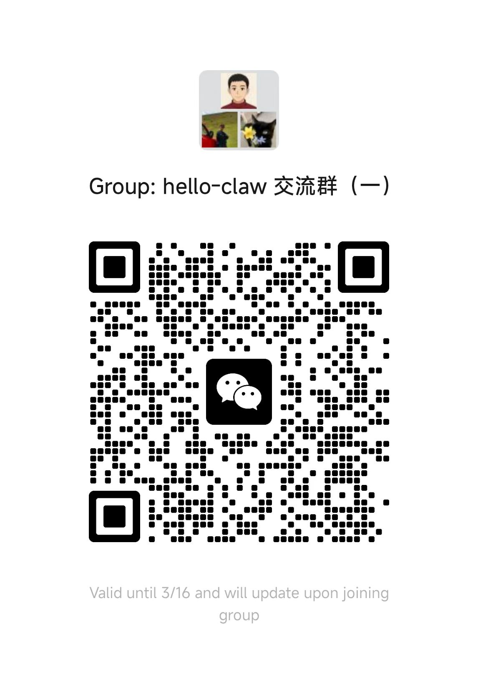

# 哈喽！龙虾 👋 零基础领养、成长你的第一只龙虾

<em>Hello Claw：领养你的 AI 龙虾助理，从零构建属于你的智能助理，智能公司</em>

  📌 <a href="https://datawhalechina.github.io/hello-claw/">在线阅读</a> | 💬 <a href="#交流群">加入交流群</a> | 🚀 <a href="https://github.com/datawhalechina/easy-vibe">还想学 vibecoding</a>

    
    
    

  
  

> [!WARNING]
> 🧪 Beta公测版本提示：教程主体已完成，正在优化细节，欢迎大家提Issue反馈问题或建议。

## 项目简介

本项目是一个面向 OpenClaw 的完整学习教程，帮助你从零开始掌握这个强大的命令行 AI 助理系统。无论你是想快速上手使用 OpenClaw 提升效率，还是想深入理解其原理并构建自己的版本，本教程都能为你提供清晰的学习路径。

**本项目包含两大核心模块：**

1. **领养 Claw（使用篇）**：12 章 + 7 个附录，5 层难度梯度（光速上手 → 手动安装 → 日常使用 → 高级配置 → 高级场景），在任意层停下来都能用
2. **构建 Claw（开发篇）**：15 章，从拆解 OpenClaw 源码到分析替代方案，再到定制你自己的 Claw

**谁适合学习：**

- 零基础用户：想要一个随时待命的 AI 助手，不需要任何编程经验
- 效率达人：希望通过 QQ / 飞书 / Telegram 远程控制 AI
- 技术爱好者：对 OpenClaw 的技能系统和自动化能力感兴趣
- 开发者：想深入理解 Agent 架构并构建自己的版本

**学习建议：**

- 零基础用户：从第一部分"领养 Claw"第 1 章开始，逐层推进
- 开发者：可直接进入第二部分"构建 Claw"，拆解底层实现原理

## 🔥 最新动态

- **[2026-03-12]** ✅ 完成构建 Claw 第1-10章：核心架构解析（提示词系统、工具系统、消息循环、多渠道接入）、替代方案探索（轻量化、安全加固、硬件方案）、站在山巅回望总结
- **[2026-03-10]** ✅ 新增龙虾大学：菜单式 Skills 选修指南，让龙虾装上"战斗外挂"
- **[2026-03-08]** ✅ 完成领养 Claw 第1-11章：安装配置、移动端接入、自动化任务、Skills系统、外部服务集成、生产部署、多模型优化、个人助理、内容创作、开发者效率、故障排查
- **[2026-03-04]** 🦞 项目启动，规划"领养 Claw"和"构建 Claw"两大核心模块

## 在线阅读

https://datawhalechina.github.io/hello-claw

## 📖 目录

### 第一部分：领养 Claw（使用篇，12 章 + 附录 A-G）

| 章节 | 简介 | 状态 |
| ---- | ---- | ---- |
| **写在开头** | **OpenClaw 是什么、领养四步法、5 层难度路线图** | ✅ |
| **🔵 第一层：光速上手** | | |
| 第 1 章 AutoClaw 一键安装 | 下载 AutoClaw 桌面客户端，5 分钟零门槛体验 | ✅ |
| **🟢 第二层：手动安装** | | |
| 第 2 章 手动安装 OpenClaw | 终端介绍、Node.js 安装、npm install、onboard 配置向导、验证 | ✅ |
| 第 3 章 接入聊天平台 | QQ / 飞书 / Telegram 三平台并行路线 + 选型矩阵 | ✅ |
| **🟡 第三层：日常使用** | | |
| 第 4 章 命令行与基础配置 | onboard 向导详解、Web 面板、CLI 对话、openclaw.json 配置 | ✅ |
| 第 5 章 定时任务 | cron 全部命令、at/every/cron 三种调度、jobs.json | ✅ |
| 第 6 章 技能系统入门 | clawhub CLI 操作、十大推荐技能、基础配置 | ✅ |
| **🟠 第四层：高级配置** | | |
| 第 7 章 多平台与外部服务 | NapCat / QClaw / Google / Notion / SQL / Playwright / Home Assistant | ✅ |
| 第 8 章 多模型与成本优化 | 多提供商配置、模型路由策略、Ollama 本地部署、成本监控 | ✅ |
| 第 9 章 个性化定制 | 9 个工作区文件、记忆系统、自定义技能、MCP | ✅ |
| **🔴 第五层：高级场景** | | |
| 第 10 章 生产环境部署 | systemd / Docker / 安全加固 / ArkClaw 托管 | ✅ |
| 第 11 章 开发者效率提升 | 代码生成、Git 自动化、测试、文档、代码审查 | ✅ |
| 第 12 章 故障排查与维护 | 常见问题速查、日志诊断、性能优化、备份升级 | ✅ |
| **附录** | | |
| 附录 A：命令速查表 | 安装、配置、日志、cron、渠道等全部 CLI 命令参考 | ✅ |
| 附录 B：配置文件详解 | openclaw.json 各项参数说明 | ✅ |
| 附录 C：技能开发模板 | SKILL.md 格式 + tavily-search 实战案例解析 | ✅ |
| 附录 D：学习资源汇总 | 80+ 链接，官方文档、社区、推荐学习路径 | ✅ |
| 附录 E：云服务部署指南 | 4 厂商 × 8 维度对比 + 自建 vs 托管 vs ArkClaw 选型 | ✅ |
| 附录 F：社区之声与生态展望 | 6 大议题深度讨论 + 金句精选 | ✅ |
| 附录 G：安全防护指南 | 威胁模型、自查清单、防护措施、群聊安全 | ✅ |

---

### 第二部分：构建 Claw（开发篇，15 章）

| 章节 | 简介 | 状态 |
| ---- | ---- | ---- |
| **写在开头** | **为什么要从零构建你的 Claw、OpenClaw 复杂度困境与学习路线图** | ✅ |
| **🔵 第一层：OpenClaw 内部拆解**（第 1～6 章） | | |
| 第 1 章 核心定位与设计理念 | Agent Runtime vs Chatbot 本质区别、自托管设计、核心基础工具哲学 | ✅ |
| 第 2 章 整体架构解析 | Gateway、Command Queue、Agent Loop、LLM 集成与错误处理 | ✅ |
| 第 3 章 提示词系统 | 八份档案（SOUL/USER/AGENTS/TOOLS/IDENTITY/MEMORY/HEARTBEAT/BOOTSTRAP）与热更新机制 | ✅ |
| 第 4 章 工具系统 | read/write/edit/exec 核心工具设计、安全架构、Agent Loop 工具调用 | ✅ |
| 第 5 章 消息循环与事件驱动 | 思考-行动循环、任务队列、并发控制、容错自愈、心跳机制 | ✅ |
| 第 6 章 多渠道接入 | Gateway 架构、标准消息格式、平台能力配置、跨渠道身份识别 | ✅ |
| **🟢 第二层：探索替代方案**（第 7～10 章） | | |
| 第 7 章 轻量化方案 | NanoClaw（~7000 行）、Nanobot（~4000 行）、ZeroClaw（<5MB 内存） | ✅ |
| 第 8 章 安全加固方案 | IronClaw 纵深防御架构、WASM 沙箱、密钥零暴露模型、提示词注入防御 | ✅ |
| 第 9 章 硬件方案 | PicoClaw（$10 硬件/<10MB 内存）、ARM 架构选型、功耗优化、离线能力 | ✅ |
| 第 10 章 站在山巅回望 | 从驾驶员到工程师的认知转变、OpenClaw 局限性与未来趋势 | ✅ |
| **🟡 第三层：定制你的 Claw**（第 11～15 章） | | |
| 第 11 章 定制路径概览 | 四级定制难度（配置/Skill/Fork/从零）、适用场景与选型建议 | 🚧 |
| 第 12 章 配置文件级定制 | openclaw.json 结构、Providers 配置、工具白名单、安全配置 | 🚧 |
| 第 13 章 Skill 编写 | Skill 文件结构、Frontmatter 格式、异步处理与调试测试 | 🚧 |
| 第 14 章 渠道接入 | 钉钉/飞书接入流程、渠道适配器编写、多渠道配置 | 🚧 |
| 第 15 章 完整定制案例 | 编程助手、个人效率助手、智能客服机器人实战 | 🚧 |

---

> 🎉 **欢迎大家来贡献案例！**
>
> 如果你有独特的 OpenClaw 使用场景或实践经验，欢迎通过以下方式分享：
> - 提交 PR 添加你的案例到本章节
> - 提 Issue 描述你的使用场景
> - 加入社区讨论，与其他开发者交流
>
> 每一份贡献都能帮助更多人发现 OpenClaw 的可能性！

## 🦞 应用场景大全（持续更新）

<table align="center">
  <tr>
    <td valign="top" width="33%">
      <b>🌅 个人效率</b> 
      • 早间简报（天气+日程+待办） 
      • 邮件自动分类与摘要 
      • 智能日程管理
    </td>
    <td valign="top" width="33%">
      <b>💻 编程开发</b> 
      • 代码生成与审查 
      • 自动化测试与部署 
      • 文档自动生成
    </td>
    <td valign="top" width="33%">
      <b>📢 内容创作</b> 
      • 社交媒体自动运营 
      • 写作辅助与润色 
      • 多平台内容发布
    </td>
  </tr>
  <tr>
    <td valign="top" width="33%">
      <b>🏢 商务销售</b> 
      • 客户支持与CRM管理 
      • 销售线索自动跟进 
      • 会议预约与纪要
    </td>
    <td valign="top" width="33%">
      <b>🤖 多智能体协作</b> 
      • 智能体团队项目管理 
      • 自动化工作流编排 
      • 知识库共享与检索
    </td>
    <td valign="top" width="33%">
      <b>🔧 更多场景</b> 
      • 智能家居控制 
      • 金融数据分析 
      • 教育培训辅助
    </td>
  </tr>
</table>

##  贡献者名单

| 姓名 | 职责 | 简介 |
| :----| :---- | :---- |
| [桂子轩](https://github.com/) | 核心贡献者 | - |
| [赵志民](https://github.com/) | 核心贡献者 | - |
| [散步](https://github.com/sanbuphy) | 项目负责人 | - |

*欢迎更多贡献者加入*

## 🤝 参与贡献

- 如果你发现了一些问题，可以提 Issue 进行反馈，如果提完没有人回复你可以联系[保姆团队](https://github.com/datawhalechina/DOPMC/blob/main/OP.md)的同学进行反馈跟进
- 如果你想参与贡献本项目，可以提 Pull Request，如果提完没有人回复你可以联系[保姆团队](https://github.com/datawhalechina/DOPMC/blob/main/OP.md)的同学进行反馈跟进
- 如果你对 Datawhale 很感兴趣并想要发起一个新的项目，请按照 [Datawhale 开源项目指南](https://github.com/datawhalechina/DOPMC/blob/main/GUIDE.md)进行操作即可

## 💬 交流群

欢迎加入 Hello Claw 交流群，与其他开发者一起探讨学习：

## 📧 关注我们

扫描下方二维码关注公众号：Datawhale

## 📄 LICENSE

 
本作品采用
<a rel="license" href="http://creativecommons.org/licenses/by-nc-sa/4.0/">
  知识共享署名-非商业性使用-相同方式共享 4.0 国际许可协议
</a>
进行许可。

---

  <h3>⭐ 如果这个项目对你有帮助，请给我们一个 Star ❤️</h3>

