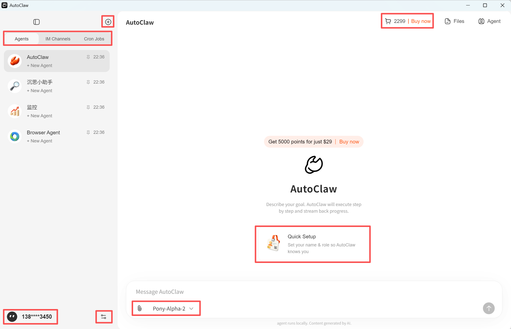
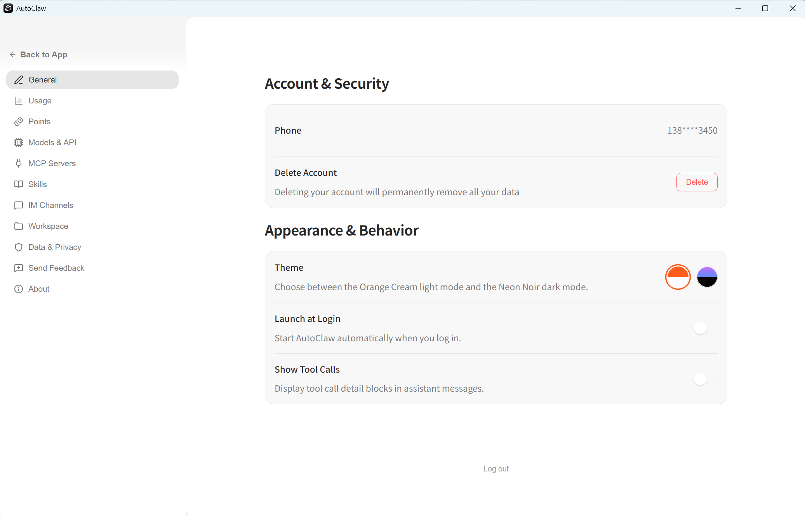

---
prev:
  text: '写在开头'
  link: '/cn/adopt/intro'
next:
  text: '第2章 OpenClaw 手动安装'
  link: '/cn/adopt/chapter2'
---

# 第一章 AutoClaw 一键安装

> 5 分钟后，你将拥有一个会搜索、会浏览网页、会定时提醒你的 AI 助手——不需要写一行代码，不需要懂任何技术。

## 1. 安装

就像装普通软件一样简单：

1. 访问 [AutoClaw 官网](https://autoglm.zhipuai.cn/autoclaw)，下载安装包（macOS / Windows）
2. 双击安装，打开 AutoClaw
3. 国内手机号注册，确认安全指南
4. 开始对话！

新用户限时赠送 **2000 积分**，零成本上手。

为什么推荐 AutoClaw？

- **一键安装**：像装普通软件一样，下载 → 双击 → 完成，无需安装 Node.js、无需配置 API Key，支持 macOS 和 Windows
- **预装 50+ 热门技能**：搜索、生图、浏览器操作、文档处理等开箱即用，无需单独配置各类 API
- **内置龙虾专属模型**：Pony-Alpha-2 针对 OpenClaw 场景深度优化，工具调用更稳、多步任务不掉链子
- **内置浏览器操作能力**：集成 AutoGLM Browser-Use，能自动完成多步骤、跨页面的复杂浏览器任务
- **一键接入飞书**：点击主界面的"一键接入飞书"，扫码登录后全程自动配置
- **模型随意切换**：默认 Pony-Alpha-2，也支持 GLM-5、DeepSeek、Kimi、MiniMax 等任意模型 API
- **免费积分**：新用户限时赠送 2000 积分，零成本上手

## 2. 开始对话

左侧有四个预置分身，选一个点进去就能聊：

| 分身 | 一句话介绍 | 怎么用 |
|------|-----------|--------|
| **AutoClaw** | 通用助手，什么都能干 | 直接描述你的目标 |
| **沉思小助手** | 深度调研 | 在提示词的【】中填入调研方向 |
| **监控** | 定时提醒 | 填入时间和监控对象（如股票代码） |
| **Browser Agent** | 浏览器操作 | 描述你想让它在网页上做的事 |

对话时可以上传文件（点📎）或粘贴 URL，分身会自动读取和索引。上传的文件会出现在右侧 **Files** 边栏中。

这四个分身分别适合做什么？

**AutoClaw**——通用助手，什么都能聊、什么都能干。界面提示："Describe your goal. AutoClaw will execute step by step and stream back progress."

**沉思小助手**——深度调研专家。打开后会看到预设提示词：

> 我想做一个深度调研，方向是：【】。请帮我：1. 从多个角度拆解这个问题；2. 搜索中英文信源，交叉验证数据；3. 给出结构清晰、有数据支撑、有独立洞察的深度报告；

你只需要在【】中填入调研方向即可。

**监控**——定时监控专家。预设提示词：

> 设置一个定时任务，每天【什么时间】告诉我【】【股票代码：】的当日收盘价格，并做简单分析

填入时间和监控对象，它会自动创建定时任务，创建后的任务会出现在左侧 **Cron Jobs** 标签页中。

**Browser Agent**——浏览器操作专家（集成 AutoGLM Browser-Use）。预设提示词：

> 到小红书搜索关于龙虾的最热门的笔记，选五个整理一下笔记的内容、点赞数和前三条评论到Excel里，放在桌面就行，名字叫"笔记整理"。

你可以根据实际需求修改这段提示词，让它完成任何多步骤、跨页面的浏览器任务。

## 3. Quick Setup：让分身认识你

首次对话前会弹出 **Quick Setup** 卡片。花 30 秒填一下，分身就知道你是谁、擅长什么：

填写你的名字、角色、给分身取个名字、选择专长领域，点 **Done** 即可。错过了也没关系——随时在对话中告诉分身，它会自己配好。

每个字段填什么？

| 字段 | 说明 | 示例 |
|------|------|------|
| **What should we call you?** | 你的名字 | Hello-Claw |
| **Your role** (optional) | 你的角色/职业 | 教学小导 |
| **What should I be called?** (optional) | 给分身取名 | 七万 |
| **Focus areas** | 选择分身的专长领域（可多选） | Coding / Writing / Product / Data Analysis / Design / DevOps / Research / Marketing / Teaching / Other |
| **Working Directory** | 分身的工作目录 | `~/.openclaw-autoclaw/workspace` |
| **Restrict File Access** | 开启后分身只能在工作目录内读写文件 | 建议开启 |
| **Optimization Plan** | 优化计划（实验性功能） | 默认关闭 |

设置完毕后，分身的配置信息会显示在右侧信息栏中。如果不够满意，可以通过对话重新调整，直到满意为止。

## 4. 积分用完了？

点右上角 **Buy now** 购买积分包，按需充值，不强制订阅。

---

如何给分身换一个专属头像？

点击左下角头像，进入风格设置界面：

选择预设风格（Cute Cat / Cyberpunk / Watercolor / Pixel Art / Anime Style / Minimalist），或输入自定义描述后点 **Generate** 实时生成。

如何创建更多分身？

点击左上角 **⊕** 创建新分身，可以重命名、换图标、置顶或删除。

想在飞书里直接和分身对话？

左侧 **IM Channels** 标签页 → **Connect IM Channels** → 选择飞书（国内）或 Lark（海外），按页面上的"飞书后台配置指引"操作即可。

更多聊天平台详见[第四章](/cn/adopt/chapter4/)。

如何查看和管理定时任务？

左侧 **Cron Jobs** 标签页显示所有定时任务。通过「监控」分身对话即可创建。

想深度定制？Preferences 里有什么？

点击左下角头像旁的设置图标（⚙），进入 Preferences 页面：

左侧菜单共 11 项，以下逐一说明。

**General（常规）**

- **Account & Security**——绑定的手机号、删除账号（永久移除所有数据，慎用）
- **Theme**——主题切换：Orange Cream（浅色）和 Neon Noir（深色）
- **Launch at Login**——开机自动启动 AutoClaw
- **Show Tool Calls**——在对话中显示工具调用详情块（适合想看"龙虾在干什么"的用户）

**Usage（用量统计）**

查看当前设备上所有对话的汇总用量：Sessions（会话数）、Messages（消息数）、Total Tokens（总 Token 消耗）。支持按模型分类查看（如 `zai_pony-alpha-2` 的输入/输出 Token 明细）。

**Points（积分管理）**

- **Total Points**——当前积分余额
- **Top Up**——充值积分
- 支持按 All / Spent / Earned 筛选积分记录

**Models & API（模型配置）**

- **Built-in Models**——内置模型 Pony-Alpha-2（默认选中）
- **Custom Models**——点击 Add Custom Model 添加第三方模型 API（如 DeepSeek、Kimi 等）
- **Gateway URL**——网关连接状态，支持 Reconnect / Reset Connection
- **Port**——网关端口，修改后自动重启；端口被占用时系统会尝试相邻端口

**MCP Servers（扩展工具）**

MCP（模型上下文协议）为分身扩展外部工具能力——文件系统、数据库、网页搜索等。

- 点击 **Add Server** 添加自定义 MCP 服务
- **Quick Add Templates**——一键添加常见服务：File System / Brave Search / SQLite / Web Fetch

**Skills（技能管理）**

AutoClaw 预装 **95 个技能**，其中约 52 个自动满足条件可直接使用。技能示例：

- **1password**——1Password CLI 集成，管理密码和密钥
- **self-reflection**——定期自我反思，分析近期对话的得失
- **aminer-data-search**——AMiner 学术数据查询（学者/论文/机构/期刊/专利）

支持通过 **Extra Skill Directories** 添加额外的技能目录。想自己编写技能？详见[附录 D：技能开发与发布指南](/cn/appendix/appendix-d)。

**IM Channels（聊天平台）**

与主界面左侧 IM Channels 标签页相同，管理已接入的聊天平台。

**Workspace（工作区）**

- **Default Projects Directory**——项目和上下文文件的保存位置（默认 `~/.openclaw-autoclaw/workspace`）
- **Restrict File Access**——限制分身只能在工作目录内读写文件（建议开启，防止误操作）
- **Auto-save Context**——自动保存聊天记录和提取的内容到本地
- **File Watcher**——实时监控本地文件变更，保持分身上下文同步
- **Migrate from OpenClaw**——从 OpenClaw 迁移配置、对话、技能等数据到 AutoClaw

**Data & Privacy（数据与隐私）**

查看本地数据存储路径（默认 `~/.openclaw-autoclaw/workspace`），所有数据存储在本地。

**Send Feedback（反馈）**

提交问题或建议，会自动附带本地日志（含 RPA 日志）以便快速定位问题。

**About（关于）**

查看当前版本，点击 **Check for Updates** 检查并安装更新。

