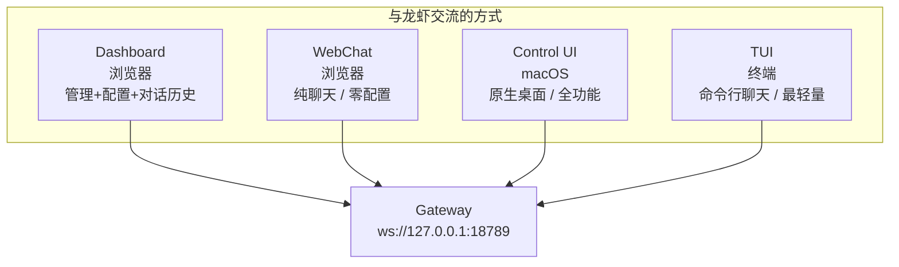

---
prev:
  text: '第10章 安全防护与威胁模型'
  link: '/cn/adopt/chapter10'
next:
  text: '附录 A：学习资源汇总'
  link: '/cn/appendix/appendix-a'
---

# 第十一章 Web 界面与客户端

> 本章介绍 OpenClaw 的各种交互界面：Web 控制面板（Dashboard）、内置 WebChat 聊天、macOS Control UI 桌面客户端、终端 TUI，以及第三方 Web 客户端。读完本章，你将掌握所有与龙虾"面对面"交流的方式。

> **前置条件**：已完成[第二章 OpenClaw 手动安装](/cn/adopt/chapter2/)，Gateway 已安装并正常运行。

## 0. 全景：你能用什么和龙虾交流？

OpenClaw 提供**四种原生界面**，外加社区第三方客户端：




| 界面 | 访问方式 | 适用场景 | 平台 |
|------|---------|---------|------|
| **Dashboard** | `openclaw dashboard` → 浏览器 | 日常管理、配置编辑、对话查看 | 全平台 |
| **WebChat** | 浏览器直接访问 Gateway 地址 | 快速对话、不装任何客户端 | 全平台 |
| **Control UI** | OpenClaw.app 桌面应用 | macOS 用户的全功能原生体验 | macOS |
| **TUI** | `openclaw chat` 终端命令 | SSH 远程、无 GUI 环境、脚本集成 | 全平台 |

> **一句话选择**：想管理配置 → Dashboard；想聊天 → WebChat 或 TUI；macOS 用户想要原生体验 → Control UI。

## 1. Web Dashboard（控制面板）

Dashboard 是 OpenClaw 的**主力管理界面**——一个运行在浏览器中的控制面板，涵盖配置管理、对话历史、渠道状态、技能管理等功能。

### 启动 Dashboard

```bash
openclaw dashboard
```

浏览器会自动打开 `http://localhost:18789`。如果没有自动打开，手动在浏览器地址栏输入即可。


> **什么是 localhost？** 就是"本机"的意思。这个网页只有你自己的电脑能打开，外部无法访问。

### Dashboard 能做什么

| 功能区 | 说明 |
|--------|------|
| **Config** | 可视化编辑 `openclaw.json` 配置，实时生效 |
| **Conversations** | 查看所有对话历史、消息详情、工具调用记录 |
| **Channels** | 查看已连接的聊天渠道状态 |
| **Sessions** | 管理活跃会话，查看会话上下文 |
| **Skills** | 浏览和管理已安装的技能 |
| **Cron** | 查看和管理定时任务 |
| **Logs** | 实时查看 Gateway 日志流 |

### 配置编辑

Dashboard 的 Config 标签页提供了图形化的配置编辑器。修改后 Gateway 会自动应用（热重载），大多数配置不需要重启。

> **提示**：Dashboard 编辑的就是 `~/.openclaw/openclaw.json` 文件。你也可以用命令行 `openclaw config set <key> <value>` 或直接编辑文件，效果完全一样（详见[第八章 配置管理](/cn/adopt/chapter8/#_2-配置管理)）。

### 远程访问 Dashboard

默认情况下 Dashboard 只能在本机访问。如果你的 Gateway 运行在远程服务器上，需要通过 SSH 隧道或 Tailscale 访问（详见[第九章 远程访问](/cn/adopt/chapter9/)）：

```bash
# SSH 隧道方式：在本地电脑执行
ssh -N -L 18789:127.0.0.1:18789 user@远程服务器

# 然后本地浏览器打开 http://localhost:18789
```

<details>
<summary>Dashboard 认证</summary>

如果 Gateway 配置了认证（`token` 或 `password` 模式），打开 Dashboard 时会要求输入凭证：

- **Token 模式**：输入 `OPENCLAW_GATEWAY_TOKEN` 环境变量的值
- **Password 模式**：输入 `OPENCLAW_GATEWAY_PASSWORD` 环境变量的值
- **Tailscale 模式**：如果启用了 `allowTailscale: true`，从 Tailscale 网络内访问无需密码

```json5
// 认证配置示例
{
  gateway: {
    auth: {
      mode: "token",             // token | password
      token: "${OPENCLAW_GATEWAY_TOKEN}",
      allowTailscale: true,      // Tailscale 设备免认证
    },
  },
}
```

> **安全提醒**：Dashboard 拥有完整的管理权限。务必设置认证，尤其是 Gateway 不在 loopback 上运行时（详见[第十章 安全防护](/cn/adopt/chapter10/)）。

</details>

<details>
<summary>更改 Dashboard 端口</summary>

如果默认端口 `18789` 与其他服务冲突：

```json5
{
  gateway: {
    port: 19000,   // 改为其他端口
  },
}
```

或启动时指定：

```bash
openclaw gateway --port 19000
```

改完后 Dashboard 地址变为 `http://localhost:19000`。

</details>

## 2. WebChat（内置 Web 聊天）

WebChat 是 Gateway **内置的 Web 聊天界面**，和 Telegram、Discord 一样是一个"渠道"——只不过它直接运行在浏览器中，不需要任何第三方平台。

### 打开 WebChat

Gateway 启动后，直接在浏览器访问：

```
http://localhost:18789
```

Dashboard 界面中通常有一个 **Chat** 入口，点击即可进入 WebChat 界面。

### WebChat 的特点

- **零配置**：Gateway 启动就能用，不需要注册任何平台账号
- **WebSocket 通信**：实时消息推送，体验流畅
- **内置渠道**：在 OpenClaw 内部它和 Telegram、Discord 处于同等地位
- **测试利器**：配置新技能或调试时，用 WebChat 测试最方便

### 典型使用场景

| 场景 | 说明 |
|------|------|
| **首次安装测试** | 装好 OpenClaw 后，先用 WebChat 确认龙虾能正常回复 |
| **技能调试** | 安装新技能后，在 WebChat 中快速测试效果 |
| **本地开发** | 开发自定义技能时，WebChat 是最快的反馈循环 |
| **无 IM 场景** | 不想接入任何聊天平台，只在浏览器中使用 |

### 健康检查快捷方式

在 WebChat 中发送 `/status` 作为独立消息，可以获取 Gateway 状态回复，不会触发 Agent 处理。

<details>
<summary>WebChat 与其他渠道的对比</summary>

| 对比维度 | WebChat | Telegram | Discord |
|---------|---------|----------|---------|
| 注册要求 | 无 | 需创建 Bot | 需创建 Bot |
| 公网要求 | 不需要 | Webhook 需要 | 不需要 |
| 移动端 | 浏览器访问 | 原生 App | 原生 App |
| 群聊 | 不支持 | 支持 | 支持 |
| 消息推送 | 需保持页面打开 | 系统通知 | 系统通知 |
| 适合场景 | 本地测试、开发调试 | 日常使用、多人协作 | 社区互动 |

WebChat 最适合**本地开发和测试**。如果你需要移动端推送通知或群聊功能，建议搭配 Telegram 或 Discord（详见[第四章 Chat Provider 配置](/cn/adopt/chapter4/)）。

</details>

<details>
<summary>第三方 Web 聊天客户端</summary>

社区还有一些第三方 Web 聊天界面，它们通过 Gateway 的 HTTP API 端点与 OpenClaw 通信：

- **PinchChat**（[github.com/pinchchat/pinchchat](https://github.com/pinchchat/pinchchat)）：开源 WebChat UI，提供类似 ChatGPT 的对话界面

使用第三方客户端前，需要在 Gateway 中启用 HTTP API 端点：

```json5
{
  gateway: {
    http: {
      endpoints: {
        chatCompletions: { enabled: true },
      },
    },
  },
}
```

然后将第三方客户端的 API 地址指向 `http://127.0.0.1:18789/v1/chat/completions`，使用 Gateway 认证 token 作为 API Key（详见[第八章 HTTP API 端点](/cn/adopt/chapter8/#_8-http-api-端点)）。

</details>

## 3. Control UI（macOS 桌面客户端）

Control UI 是 OpenClaw 的 **macOS 原生桌面应用**（OpenClaw.app），提供系统级的集成体验。

### 安装

如果你通过 [AutoClaw](/cn/adopt/chapter1/) 或 Homebrew 安装了 OpenClaw，Control UI 可能已经包含在内。也可以单独下载：

```bash
brew install --cask openclaw
```

安装后在「应用程序」中找到 **OpenClaw.app**，双击打开。

### Control UI 能做什么

| 功能 | 说明 |
|------|------|
| **菜单栏常驻** | 系统托盘图标，随时唤起 |
| **Gateway 管理** | 启动/停止/重启 Gateway，无需终端 |
| **配置编辑** | 图形化编辑 `openclaw.json` |
| **对话查看** | 浏览历史对话和工具调用 |
| **远程连接** | 内置 SSH 隧道管理（Settings → General → "OpenClaw runs"） |
| **通知推送** | macOS 原生通知，龙虾回复时弹窗提醒 |

### 远程模式

Control UI 支持直接连接远程 Gateway：

1. 打开 OpenClaw.app → **Settings** → **General** → **"OpenClaw runs"**
2. 选择 **"Remote over SSH"**
3. 填入远程服务器地址和 SSH 配置
4. App 会自动管理 SSH 隧道，WebChat 和健康检查"开箱即用"

> **提示**：远程模式的详细配置参见[第九章 远程访问](/cn/adopt/chapter9/)。

<details>
<summary>Control UI vs Dashboard 对比</summary>

| 对比维度 | Control UI | Dashboard |
|---------|-----------|-----------|
| 平台 | 仅 macOS | 全平台（浏览器） |
| 安装 | 需下载 App | Gateway 内置 |
| 系统集成 | 菜单栏、通知、快捷键 | 无 |
| 远程连接 | 内置 SSH 管理 | 需手动建隧道 |
| 离线状态 | 可查看缓存数据 | 需 Gateway 运行 |
| 推荐人群 | macOS 重度用户 | 跨平台用户、远程管理 |

两者可以同时使用——Control UI 管理 Gateway 生命周期，Dashboard 做细粒度配置。

</details>

## 4. TUI（终端聊天）

TUI（Terminal User Interface）是最轻量的交互方式——直接在终端中和龙虾对话，不需要浏览器，不需要 GUI。

### 启动 TUI

```bash
openclaw chat
```

进入交互式对话模式，输入消息后按回车发送，龙虾会在终端中回复。

### 适用场景

| 场景 | 说明 |
|------|------|
| **SSH 远程** | 通过 SSH 登录服务器后直接聊天，无需隧道 |
| **无 GUI 环境** | 服务器、Docker 容器、WSL 等没有图形界面的环境 |
| **快速测试** | 一条命令验证龙虾是否正常工作 |
| **脚本集成** | 在 Shell 脚本中调用龙虾处理任务 |

### 单次消息模式

如果不想进入交互模式，可以直接发送一条消息：

```bash
openclaw agent --message "帮我写一个 Python hello world"
```

<details>
<summary>TUI 进阶用法</summary>

**指定思考级别**：

```bash
openclaw agent --message "分析这段代码的安全性" --thinking high
```

**指定 Agent**：

如果配置了多个 Agent（详见[附录 G 配置文件详解](/cn/appendix/appendix-g)），可以指定使用哪个：

```bash
openclaw agent --message "查看今天的日程" --agent home
openclaw agent --message "审查这个 PR" --agent work
```

**管道输入**：

TUI 支持从管道接收输入，方便与其他命令组合：

```bash
# 让龙虾解释一段代码
cat script.py | openclaw agent --message "解释这段代码"

# 让龙虾分析日志
openclaw logs --limit 50 --plain | openclaw agent --message "有什么异常？"
```

</details>

## 5. 界面选择指南

### 按场景选择

| 你想做什么 | 推荐界面 |
|-----------|---------|
| 第一次安装，确认龙虾能用 | `openclaw chat`（最快） |
| 日常管理配置 | Dashboard |
| 和龙虾聊天（有浏览器） | WebChat |
| 和龙虾聊天（SSH 远程） | `openclaw chat` |
| macOS 全功能体验 | Control UI |
| 调试技能和工具 | WebChat + Dashboard（查看工具调用） |
| 在脚本中调用龙虾 | `openclaw agent --message` |

### 按环境选择

| 你的环境 | 推荐界面 |
|---------|---------|
| macOS 桌面 | Control UI + Dashboard |
| Windows / Linux 桌面 | Dashboard + WebChat |
| 云服务器（SSH） | TUI（`openclaw chat`） |
| Docker 容器 | TUI |
| 手机/平板 | WebChat（通过浏览器） |

### 多界面协同

这些界面**不是互斥的**——它们都连接到同一个 Gateway，可以同时使用：

- 用 **Control UI** 启动和监控 Gateway
- 用 **Dashboard** 管理配置和查看对话历史
- 用 **WebChat** 日常聊天
- 用 **TUI** 在终端中快速提问

所有界面共享同一个 Gateway 的会话、技能和配置。在 WebChat 中的对话可以在 Dashboard 的 Conversations 中查看，反之亦然。

## 6. 常见问题

**Q: 打开 Dashboard 显示连接失败？**

A: 确认 Gateway 正在运行：

```bash
openclaw gateway status
```

如果 Gateway 未运行，先启动它：

```bash
openclaw gateway restart
```

**Q: Dashboard 打不开，端口被占用？**

A: 检查端口占用情况：

```bash
# Linux / macOS
ss -tlnp | grep 18789

# Windows
netstat -ano | findstr 18789
```

如果被其他进程占用，可以更换端口（见上文"更改 Dashboard 端口"）或使用 `--force` 强制释放。

**Q: WebChat 发消息没有回复？**

A: 依次检查：
1. `openclaw status` 确认 Gateway 和 Agent 正常
2. `openclaw logs --follow` 查看实时日志，发送一条消息观察是否有错误
3. 确认模型配置正确、API Key 有效（详见[第五章 模型管理](/cn/adopt/chapter5/)）

**Q: 远程服务器上能用 WebChat 吗？**

A: 可以。建立 SSH 隧道后，在本地浏览器访问 `http://localhost:18789` 即可。Tailscale 用户可以直接通过 Tailscale IP 访问（详见[第九章 远程访问](/cn/adopt/chapter9/)）。

**Q: Control UI 只有 macOS 版本吗？**

A: 是的。Windows 和 Linux 用户可以使用 Dashboard（功能基本等价）或社区桌面客户端如 [ClawX](/cn/adopt/chapter1/)。
