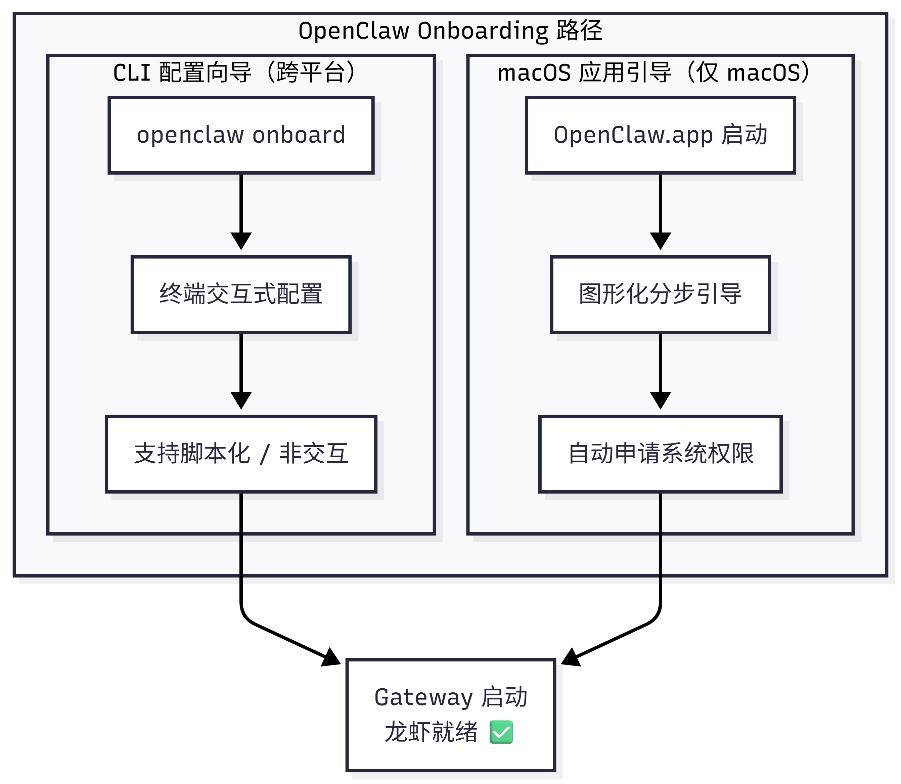
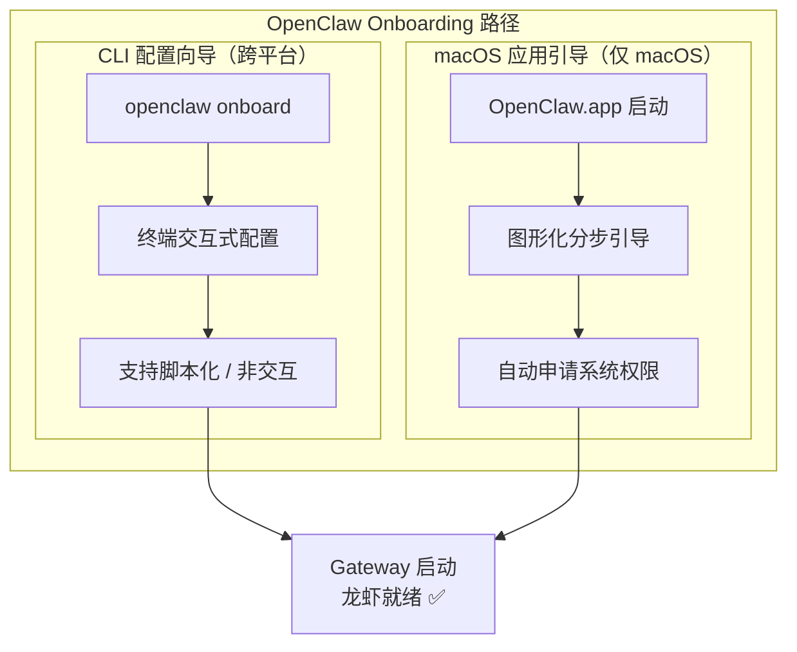

---
prev:
  text: '第2章 OpenClaw 手动安装'
  link: '/cn/adopt/chapter2'
next:
  text: '第4章 聊天平台接入'
  link: '/cn/adopt/chapter4'
---

# 第三章 初始配置向导

> 跑完本章，龙虾就能开口说话了。

> **前置条件**：已完成[第二章 OpenClaw 手动安装](/cn/adopt/chapter2/)。

## 0. 两条路径，选一条

**Onboarding（配置向导）** 帮你告诉龙虾三件事：用哪个模型、通过哪个渠道联系你、在哪里工作。OpenClaw 提供两条路径：





| 路径 | 适用场景 | 平台 |
|------|---------|------|
| **CLI 配置向导** | 需要完全控制、远程服务器、自动化脚本 | macOS / Linux / Windows (WSL2) |
| **macOS 应用引导** | 希望图形化引导、需要语音/摄像头等原生权限 | 仅 macOS |

> **已经在第二章跑过 `openclaw onboard` 了？** 基本配置已完成！本章帮你理解每一步做了什么，以及如何微调。

---

## 1. CLI 配置向导（所有平台）

### 1.1 启动向导

```bash
openclaw onboard
```

> **想同时安装后台服务？** 加 `--install-daemon` 一步到位：
> ```bash
> openclaw onboard --install-daemon
> ```

### 1.2 QuickStart vs Advanced

向导启动后会问你第一个问题：**QuickStart（快速开始）** 还是 **Advanced（高级模式）**？

| 选项 | 自动配置内容 | 适合谁 |
|------|------------|--------|
| **QuickStart** | 本地 Gateway + 默认工作区 + 端口 18789 + Token 认证 + coding 工具策略 | 第一次用，想尽快聊天 |
| **Advanced** | 所有选项都可自定义 | 需要远程部署、Tailscale、特殊安全策略 |

<details>
<summary>QuickStart 默认配置一览</summary>

QuickStart 模式自动应用以下默认值：

| 配置项 | 默认值 | 说明 |
|--------|--------|------|
| Gateway 位置 | 本机（loopback） | 仅本机可访问 |
| 工作区 | `~/.openclaw/workspace/` | 或使用已有工作区 |
| Gateway 端口 | 18789 | 标准端口 |
| 认证方式 | Token（自动生成） | 即使本地也需认证 |
| 工具策略 | `tools.profile: "coding"` | 保留文件系统和运行时工具 |
| DM 隔离 | `session.dmScope: "per-channel-peer"` | 每个渠道独立会话 |
| Tailscale | 关闭 | 不暴露到 Tailnet |
| Telegram/WhatsApp DM | 白名单模式 | 会提示输入你的手机号 |

> 已有自定义 `tools.profile` 的用户不会被覆盖——向导尊重现有配置。

</details>

### 1.3 向导的六个步骤

#### 步骤一：模型与认证

选择模型提供商，粘贴 API Key。不确定选哪个？见[第五章 模型管理](/cn/adopt/chapter5/)。

<details>
<summary>安全提示：模型选择与工具安全</summary>

如果你的龙虾会运行工具（执行命令、调用 API）或处理来自 Webhook/Hooks 的外部内容，请注意：

- **优先选择最新一代的强模型**——较弱/较旧的模型更容易被提示词注入攻击
- **保持严格的工具策略**——避免使用 `tools.profile: "full"`（不限制模式），除非你完全信任所有输入来源
- 详见[第十章 安全防护](/cn/adopt/chapter10/)

</details>

<details>
<summary>密钥存储：明文 vs SecretRef</summary>

向导默认将 API Key 以明文存储在配置文件中。如果你需要更安全的存储方式：

**交互模式**：选择 Secret Reference 模式，可以指向环境变量或 Provider Ref（文件/可执行程序），向导会立即验证引用是否有效。

**非交互模式**：使用 `--secret-input-mode ref`，此时提供商的环境变量必须已设置：
```bash
export OPENAI_API_KEY="sk-..."
openclaw onboard --secret-input-mode ref --non-interactive
```

</details>

#### 步骤二：工作区

设置龙虾的工作目录（默认 `~/.openclaw/workspace/`），存放 IDENTITY.md、MEMORY.md 等文件。已有工作区文件会被保留。

#### 步骤三：Gateway 配置

设置端口（默认 18789）、绑定地址（默认仅本机）和认证方式。

<details>
<summary>Gateway Token 与 SecretRef</summary>

在交互式 Token 模式下，你可以选择：
- **明文 Token**（默认）：存储在配置文件中
- **SecretRef**：通过环境变量或外部程序管理 Token

非交互模式下使用 SecretRef：
```bash
openclaw onboard --gateway-token-ref-env GATEWAY_TOKEN --non-interactive
```

注意：如果同时配置了 `gateway.auth.token` 和 `gateway.auth.password` 但未设置 `gateway.auth.mode`，后台服务安装会被阻止，直到你明确选择一种模式。

</details>

#### 步骤四：渠道接入

选择要连接的聊天平台（WhatsApp、Telegram、Discord 等）。可以跳过，后续用 `openclaw channels add` 随时添加，详见[第四章](/cn/adopt/chapter4/)。

#### 步骤五：后台服务

安装后台服务，开机自动启动 Gateway。macOS 用 LaunchAgent，Linux/WSL2 用 systemd。

<details>
<summary>后台服务与 SecretRef 的注意事项</summary>

- 如果 Token 认证使用 SecretRef，后台服务安装时会验证引用有效性，但**不会**将解析后的 Token 持久化到服务环境中
- 如果配置的 SecretRef 无法解析，后台服务安装会被阻止，并给出修复建议
- 使用 `openclaw doctor` 可以自动检测和修复服务问题

</details>

#### 步骤六：健康检查与技能安装

启动 Gateway、验证运行状态，安装推荐技能。详见[附录 D：技能开发与发布指南](/cn/appendix/appendix-d)。

### 1.4 Web 搜索配置

让龙虾能上网搜索，需要配置一个搜索提供商。支持的选项：

| 提供商 | 说明 |
|--------|------|
| Perplexity | AI 搜索引擎 |
| Brave | 隐私搜索 |
| Gemini | Google AI 搜索 |
| Grok | xAI 搜索 |
| Kimi | 月之暗面搜索 |

粘贴对应的 API Key 即可启用。也可以后续配置：

```bash
openclaw configure --section web
```

---

## 2. macOS 应用引导

首次启动 OpenClaw.app（Control UI）时，会自动进入图形化引导。

### 2.1 引导步骤总览

| 步骤 | 内容 | 操作 |
|------|------|------|
| ① | macOS 安全警告 | 点击「允许」 |
| ② | 本地网络发现 | 允许查找本地网络设备 |
| ③ | 安全须知 | 阅读信任模型说明 |
| ④ | 选择 Gateway 位置 | 本机 / 远程 / 稍后配置 |
| ⑤ | 系统权限申请 | 逐项授权 |
| ⑥ | 安装 CLI（可选） | 安装 `openclaw` 命令行工具 |
| ⑦ | Onboarding 对话 | 龙虾自我介绍 + 引导下一步 |

### 2.2 安全须知（步骤 ③）

应用会展示 OpenClaw 的信任模型说明，阅读后点击继续即可。

<details>
<summary>信任模型是什么意思？</summary>

- **默认定位**：个人助手，一个可信操作者边界
- **多用户场景**：需要拆分信任边界、最小化工具权限，参考[第十章 安全防护](/cn/adopt/chapter10/)
- **本地新安装**默认使用 `tools.profile: "coding"`，保留文件系统和运行时工具

</details>

### 2.3 Gateway 位置选择（步骤 ④）

| 选项 | 说明 |
|------|------|
| **This Mac（本机）** | 在本机运行 Gateway，应用直接配置认证和凭证 |
| **Remote（远程）** | 连接远程 Gateway（通过 SSH 或 Tailnet），不修改本机认证 |
| **Configure later（稍后配置）** | 跳过设置，应用保持未配置状态 |

<details>
<summary>Gateway 认证提示</summary>

- 向导现在即使对本地回环连接也会生成 Token，所以本地 WebSocket 客户端也需要认证
- 如果禁用认证，任何本地进程都能连接——仅在完全可信的机器上这样做
- 多机访问或非回环绑定时，请务必使用 Token 认证

</details>

### 2.4 系统权限（步骤 ⑤）

macOS 应用会请求以下 TCC 权限：

| 权限 | 用途 |
|------|------|
| **Automation（自动化）** | AppleScript 控制其他应用 |
| **Notifications（通知）** | 推送消息提醒 |
| **Accessibility（辅助功能）** | UI 交互控制 |
| **Screen Recording（屏幕录制）** | 截屏/屏幕共享 |
| **Microphone（麦克风）** | 语音输入 |
| **Speech Recognition（语音识别）** | 语音转文字 |
| **Camera（摄像头）** | 视觉输入 |
| **Location（定位）** | 位置感知 |

> 不需要的权限可以跳过，后续在 macOS「系统设置 → 隐私与安全性」中随时调整。

### 2.5 CLI 安装（步骤 ⑥）

安装全局 `openclaw` CLI，让终端命令和定时任务正常工作。已通过[第二章](/cn/adopt/chapter2/)安装过的可跳过。

### 2.6 Onboarding 对话（步骤 ⑦）

设置完成后，龙虾会自我介绍并引导你探索功能。这是一个专用的引导会话，不影响日常使用。

---

## 3. 自定义模型提供商（Custom Provider）

向导列表里没有你的提供商？选 **Custom Provider**，依次填写：

| 步骤 | 内容 | 示例 |
|------|------|------|
| 1. 选择兼容类型 | OpenAI-compatible / Anthropic-compatible / Unknown（自动检测） | OpenAI-compatible |
| 2. 输入 Base URL | 提供商的 API 地址 | `https://api.mycompany.com/v1` |
| 3. 输入 API Key | 如果需要的话 | `sk-custom-...` |
| 4. 填写 Model ID | 模型标识符 | `gpt-4o` |
| 5. 设置别名（可选） | 方便记忆的短名称 | `company-gpt` |
| 6. 设置 Endpoint ID | 区分多个自定义端点 | `mycompany` |

<details>
<summary>多个自定义端点共存</summary>

每个 Custom Provider 通过 **Endpoint ID** 区分，所以你可以同时配置多个自定义端点：

```json
// openclaw.json 示例
{
  "models": {
    "providers": {
      "custom-company-a": {
        "type": "openai",
        "baseUrl": "https://api.company-a.com/v1",
        "apiKey": "sk-a-..."
      },
      "custom-company-b": {
        "type": "anthropic",
        "baseUrl": "https://api.company-b.com/v1",
        "apiKey": "sk-b-..."
      }
    }
  }
}
```

详见[附录 G：配置文件详解](/cn/appendix/appendix-g)。

</details>

---

## 4. 多智能体配置

OpenClaw 支持在同一实例下运行多个独立智能体，每个智能体有自己的工作区、会话和渠道绑定。

### 4.1 添加智能体

```bash
openclaw agents add <name>
```

### 4.2 智能体配置项

| 配置项 | 说明 |
|--------|------|
| `agents.list[].name` | 智能体名称 |
| `agents.list[].workspace` | 工作区路径（默认 `~/.openclaw/workspace-<agentId>`） |
| `agents.list[].agentDir` | 智能体配置目录 |

<details>
<summary>非交互模式与消息路由</summary>

**非交互模式标志**：
```bash
openclaw agents add worker-bot \
  --model "openrouter/stepfun/step-3.5-flash:free" \
  --agent-dir ~/.openclaw/agents/worker \
  --bind "telegram:chat:12345" \
  --non-interactive
```

**消息路由**：通过 `--bind` 参数将特定渠道/对话绑定到某个智能体。向导也会引导你完成绑定配置。

这样你可以让不同的龙虾负责不同的聊天群或任务类型。

</details>

---

## 5. 重新配置与维护

### 5.1 重新运行向导

```bash
openclaw configure
```

> `configure` 修改现有配置，`onboard` 用于首次设置；前者不会重新安装后台服务。

### 5.2 重置配置

```bash
# 默认重置：配置、凭证、会话
openclaw onboard --reset

# 完整重置：包括工作区
openclaw onboard --reset --reset-scope full
```

> ⚠️ `--reset` 会清除现有配置。只想改某项设置，用 `openclaw configure` 更安全。

### 5.3 配置异常处理

配置文件损坏时，运行 `openclaw doctor` 自动诊断并修复。详见[第八章](/cn/adopt/chapter8/)。

<details>
<summary>非交互模式（脚本化部署）</summary>

在 CI/CD 或批量部署场景中，可以使用非交互模式跳过所有交互式提问：

```bash
openclaw onboard \
  --non-interactive \
  --auth-choice openai-api-key \
  --install-daemon
```

注意事项：
- `--json` 标志**不代表**非交互模式，它只是改变输出格式
- 非交互模式下必须通过命令行参数或环境变量提供所有必要配置
- 使用 `--secret-input-mode ref` 时，对应的环境变量必须已设置

</details>

---

## 6. 常见问题

**Q：配置文件存在哪里？**

`~/.openclaw/openclaw.json`，工作区在 `~/.openclaw/workspace/`。详见[附录 G](/cn/appendix/appendix-g)。

**Q：向导跑完，怎么马上开始聊天？**

```bash
openclaw chat        # 终端对话
openclaw dashboard   # 浏览器 Dashboard（无需渠道配置）
```

详见[第十一章](/cn/adopt/chapter11/)。

**Q：提供商不在列表里怎么办？**

选 **Custom Provider**，填入 API 地址和密钥。详见[本章第 3 节](#_3-自定义模型提供商-custom-provider)。

**Q：Remote 模式会改动远程主机吗？**

不会。它只配置本地客户端如何连接远程 Gateway（SSH 隧道或 Tailnet），远程主机不受影响。详见[第九章](/cn/adopt/chapter9/)。

**Q：重新运行向导会覆盖现有配置吗？**

不会，除非你传入 `--reset` 参数。
