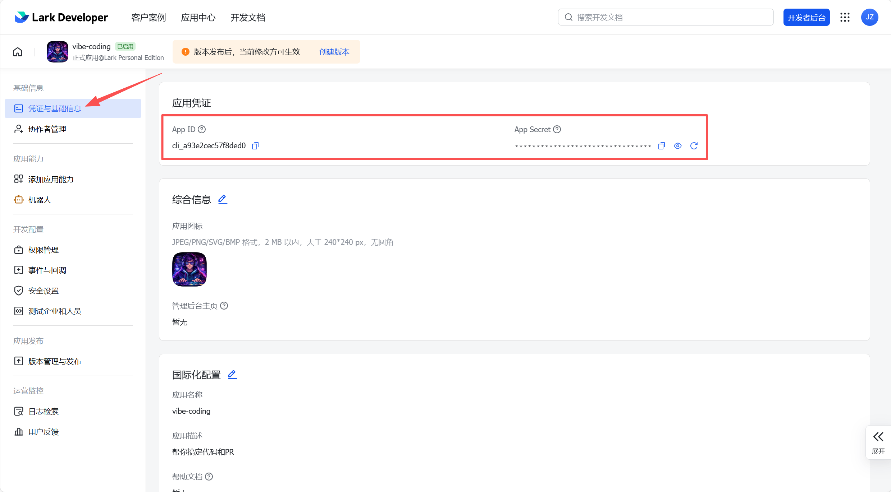
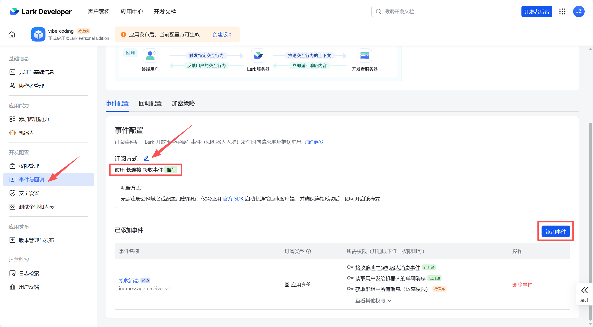
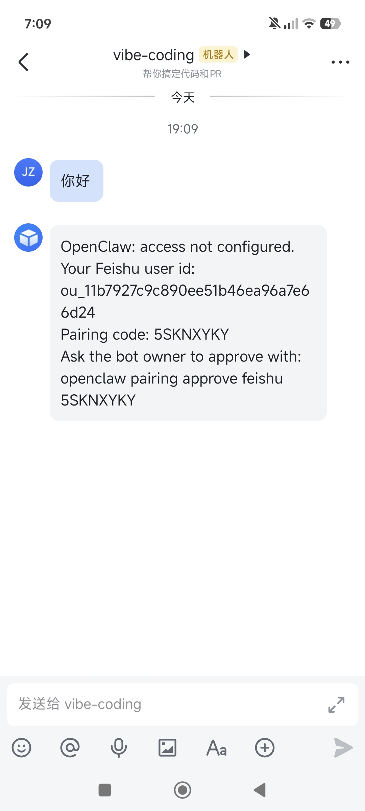

---
prev:
  text: '第3章 初始配置向导'
  link: '/cn/adopt/chapter3'
next:
  text: '第5章 模型管理'
  link: '/cn/adopt/chapter5'
---

# 第四章 聊天平台接入

接完这章，你就能在手机上跟龙虾对话了。

> **AutoClaw 用户**：飞书扫码即完成接入，[可跳过本章](/cn/adopt/chapter1/)。

## 0. 支持哪些聊天平台？

OpenClaw 支持几乎所有主流聊天软件，文字消息全渠道可用。

| 渠道 | 说明 | 安装方式 |
|------|------|---------|
| **飞书 / Lark** | WebSocket 长连接；企业协作首选 | 内置 |
| **WhatsApp** | 全球最流行；Baileys 库，需 QR 配对 | 内置 |
| **Telegram** | Bot API（grammY）；支持群聊，API 最开放 | 内置 |
| **Discord** | Bot API + Gateway；服务器、频道、私信 | 内置 |
| **Slack** | Bolt SDK；工作区应用 | 内置 |
| **Signal** | signal-cli；注重隐私 | 内置 |
| **Google Chat** | Google Chat API；HTTP webhook | 内置 |
| **iMessage** | BlueBubbles（推荐）或旧版 imsg CLI | 内置 |
| **IRC** | 经典 IRC 服务器；频道 + 私信 | 内置 |
| **WebChat** | Gateway 内置 Web 聊天界面 | 内置 |
| **QQ** | QQ 开放平台 Bot API | 插件 |
| **LINE** | LINE Messaging API | 插件 |
| **Matrix** | Matrix 开放协议 | 插件 |
| **Mattermost** | Bot API + WebSocket | 插件 |
| **Microsoft Teams** | Bot Framework；企业支持 | 插件 |
| **Nostr** | 去中心化协议 NIP-04 | 插件 |
| **Twitch** | IRC 连接 | 插件 |
| **Zalo** | Zalo Bot API（越南） | 插件 |

<details>
<summary>多个平台可以同时接入吗？</summary>

可以。OpenClaw 会按来源自动路由消息，飞书处理工作、Telegram 做个人助理，共享同一个 AI 大脑。

</details>

本章以**飞书**为例——国内办公场景首选，深度集成文档、日历、多维表格，Telegram 配置更简单但国内需代理。

## 1. 前置准备

- 已完成 [第二章](/cn/adopt/chapter2/) 的安装（`openclaw status` 显示正常）
- 拥有飞书账号（个人账号即可，无需企业管理员权限）

## 2. 创建飞书应用

### 第一步：登录飞书开放平台

访问 [飞书开放平台](https://open.feishu.cn/app)，使用飞书账号登录。


<details>
<summary>用的是国际版 Lark？</summary>

访问 [Lark Open Platform](https://open.larksuite.com/app)，后续配置中需设置 `domain: "lark"`。

</details>

### 第二步：创建企业自建应用

点击"创建企业自建应用"，填写名称（如"OpenClaw 助理"）和描述，点击"创建"。

### 第三步：获取应用凭证

进入"凭证与基础信息"，复制 **App ID**（格式 `cli_xxx`）和 **App Secret**，妥善保存。



### 第四步：启用机器人能力

进入"添加应用能力" → "机器人"，点击"添加"。


> **必须先做这步**：否则下一步导入权限时，消息相关权限无法开通。

### 第五步：配置权限

进入"权限管理"，点击"批量导入"，粘贴下方 JSON：


```json
{
  "scopes": {
    "tenant": [
      "application:application:self_manage",
      "application:bot.menu:write",
      "cardkit:card:read",
      "cardkit:card:write",
      "contact:contact.base:readonly",
      "contact:user.employee_id:readonly",
      "docs:document.content:read",
      "docx:document:readonly",
      "event:ip_list",
      "im:chat",
      "im:chat.members:bot_access",
      "im:chat:read",
      "im:chat:update",
      "im:message",
      "im:message.group_at_msg:readonly",
      "im:message.group_msg",
      "im:message.p2p_msg:readonly",
      "im:message.pins:read",
      "im:message.pins:write_only",
      "im:message.reactions:read",
      "im:message.reactions:write_only",
      "im:message:readonly",
      "im:message:recall",
      "im:message:send_as_bot",
      "im:message:send_multi_users",
      "im:message:send_sys_msg",
      "im:message:update",
      "im:resource",
      "sheets:spreadsheet",
      "wiki:wiki:readonly"
    ],
    "user": [
      "base:app:copy",
      "base:app:create",
      "base:app:read",
      "base:app:update",
      "base:field:create",
      "base:field:delete",
      "base:field:read",
      "base:field:update",
      "base:record:create",
      "base:record:delete",
      "base:record:retrieve",
      "base:record:update",
      "base:table:create",
      "base:table:delete",
      "base:table:read",
      "base:table:update",
      "base:view:read",
      "base:view:write_only",
      "board:whiteboard:node:create",
      "board:whiteboard:node:read",
      "calendar:calendar.event:create",
      "calendar:calendar.event:delete",
      "calendar:calendar.event:read",
      "calendar:calendar.event:reply",
      "calendar:calendar.event:update",
      "calendar:calendar.free_busy:read",
      "calendar:calendar:read",
      "contact:contact.base:readonly",
      "contact:user.base:readonly",
      "contact:user.employee_id:readonly",
      "contact:user:search",
      "docs:document.comment:create",
      "docs:document.comment:read",
      "docs:document.comment:update",
      "docs:document.media:download",
      "docs:document:copy",
      "docx:document:create",
      "docx:document:readonly",
      "docx:document:write_only",
      "drive:drive.metadata:readonly",
      "drive:file:download",
      "drive:file:upload",
      "im:chat.members:read",
      "im:chat:read",
      "im:message",
      "im:message.group_msg:get_as_user",
      "im:message.p2p_msg:get_as_user",
      "im:message:readonly",
      "offline_access",
      "search:docs:read",
      "search:message",
      "space:document:delete",
      "space:document:move",
      "space:document:retrieve",
      "task:comment:read",
      "task:comment:write",
      "task:task:read",
      "task:task:write",
      "task:task:writeonly",
      "task:tasklist:read",
      "task:tasklist:write",
      "wiki:node:copy",
      "wiki:node:create",
      "wiki:node:move",
      "wiki:node:read",
      "wiki:node:retrieve",
      "wiki:space:read",
      "wiki:space:retrieve",
      "wiki:space:write_only"
    ]
  }
}
```

> 这一包权限涵盖消息收发、云文档、多维表格、日历、任务等完整能力。

<details>
<summary>这些权限分别做什么？</summary>

| 权限类别 | 代表权限 | 用途 |
|---------|---------|------|
| **应用管理（application:）** | `application:application:self_manage`、`application:bot.menu:write` | 应用自管理、机器人菜单配置 |
| **消息卡片（cardkit:）** | `cardkit:card:read`、`cardkit:card:write` | 读写消息卡片 |
| **消息（im:）** | `im:message`、`im:message:send_as_bot`、`im:resource` | 收发消息、图片、文件 |
| **群聊（im:chat）** | `im:chat`、`im:chat.members:bot_access` | 群聊管理、成员访问 |
| **联系人（contact:）** | `contact:user.base:readonly`、`contact:user.employee_id:readonly` | 获取用户基础信息 |
| **云文档（docx:/docs:）** | `docx:document:create`、`docs:document.content:read` | 创建和读取飞书文档 |
| **电子表格（sheets:）** | `sheets:spreadsheet` | 操作飞书电子表格 |
| **多维表格（base:）** | `base:record:create`、`base:table:read` | 操作多维表格数据 |
| **日历（calendar:）** | `calendar:calendar.event:create`、`calendar:calendar.event:read` | 管理日程 |
| **任务（task:）** | `task:task:read`、`task:task:write` | 创建和管理飞书任务 |
| **知识库（wiki:）** | `wiki:node:read`、`wiki:wiki:readonly` | 读写飞书知识库 |
| **云空间（drive:/space:）** | `drive:file:upload`、`drive:file:download` | 上传下载文件 |
| **白板（board:）** | `board:whiteboard:node:create`、`board:whiteboard:node:read` | 读写飞书白板 |
| **搜索（search:）** | `search:docs:read`、`search:message` | 搜索文档和消息 |
| **事件（event:）** | `event:ip_list` | 事件推送 IP 白名单 |

如果你只需要基础聊天功能，最少只需 `im:message`、`im:message.p2p_msg:readonly`、`im:message.group_at_msg:readonly`、`im:message:send_as_bot`、`im:resource` 这几个消息相关权限即可。但建议导入完整权限以获得最佳体验。

</details>

导入后点击"申请开通"确认。企业管理员可直接通过，否则需联系管理员审核。

### 第六步：配置事件订阅

> **注意顺序**：请先完成下方[第 3 步](#_3-在-openclaw-中添加飞书渠道)（添加渠道并启动网关），再回来做这一步，否则长连接保存会失败。

进入"事件与回调" → "事件配置"：



1. 选择"**使用长连接接收事件**"
2. 添加事件：`im.message.receive_v1`

<details>
<summary>为什么用长连接而不是 Webhook？</summary>

Webhook 需要公网 IP，长连接（WebSocket）由 OpenClaw 主动连飞书——不需要公网 IP、不需要域名、家用网络就能用。

</details>

### 第七步：发布应用

进入"版本管理与发布"，点击"创建版本"，填写版本号后提交发布申请。管理员审批通过即生效（你本人是管理员可直接通过）。


## 3. 在 OpenClaw 中添加飞书渠道

回到终端，运行：

```bash
openclaw channels add
```

选择"Feishu/Lark"，输入 App ID 和 App Secret，其余保持默认。添加后重启网关：

```bash
openclaw gateway restart
openclaw gateway status
```

<details>
<summary>手动编辑配置文件（高级）</summary>

编辑 `~/.openclaw/openclaw.json`（Windows：`C:\Users\你的用户名\.openclaw\openclaw.json`）：

```json
{
  "channels": {
    "feishu": {
      "enabled": true,
      "connectionMode": "websocket",
      "dmPolicy": "pairing",
      "accounts": {
        "main": {
          "appId": "cli_xxx",
          "appSecret": "你的App Secret"
        }
      }
    }
  }
}
```

修改后运行 `openclaw gateway restart` 生效。

</details>

> 完成这步后，回到飞书开放平台完成[第六步（事件订阅）](#第六步-配置事件订阅)。

## 4. 配对与首次对话

在飞书中找到你的机器人，发送"你好"。机器人会回复一个 **8 位配对码**：



<details>
<summary>为什么要配对？</summary>

防止陌生人滥用你的机器人——每次对话都消耗你的 API 额度。新用户第一次发消息时会收到配对码，只有你批准后才能正常对话。配对码 1 小时过期。

</details>

在终端批准：

```bash
openclaw pairing approve feishu <配对码>
```

例如：`openclaw pairing approve feishu 6KKG7C7K`。也可在 Web 控制面板（`openclaw dashboard`）中点击批准。

配对成功后，飞书里的龙虾就能回你了。试试：

```
你好，请介绍一下你自己
```

## 5. 群聊中使用

把机器人拉进飞书群，**@机器人** 触发回复。

<details>
<summary>群聊访问控制</summary>

OpenClaw 通过 `groupPolicy` 控制群聊行为：

| 策略 | 行为 |
|------|------|
| `"open"` | 允许所有群聊，仍需 @提及才回复 |
| `"allowlist"` | 仅允许白名单中的群（默认） |
| `"disabled"` | 禁用所有群聊消息 |

配置示例：

```bash
# 允许所有群聊
openclaw config set channels.feishu.groupPolicy "open"

# 设置某个群不需要@就回复
openclaw config set channels.feishu.groups.<群ID>.requireMention false
```

群聊中每个群拥有独立的会话——群里的对话不会影响你和机器人的私聊记录。

</details>

<details>
<summary>私聊访问策略（dmPolicy）</summary>

`dmPolicy` 控制谁能通过私聊使用你的机器人：

| 策略 | 行为 |
|------|------|
| `"pairing"` | 默认。新用户需配对码批准 |
| `"allowlist"` | 仅允许 `allowFrom` 列表中的用户 |
| `"open"` | 允许所有人（需在 `allowFrom` 中设置 `"*"`） |
| `"disabled"` | 禁用私聊 |

</details>

## 6. 常见问题

**事件订阅保存失败？**

先确认网关已运行（`openclaw gateway status`）。长连接模式要求网关在线才能注册。

**机器人没有回复？**

按顺序排查：
1. `openclaw status` — 网关是否运行
2. `openclaw pairing list feishu` — 是否已完成配对
3. `openclaw logs --follow` — 查看实时日志定位错误
4. `openclaw gateway restart` — 重启重试

**权限审核不通过？**

你本人是管理员的话，进入飞书管理后台 → "工作台" → "应用审核"，找到应用点击"通过"。


**配置修改后不生效？**

`openclaw gateway restart`。更多配置项见[附录 G](/cn/appendix/appendix-g)。

**群聊 @了机器人没反应？**

检查 `groupPolicy` 是否为 `"disabled"` 或 `"allowlist"`（后者需将群 ID 加入白名单）。
