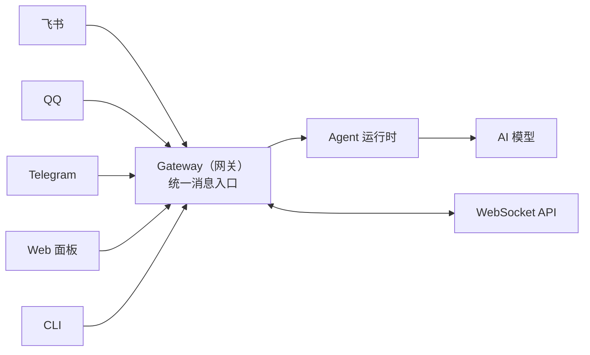

---
prev:
  text: '第5章 模型管理'
  link: '/cn/adopt/chapter5'
next:
  text: '第7章 工具与定时任务'
  link: '/cn/adopt/chapter7'
---

# 第六章 智能体管理

> 本章深入介绍 OpenClaw 的智能体（Agent）系统——龙虾的"大脑"是如何工作的。完成后你将理解网关架构、Agent 运行时、会话管理、记忆系统、多 Agent 路由等核心概念，并能根据需求调整配置。

> **AutoClaw 用户提示**：[AutoClaw](/cn/adopt/chapter1/) 已预配置好 Agent 运行时，开箱即用。本章帮助你理解背后的工作原理，以及如何进阶调整。

## 0. 什么是 Agent？

在 OpenClaw 的世界里，**Agent（智能体）就是你的龙虾本身**——它有自己的"大脑"（AI 模型）、"双手"（工具，见[第七章](/cn/adopt/chapter7/)）、"记忆"（工作区文件）和"性格"（人设文件）。

一个 Agent 包含：

| 组成部分 | 说明 | 文件位置 |
|---------|------|---------|
| **工作区** | 龙虾的"家"，存放人设、记忆、技能 | `~/.openclaw/workspace` |
| **会话** | 对话记录，每个聊天窗口一个 | `~/.openclaw/agents/<id>/sessions/` |
| **认证** | API 密钥、OAuth 令牌 | `~/.openclaw/agents/<id>/agent/` |
| **配置** | 模型、工具、行为规则 | `~/.openclaw/openclaw.json` |

> **Windows 用户**：`~/` 在 Windows 上是 `C:\Users\你的用户名\`，所以 `~/.openclaw/workspace` 就是 `C:\Users\你的用户名\.openclaw\workspace`。

简单来说：**一个 Agent = 一个独立的 AI 助手实例**，有自己的记忆、性格和能力边界。默认情况下 OpenClaw 运行一个 Agent（id 为 `main`），但你也可以创建多个 Agent 来服务不同场景（后文详述）。

## 1. 网关架构（Gateway）


Gateway（网关）是 OpenClaw 的"中枢"，是一个常驻后台运行的服务。所有消息——无论来自飞书、QQ、Telegram 还是 Web 面板——都经过 Gateway 统一处理。



### 核心职责

- **维护聊天平台连接**：保持与各平台的长连接
- **消息路由**：将消息分发给对应的 Agent
- **WebSocket API**：为客户端（macOS App、CLI、Web 面板）提供实时通信
- **定时任务**：执行 Cron 调度的任务

### 基本操作

```bash
# 查看 Gateway 状态
openclaw gateway status

# 重启（修改配置后需要）
openclaw gateway restart

# 查看运行状态
openclaw status
```

> **记住**：修改 `openclaw.json` 后，几乎都需要运行 `openclaw gateway restart` 才能生效。

<details>
<summary>Gateway 的连接协议</summary>

Gateway 使用 WebSocket 通信，默认监听 `127.0.0.1:18789`（仅本机可访问）。

**连接流程**：
1. 客户端发送 `connect` 请求（WebSocket 的第一帧必须是 `connect`）
2. Gateway 返回 `hello-ok`，包含健康状态和在线信息
3. 之后可以收发请求和事件

**通信格式**：
- 请求：`{type:"req", id, method, params}` → 响应：`{type:"res", id, ok, payload}`
- 事件（服务器推送）：`{type:"event", event, payload}`

**安全认证**：
- 如果设置了 `OPENCLAW_GATEWAY_TOKEN`（或 `--token`），连接时必须提供匹配的 token
- 新设备需要配对审批，Gateway 会签发设备令牌供后续连接使用
- 本地连接（loopback）可以自动批准，远程连接需要显式审批

**远程访问**：
- 推荐方式：Tailscale 或 VPN
- 备选方式：SSH 隧道
  ```bash
  ssh -N -L 18789:127.0.0.1:18789 user@host
  ```

</details>

<details>
<summary>Gateway 的节点（Node）系统</summary>

除了聊天客户端，Gateway 还支持"节点"连接——物理设备（手机、平板、桌面端）通过 WebSocket 以 `role: node` 身份接入。

节点可以提供：
- `camera.*`：拍照
- `screen.record`：录屏
- `location.get`：获取位置
- `canvas.*`：在设备上展示画布内容

节点需要声明自己的能力（`caps`）和支持的命令（`commands`），配对方式与普通客户端相同（设备级配对审批）。

</details>

## 2. Agent 工作区

工作区（Workspace）是龙虾的"家"——它的身份、性格、记忆、技能全都存放在这里。

### 2.1 默认位置

```
~/.openclaw/workspace/
```

如果设置了 `OPENCLAW_PROFILE`（非 `default`），则默认位置变为 `~/.openclaw/workspace-<profile>`。

### 2.2 工作区文件一览

| 文件 | 用途 | 加载时机 |
|------|------|---------|
| `AGENTS.md` | 操作指令：告诉龙虾"怎么做事"和如何使用记忆 | 每次会话开始 |
| `SOUL.md` | 人设：性格、语气、边界 | 每次会话开始 |
| `USER.md` | 用户资料：你是谁、怎么称呼你 | 每次会话开始 |
| `IDENTITY.md` | 龙虾身份：名字、风格、表情符号 | 每次会话开始 |
| `TOOLS.md` | 工具使用备注（不控制工具开关，只是使用建议） | 每次会话开始 |
| `HEARTBEAT.md` | 心跳任务清单（可选，保持简短） | 心跳运行时 |
| `BOOT.md` | 启动清单（可选，Gateway 重启时执行） | Gateway 启动时 |
| `BOOTSTRAP.md` | 首次引导仪式（完成后删除） | 仅首次运行 |
| `MEMORY.md` | 长期记忆（可选） | 仅主会话 |
| `memory/YYYY-MM-DD.md` | 每日记忆日志 | 按需读取 |
| `skills/` | 工作区级技能（可选） | 按需加载 |

> **重要**：这些文件在每次对话时都会注入到 AI 模型的上下文窗口中，**会消耗 Token**。保持文件简洁，尤其是 `MEMORY.md`——它会随时间增长，导致上下文使用量增大和更频繁的压缩。

> `memory/YYYY-MM-DD.md` 每日文件**不会**自动注入，而是通过 `memory_search` 和 `memory_get` 工具按需访问，不占用上下文窗口。

<details>
<summary>工作区文件注入规则</summary>

- 空文件会被跳过
- 大文件会被截断并标注 `[truncated]`
  - 单文件上限：`agents.defaults.bootstrapMaxChars`（默认 20,000 字符）
  - 所有文件总上限：`agents.defaults.bootstrapTotalMaxChars`（默认 150,000 字符）
- 缺失的文件会注入一行 "missing file" 标记
- 子 Agent 会话只注入 `AGENTS.md` 和 `TOOLS.md`（其他文件被过滤以保持子 Agent 上下文精简）
- 截断时可注入警告，通过 `agents.defaults.bootstrapPromptTruncationWarning` 控制（`off` / `once` / `always`，默认 `once`）

运行 `/context list` 或 `/context detail` 可以查看每个文件的原始大小 vs 注入大小、是否被截断。

</details>

<details>
<summary>工作区的安全边界</summary>

工作区是默认的工作目录（`cwd`），**但不是硬沙盒**。工具解析相对路径时会基于工作区，但绝对路径仍然可以访问主机上的其他位置。

如果你需要严格隔离，使用沙盒模式：
```json
{
  "agents": {
    "defaults": {
      "sandbox": {
        "mode": "all",
        "scope": "agent"
      }
    }
  }
}
```

启用沙盒后，工具会在 `~/.openclaw/sandboxes` 下的隔离目录中操作，而非主机工作区。

</details>

<details>
<summary>工作区 Git 备份（推荐）</summary>

建议将工作区放入私有 Git 仓库备份：

```bash
# 初始化
cd ~/.openclaw/workspace
git init
git add AGENTS.md SOUL.md TOOLS.md IDENTITY.md USER.md HEARTBEAT.md memory/
git commit -m "Add agent workspace"

# 添加远程仓库（GitHub CLI）
gh repo create openclaw-workspace --private --source . --remote origin --push

# 日常更新
git add .
git commit -m "Update memory"
git push
```

**不要提交**：API 密钥、OAuth 令牌、`~/.openclaw/` 下的任何内容。

建议的 `.gitignore`：
```
.DS_Store
.env
**/*.key
**/*.pem
**/secrets*
```

</details>

### 2.3 哪些不在工作区

以下内容存储在 `~/.openclaw/` 下，不在工作区中：

| 路径 | 内容 |
|------|------|
| `~/.openclaw/openclaw.json` | 全局配置 |
| `~/.openclaw/credentials/` | OAuth 令牌、API 密钥 |
| `~/.openclaw/agents/<id>/sessions/` | 会话记录 |
| `~/.openclaw/skills/` | 共享级技能 |

> 如果你需要迁移到新机器，配置和会话需要单独复制。

## 3. 首次启动：引导仪式

首次运行 Agent 时，OpenClaw 会执行一个**引导仪式（Bootstrapping）**——一个简短的问答过程，帮助龙虾了解"它是谁"和"你是谁"。

### 引导过程

1. 在工作区中创建 `AGENTS.md`、`BOOTSTRAP.md`、`IDENTITY.md`、`USER.md`
2. 运行一轮简短的问答（每次一个问题）
3. 将你的回答写入 `IDENTITY.md`、`USER.md`、`SOUL.md`
4. 完成后自动删除 `BOOTSTRAP.md`（确保只运行一次）

> **引导仪式始终在 Gateway 所在的机器上执行。** 如果你通过 macOS App 连接远程 Gateway，工作区和引导文件都在远程机器上。

如果你已经自行管理工作区文件（比如从另一台机器迁移过来），可以跳过引导：

```json
{
  "agent": {
    "skipBootstrap": true
  }
}
```

也可以随时运行 `openclaw setup` 重建缺失的默认文件（不会覆盖已有文件）。

## 4. Agent 循环：从消息到回复

当你发送一条消息时，龙虾是如何处理并回复的？这个过程叫做 **Agent 循环（Agent Loop）**。

### 4.1 高层流程

```
你的消息
  → 路由（找到对应的 Agent 和会话）
  → 排队（如果正在处理另一条消息）
  → Agent 运行
      → 组装上下文（系统提示词 + 历史消息 + 工具列表）
      → 发送给 AI 模型
      → 模型思考并决定下一步
      → 执行工具调用（搜索、读写文件等）
      → 流式输出回复
  → 回复发送到聊天平台
```

### 4.2 运行串行化

为了保证会话一致性，**同一个会话中的消息会排队依次处理**，不会并行。这意味着如果龙虾正在处理你的上一条消息，新消息会进入队列等待。

> 不同会话（比如不同群聊）之间是并行的。通过 `agents.defaults.maxConcurrent`（默认 4）控制最大并行数。

<details>
<summary>Agent 运行的详细步骤</summary>

1. **验证请求**：检查参数、解析会话键
2. **解析模型**：确定使用哪个模型和认证信息
3. **加载技能**：加载技能快照并注入到环境和提示词中
4. **准备工作区**：解析工作区路径，沙盒运行可能重定向到沙盒工作区
5. **构建系统提示词**：组装 OpenClaw 的基础提示词、技能提示词、引导上下文
6. **创建会话**：获取写锁、打开 SessionManager、准备流式输出
7. **执行提示**：调用 `session.prompt()` 驱动完整的 Agent 循环
8. **事件分发**：将 pi-agent-core 的事件（工具调用、文本流、生命周期）桥接到 OpenClaw 的事件流
9. **超时控制**：`agents.defaults.timeoutSeconds`（默认 600 秒）超时后中止运行

Agent 运行返回后，如果还有排队的消息，会继续处理下一条。

</details>

<details>
<summary>钩子系统（Hooks）</summary>

OpenClaw 提供两类钩子，允许你在关键节点插入自定义逻辑：

**内部钩子（Gateway Hooks）**：
- `agent:bootstrap`：引导文件构建前，可修改/替换引导上下文
- 命令钩子：`/new`、`/reset`、`/stop` 等命令事件

**插件钩子**：
- `before_model_resolve`：在模型解析前覆盖 provider/model
- `before_prompt_build`：在提交前注入额外上下文或系统提示
- `agent_end`：运行完成后检查消息列表和元数据
- `before_tool_call` / `after_tool_call`：拦截工具参数/结果
- `message_received` / `message_sending` / `message_sent`：消息生命周期
- `session_start` / `session_end`：会话边界
- `gateway_start` / `gateway_stop`：网关生命周期

</details>

### 4.3 超时与中止

| 场景 | 默认值 | 说明 |
|------|--------|------|
| Agent 运行超时 | 600 秒 | 超时后中止运行 |
| `agent.wait` 等待超时 | 30 秒 | 仅等待超时，不会停止 Agent |

发送 `/stop` 可以中止当前运行、清除该会话的排队消息，并停止它派生的子 Agent。

## 5. 系统提示词与上下文

### 5.1 系统提示词

每次 Agent 运行时，OpenClaw 都会构建一个自定义系统提示词——这是龙虾"看到"的第一段指令。

系统提示词包含以下部分：

| 部分 | 内容 |
|------|------|
| **工具列表** | 当前可用工具 + 简短描述 |
| **安全守则** | 避免越权行为的提醒 |
| **技能列表** | 可用技能的名称、描述和文件路径（模型需要时会读取 SKILL.md） |
| **工作区** | 工作目录路径 |
| **文档** | 本地 OpenClaw 文档路径 |
| **日期时间** | 用户时区 |
| **运行时信息** | 主机、操作系统、模型、思考级别 |
| **引导文件** | AGENTS.md、SOUL.md 等文件内容（注入到"项目上下文"中） |

> **安全守则是建议性的**，它引导模型行为但不强制执行策略。真正的硬限制来自工具策略、exec 审批、沙盒和渠道白名单。

<details>
<summary>提示词模式</summary>

OpenClaw 支持三种提示词模式（由运行时自动设置，非用户配置）：

| 模式 | 适用场景 | 包含内容 |
|------|---------|---------|
| `full` | 默认 | 所有部分 |
| `minimal` | 子 Agent | 省略技能、记忆召回、自更新、用户身份、心跳等 |
| `none` | 最小化 | 仅基础身份行 |

`minimal` 模式下，注入的额外提示标注为"Subagent Context"而非"Group Chat Context"。

</details>

<details>
<summary>时间处理</summary>

系统提示词中包含"当前日期与时间"部分（前提是已知用户时区）。为了保持提示词缓存稳定，只包含时区信息而非动态时钟。

当 Agent 需要当前时间时，使用 `session_status` 工具（返回包含时间戳的状态卡片）。

配置项：
- `agents.defaults.userTimezone`：用户时区
- `agents.defaults.timeFormat`：时间格式（`auto` / `12` / `24`）

</details>

### 5.2 上下文窗口

**上下文（Context）是 OpenClaw 发送给模型的全部内容**，受限于模型的上下文窗口（Token 上限）。

上下文包含：
- 系统提示词（所有部分）
- 对话历史（你的消息 + 龙虾的回复）
- 工具调用与结果
- 附件（图片、音频、文件）
- 压缩摘要（如果发生过压缩）

> **上下文 ≠ 记忆**。记忆存储在磁盘上，可以跨会话加载；上下文是模型当前窗口中的内容。

### 5.3 查看上下文使用情况

在对话中发送以下命令：

| 命令 | 作用 |
|------|------|
| `/status` | 快速查看上下文使用率 + 会话设置 |
| `/context list` | 查看注入的文件和大致大小 |
| `/context detail` | 详细分解：每个文件、工具 Schema、技能条目的大小 |
| `/usage tokens` | 在每次回复后追加 Token 使用量 |

<details>
<summary>上下文消耗的两大隐形成本</summary>

**技能列表**：系统提示词中的技能列表（名称 + 描述 + 路径）有实际开销。技能的详细指令不会默认包含——模型在需要时才会读取 `SKILL.md`。

**工具 Schema**：工具影响上下文的两个方面：
1. 系统提示词中的工具列表文本（你能看到的部分）
2. 工具 Schema（JSON 格式，发送给模型以便调用工具，看不见但占用空间）

`/context detail` 会列出最大的工具 Schema，让你知道哪些工具占用最多空间。例如 `browser` 工具的 Schema 通常约 2,500 Token。

</details>

## 6. 会话管理

会话（Session）是龙虾与你（或一个群聊）之间的对话记录。

### 6.1 会话键（Session Key）

OpenClaw 用 **会话键** 来区分不同的对话：

| 来源 | 会话键格式 | 说明 |
|------|-----------|------|
| 私聊（默认） | `agent:main:main` | 所有私聊共享一个会话 |
| 群聊 | `agent:main:<channel>:group:<id>` | 每个群独立 |
| Cron 任务 | `cron:<job.id>` | 每次运行独立会话 |
| 子 Agent | `agent:main:subagent:<uuid>` | 隔离的子任务 |

### 6.2 私聊隔离（dmScope）

默认情况下，**所有私聊共享同一个会话**（`dmScope: "main"`）。这对单人使用很方便——你在飞书和 QQ 发消息，龙虾能记住上下文。

但如果**多个人**可以私聊你的龙虾，这就有隐私风险了：

> **安全警告**：假设 Alice 和 Bob 都能私聊你的龙虾。Alice 聊了一个隐私话题，Bob 接着问"我们刚才在聊什么？"——由于共享会话，模型可能会用 Alice 的内容回答 Bob。

**修复方法**：设置 `dmScope` 隔离每个人的会话：

```json
{
  "session": {
    "dmScope": "per-channel-peer"
  }
}
```

| 模式 | 说明 | 适用场景 |
|------|------|---------|
| `main` | 所有私聊共享主会话 | 只有你一个人使用 |
| `per-peer` | 按发送者隔离 | 多人使用，跨渠道合并同一人 |
| `per-channel-peer` | 按渠道 + 发送者隔离 | **推荐**——多人使用 |
| `per-account-channel-peer` | 按账号 + 渠道 + 发送者隔离 | 多账号多人场景 |

> 运行 `openclaw security audit` 可以检查你的 DM 安全设置。

<details>
<summary>身份关联（identityLinks）</summary>

如果同一个人在多个平台联系你的龙虾（比如 Telegram 和 Discord），你可以用 `identityLinks` 把他们的身份关联起来，让他们共享同一个私聊会话：

```json
{
  "session": {
    "dmScope": "per-channel-peer",
    "identityLinks": {
      "alice": ["telegram:123456789", "discord:987654321012345678"]
    }
  }
}
```

这样 Alice 无论从 Telegram 还是 Discord 发消息，都在同一个会话中。

</details>

### 6.3 会话生命周期

会话不会永远持续——它们会按策略重置。

**默认行为**：每天凌晨 4:00（Gateway 所在机器的本地时间）自动重置。下次发消息时开始新会话。

```json
{
  "session": {
    "reset": {
      "mode": "daily",
      "atHour": 4,
      "idleMinutes": 120
    }
  }
}
```

| 重置触发 | 说明 |
|---------|------|
| 每日重置 | 默认凌晨 4:00，上次更新早于该时间的会话视为过期 |
| 空闲重置 | 可选，空闲超过 N 分钟后重置（与每日重置取先到期者） |
| 手动重置 | 发送 `/new` 或 `/reset` 开始新会话 |

> `/new <model>` 还可以在重置的同时切换模型，例如 `/new Opus`。

<details>
<summary>按类型 / 按渠道自定义重置策略</summary>

可以为不同类型的会话（私聊、群聊、线程）和不同渠道设置不同的重置策略：

```json
{
  "session": {
    "resetByType": {
      "direct": { "mode": "idle", "idleMinutes": 240 },
      "group": { "mode": "idle", "idleMinutes": 120 },
      "thread": { "mode": "daily", "atHour": 4 }
    },
    "resetByChannel": {
      "discord": { "mode": "idle", "idleMinutes": 10080 }
    }
  }
}
```

`resetByChannel` 优先级高于 `reset` / `resetByType`。

</details>

### 6.4 会话存储与维护

会话记录存储为 JSONL 文件：
```
~/.openclaw/agents/<agentId>/sessions/<SessionId>.jsonl
```

OpenClaw 会自动维护会话存储，防止无限增长：

| 配置项 | 默认值 | 说明 |
|--------|--------|------|
| `session.maintenance.mode` | `warn` | `warn` 仅报告，`enforce` 自动清理 |
| `session.maintenance.pruneAfter` | `30d` | 清理超过 30 天的旧会话 |
| `session.maintenance.maxEntries` | `500` | 最多保留 500 个会话条目 |
| `session.maintenance.rotateBytes` | `10mb` | sessions.json 超过此大小时轮转 |

> **生产环境建议**：将 `mode` 设为 `enforce`，同时设置时间和数量限制。运行 `openclaw sessions cleanup --dry-run` 可以预览清理效果。

<details>
<summary>高级会话维护配置</summary>

**启用磁盘预算**（限制会话目录总大小）：
```json
{
  "session": {
    "maintenance": {
      "mode": "enforce",
      "maxDiskBytes": "1gb",
      "highWaterBytes": "800mb"
    }
  }
}
```

**大规模部署示例**：
```json
{
  "session": {
    "maintenance": {
      "mode": "enforce",
      "pruneAfter": "14d",
      "maxEntries": 2000,
      "rotateBytes": "25mb",
      "maxDiskBytes": "2gb",
      "highWaterBytes": "1.6gb"
    }
  }
}
```

CLI 命令：
```bash
# 预览清理效果
openclaw sessions cleanup --dry-run

# 执行清理
openclaw sessions cleanup --enforce
```

</details>

<details>
<summary>会话检查命令</summary>

| 命令 | 说明 |
|------|------|
| `openclaw status` | 查看会话存储路径和最近会话 |
| `openclaw sessions --json` | 导出所有会话条目 |
| `/status`（在聊天中发送） | 查看上下文使用率、当前设置 |
| `/context list`（在聊天中发送） | 查看系统提示词和注入文件 |
| `/stop`（在聊天中发送） | 中止当前运行并清除排队消息 |
| `/compact`（在聊天中发送） | 压缩旧上下文以释放窗口空间 |

</details>

### 6.5 会话工具

Agent 可以通过内置工具管理和跨会话通信：

| 工具 | 功能 |
|------|------|
| `sessions_list` | 列出所有会话 |
| `sessions_history` | 获取某个会话的对话记录 |
| `sessions_send` | 向另一个会话发送消息（支持等待回复） |
| `sessions_spawn` | 派生子 Agent 执行隔离任务 |

<details>
<summary>sessions_send 的工作方式</summary>

`sessions_send` 可以让一个 Agent 向另一个会话发送消息并等待回复：

- `timeoutSeconds = 0`：发完即走（异步），返回 `{ runId, status: "accepted" }`
- `timeoutSeconds > 0`：等待最多 N 秒，返回 `{ runId, status: "ok", reply }`
- 超时则返回 `{ runId, status: "timeout" }`

发送后会触发一个**乒乓循环**：请求方和目标方交替回复，最多 `session.agentToAgent.maxPingPongTurns` 轮（默认 5）。回复 `REPLY_SKIP` 可终止循环。

循环结束后，目标 Agent 会运行一个"宣告"步骤，将结果发送到目标渠道。回复 `ANNOUNCE_SKIP` 可以静默处理。

</details>

<details>
<summary>sessions_spawn 的工作方式</summary>

`sessions_spawn` 派生一个子 Agent 在隔离会话中执行任务：

```
参数：
- task（必填）：任务描述
- label（可选）：标签
- model（可选）：覆盖模型
- thinking（可选）：覆盖思考级别
- runTimeoutSeconds（可选）：子 Agent 超时时间
- thread（可选）：绑定到线程
- cleanup（可选）：完成后是否删除（delete/keep，默认 keep）
- sandbox（可选）：inherit/require
- attachments（可选）：附件数组
```

子 Agent 的限制：
- 默认拥有完整工具集，但不包含会话工具
- 不能调用 `sessions_spawn`（不允许嵌套派生）
- 通过 `agents.list[].subagents.allowAgents` 控制可跨 Agent 派生
- 完成后自动归档（默认 60 分钟后）

</details>

## 7. 记忆系统

OpenClaw 的记忆是**纯 Markdown 文件**——文件就是真相来源，模型只"记住"被写到磁盘上的内容。

### 7.1 两层记忆

| 文件 | 用途 | 更新频率 |
|------|------|---------|
| `memory/YYYY-MM-DD.md` | 每日日志（追加写入） | 每天 |
| `MEMORY.md` | 精选长期记忆 | 不定期 |

### 7.2 何时写记忆

- **决策、偏好、持久事实** → 写入 `MEMORY.md`
- **日常笔记、运行上下文** → 写入 `memory/YYYY-MM-DD.md`
- 如果有人说"记住这个"，龙虾应该**立即写到文件中**（不要只放在"脑子里"）

> 记忆系统仍在演进中。明确提醒龙虾"把这个记下来"会有帮助。

### 7.3 记忆搜索工具

| 工具 | 功能 |
|------|------|
| `memory_search` | 语义搜索——即使措辞不同也能找到相关记忆 |
| `memory_get` | 读取指定记忆文件的内容 |

### 7.4 自动记忆刷新

当会话接近自动压缩时，OpenClaw 会触发一次**静默记忆刷新**——提醒模型将重要信息写入磁盘，避免压缩后丢失。

```json
{
  "agents": {
    "defaults": {
      "compaction": {
        "memoryFlush": {
          "enabled": true,
          "softThresholdTokens": 4000
        }
      }
    }
  }
}
```

> 这个过程对用户不可见（使用 `NO_REPLY` 静默处理）。

<details>
<summary>向量记忆搜索（语义检索）</summary>

OpenClaw 可以为 `MEMORY.md` 和 `memory/*.md` 构建向量索引，通过语义相似度搜索（即使措辞不同也能匹配）。

**默认启用**，自动监控记忆文件变化。

**嵌入提供商选择**（自动检测顺序）：
1. 本地模型（如果配置了 `memorySearch.local.modelPath`）
2. OpenAI（如果有 API Key）
3. Gemini（如果有 API Key）
4. Voyage / Mistral（如果有 API Key）
5. Ollama（需手动指定 `provider: "ollama"`）

**配置示例**（使用 Gemini 嵌入）：
```json
{
  "agents": {
    "defaults": {
      "memorySearch": {
        "provider": "gemini",
        "model": "gemini-embedding-001",
        "remote": {
          "apiKey": "你的 Gemini API Key"
        }
      }
    }
  }
}
```

**混合搜索（BM25 + 向量）**：
结合语义匹配（"这段话意思相近"）和关键词匹配（精确的 ID、代码符号、错误信息），提供更全面的搜索结果。

```json
{
  "agents": {
    "defaults": {
      "memorySearch": {
        "query": {
          "hybrid": {
            "enabled": true,
            "vectorWeight": 0.7,
            "textWeight": 0.3
          }
        }
      }
    }
  }
}
```

</details>

<details>
<summary>高级记忆搜索配置</summary>

**MMR 去重（减少重复结果）**：

当搜索结果中有多个近似重复的笔记时（常见于每日日志重复记录同一主题），启用 MMR 可以提高结果多样性：

```json
{
  "agents": {
    "defaults": {
      "memorySearch": {
        "query": {
          "hybrid": {
            "mmr": {
              "enabled": true,
              "lambda": 0.7
            }
          }
        }
      }
    }
  }
}
```

`lambda`：0 = 最大多样性，1 = 最大相关性，默认 0.7（平衡偏相关）。

**时间衰减（优先近期记忆）**：

对于积累了大量每日笔记的 Agent，旧笔记可能因措辞更好而排名超过昨天的更新。启用时间衰减可以让近期记忆自然排名更高：

```json
{
  "agents": {
    "defaults": {
      "memorySearch": {
        "query": {
          "hybrid": {
            "temporalDecay": {
              "enabled": true,
              "halfLifeDays": 30
            }
          }
        }
      }
    }
  }
}
```

半衰期 30 天的效果：今天 100%、7 天前 84%、30 天前 50%、90 天前 12.5%。

**永久文件不受衰减影响**：`MEMORY.md` 和 `memory/` 下非日期命名的文件（如 `memory/projects.md`）永远保持原始分数。

**额外记忆路径**：
```json
{
  "agents": {
    "defaults": {
      "memorySearch": {
        "extraPaths": ["../team-docs", "/srv/shared-notes/overview.md"]
      }
    }
  }
}
```

</details>

<details>
<summary>QMD 后端（实验性高级搜索）</summary>

QMD 是一个本地优先的搜索引擎，结合 BM25 + 向量 + 重排序，提供更强大的记忆搜索。

**启用方式**：
```json
{
  "memory": {
    "backend": "qmd"
  }
}
```

**前提条件**：
- 安装 QMD CLI：`bun install -g https://github.com/tobi/qmd`
- macOS 需要 `brew install sqlite`（支持扩展的 SQLite）
- QMD 自动从 HuggingFace 下载 GGUF 模型，首次搜索可能较慢
- Windows 建议通过 WSL2 使用

QMD 完全本地运行，Markdown 文件仍然是数据来源。如果 QMD 失败，OpenClaw 自动回退到内置 SQLite 搜索。

</details>

## 8. 上下文压缩与会话修剪

### 8.1 上下文压缩（Compaction）

每个模型都有上下文窗口上限。当对话越来越长，接近窗口极限时，OpenClaw 会**自动压缩**旧的对话——将历史消息总结成一段摘要，只保留最近的消息。

**压缩后的上下文结构**：
```
压缩摘要（旧对话的总结）
+ 最近的消息
+ 当前提问
```

> **自动压缩默认开启。** 你会在 verbose 模式下看到 `🧹 Auto-compaction complete`，或在 `/status` 中看到压缩次数。

**手动压缩**：

```
/compact Focus on decisions and open questions
```

可以附带指令来引导压缩的重点。

<details>
<summary>压缩配置</summary>

```json
{
  "agents": {
    "defaults": {
      "compaction": {
        "model": "openrouter/anthropic/claude-sonnet-4-5",
        "identifierPolicy": "strict"
      }
    }
  }
}
```

- **`model`**：可以为压缩指定不同的模型（比如主模型是小模型时，用更强的模型做压缩总结）
- **`identifierPolicy`**：`strict`（默认，保留标识符）/ `off` / `custom`

</details>

### 8.2 会话修剪（Session Pruning）

修剪与压缩不同：**修剪只是临时裁剪发送给模型的内容，不会修改磁盘上的记录。**

修剪针对的是旧的工具调用结果——它们往往很长（比如 `exec` 输出的一大段日志），但对当前对话已经没有参考价值。

| 对比 | 压缩 | 修剪 |
|------|------|------|
| **作用** | 总结旧对话 | 裁剪旧工具结果 |
| **持久化** | 写入 JSONL | 仅内存中，不改文件 |
| **触发** | 接近上下文上限 | 每次 LLM 调用前 |

<details>
<summary>修剪配置（cache-ttl 模式）</summary>

修剪默认关闭。启用后，当上一次 Anthropic 调用超过 TTL 时，修剪旧工具结果以减少缓存重写成本：

```json
{
  "agents": {
    "defaults": {
      "contextPruning": {
        "mode": "cache-ttl",
        "ttl": "5m"
      }
    }
  }
}
```

**修剪规则**：
- 只修剪 `toolResult` 消息，用户和助手消息不受影响
- 保护最近 `keepLastAssistants`（默认 3）条助手消息之后的工具结果
- 含图片的工具结果不会被修剪
- **软裁剪**：保留头尾，中间插入 `...`
- **硬清除**：替换为 `[Old tool result content cleared]`

**默认参数**：
- `ttl`：5 分钟
- `keepLastAssistants`：3
- `softTrimRatio`：0.3
- `hardClearRatio`：0.5
- `minPrunableToolChars`：50,000
- `softTrim.maxChars`：4,000（头 1,500 + 尾 1,500）

</details>

## 9. 多 Agent 路由

默认情况下 OpenClaw 运行一个 Agent（`main`）。但你可以创建多个 Agent，每个都有独立的工作区、会话、认证和人设——然后通过路由规则将不同的消息分发给不同的 Agent。

### 9.1 什么时候需要多 Agent？

- **多人使用**：家人各有自己的龙虾（独立人设和记忆）
- **多场景**：日常聊天用快速模型、深度工作用 Opus
- **多渠道分离**：WhatsApp 私人助手、Telegram 工作助手
- **安全隔离**：给公开群组的 Agent 限制权限

### 9.2 快速创建

```bash
# 创建一个名为 "work" 的新 Agent
openclaw agents add work

# 查看所有 Agent 和路由绑定
openclaw agents list --bindings
```

每个 Agent 会获得独立的工作区（`~/.openclaw/workspace-<id>`）和会话存储。

### 9.3 路由绑定（Bindings）

通过 `bindings` 配置将消息路由到指定 Agent：

```json
{
  "agents": {
    "list": [
      { "id": "chat", "name": "Everyday", "workspace": "~/.openclaw/workspace-chat" },
      { "id": "opus", "name": "Deep Work", "workspace": "~/.openclaw/workspace-opus" }
    ]
  },
  "bindings": [
    { "agentId": "chat", "match": { "channel": "whatsapp" } },
    { "agentId": "opus", "match": { "channel": "telegram" } }
  ]
}
```

**路由优先级**（最具体的先匹配）：
1. `peer`（精确的私聊/群聊 ID）
2. `parentPeer`（线程继承）
3. `guildId` + `roles`（Discord 角色路由）
4. `guildId` / `teamId`
5. `accountId`（渠道账号）
6. `channel`（渠道级匹配）
7. 回退到默认 Agent

> 同一优先级有多个匹配时，配置中靠前的先生效。

<details>
<summary>路由配置示例集</summary>

**按渠道分流（WhatsApp 日常 + Telegram 深度工作）**：
```json
{
  "bindings": [
    { "agentId": "chat", "match": { "channel": "whatsapp" } },
    { "agentId": "opus", "match": { "channel": "telegram" } }
  ]
}
```

**同一渠道按联系人分流**：
```json
{
  "bindings": [
    {
      "agentId": "opus",
      "match": { "channel": "whatsapp", "peer": { "kind": "direct", "id": "+15551234567" } }
    },
    { "agentId": "chat", "match": { "channel": "whatsapp" } }
  ]
}
```

**为家庭群创建专用 Agent（限制权限）**：
```json
{
  "agents": {
    "list": [
      {
        "id": "family",
        "name": "Family Bot",
        "workspace": "~/.openclaw/workspace-family",
        "tools": {
          "allow": ["exec", "read", "sessions_list", "sessions_history"],
          "deny": ["write", "edit", "browser", "canvas", "cron"]
        }
      }
    ]
  },
  "bindings": [
    {
      "agentId": "family",
      "match": {
        "channel": "whatsapp",
        "peer": { "kind": "group", "id": "120363999999999999@g.us" }
      }
    }
  ]
}
```

**多渠道账号（每个平台多个机器人）**：

Discord 多机器人：
```json
{
  "bindings": [
    { "agentId": "main", "match": { "channel": "discord", "accountId": "default" } },
    { "agentId": "coding", "match": { "channel": "discord", "accountId": "coding" } }
  ],
  "channels": {
    "discord": {
      "accounts": {
        "default": { "token": "DISCORD_BOT_TOKEN_MAIN" },
        "coding": { "token": "DISCORD_BOT_TOKEN_CODING" }
      }
    }
  }
}
```

WhatsApp 多号码：
```bash
# 先链接每个账号
openclaw channels login --channel whatsapp --account personal
openclaw channels login --channel whatsapp --account biz
```

</details>

<details>
<summary>每个 Agent 独立沙盒和工具权限</summary>

每个 Agent 可以有自己的沙盒和工具限制：

```json
{
  "agents": {
    "list": [
      {
        "id": "personal",
        "sandbox": { "mode": "off" }
      },
      {
        "id": "family",
        "sandbox": {
          "mode": "all",
          "scope": "agent",
          "docker": {
            "setupCommand": "apt-get update && apt-get install -y git curl"
          }
        },
        "tools": {
          "allow": ["read"],
          "deny": ["exec", "write", "edit"]
        }
      }
    ]
  }
}
```

注意：`tools.elevated` 是全局的（基于发送者），不能按 Agent 配置。

</details>

## 10. 消息投递与流式输出

### 10.1 消息处理流程

```
入站消息
  → 去重（防止平台重复投递）
  → 防抖（合并快速连续消息）
  → 路由 → 会话键
  → 排队（如果有正在运行的任务）
  → Agent 运行
  → 出站回复（分块 + 渠道适配）
```

### 10.2 入站防抖

快速连续发送多条消息时，OpenClaw 会将它们合并为一次 Agent 调用：

```json
{
  "messages": {
    "inbound": {
      "debounceMs": 2000,
      "byChannel": {
        "whatsapp": 5000,
        "slack": 1500
      }
    }
  }
}
```

> 媒体/附件消息会立即处理，不参与防抖。控制命令（如 `/stop`）也会绕过防抖。

### 10.3 消息排队

如果龙虾正在处理消息，新消息怎么办？通过 `messages.queue.mode` 控制：

| 模式 | 行为 |
|------|------|
| `collect`（默认） | 收集所有排队消息，合并为一次后续处理 |
| `steer` | 注入当前运行（取消后续工具调用，插入新消息） |
| `followup` | 当前运行结束后开始新一轮 |
| `steer-backlog` | 注入当前运行 + 保留消息供后续处理 |
| `interrupt` | 中止当前运行，处理最新消息 |

```json
{
  "messages": {
    "queue": {
      "mode": "collect",
      "debounceMs": 1000,
      "cap": 20,
      "drop": "summarize"
    }
  }
}
```

> 在聊天中发送 `/queue <mode>` 可以为当前会话临时切换排队模式。

<details>
<summary>排队选项详解</summary>

- **`debounceMs`**：收到最后一条排队消息后等待多久再开始处理（防止"继续继续"式连发）
- **`cap`**：每个会话最多排队多少条消息（默认 20）
- **`drop`**：超出上限时的溢出策略
  - `old`：丢弃最旧的
  - `new`：丢弃最新的
  - `summarize`（默认）：保留摘要清单

**按渠道自定义**：
```json
{
  "messages": {
    "queue": {
      "byChannel": {
        "discord": "collect",
        "telegram": "steer"
      }
    }
  }
}
```

**组合选项**：`/queue collect debounce:2s cap:25 drop:summarize`

</details>

### 10.4 流式输出

OpenClaw 有两层流式输出：

| 类型 | 说明 |
|------|------|
| **块流（Block Streaming）** | 将回复分成多个消息逐步发送 |
| **预览流（Preview Streaming）** | 在"正在输入"气泡中实时更新文字 |

**块流**默认关闭。开启后龙虾会在回复过程中逐段发送，而非等全部完成后一次性发送：

```json
{
  "agents": {
    "defaults": {
      "blockStreamingDefault": "on",
      "blockStreamingBreak": "text_end"
    }
  }
}
```

> 非 Telegram 渠道需要额外在渠道配置中设置 `*.blockStreaming: true` 才能启用。

<details>
<summary>块流分块算法</summary>

分块器使用低/高水位线：
- **低水位**（`minChars`）：缓冲区未达到此大小前不发送
- **高水位**（`maxChars`）：尽量在此之前分割；超出则强制分割
- **分割优先级**：段落 → 换行 → 句子 → 空格 → 硬分割
- **代码块保护**：不在代码围栏内分割；强制分割时会关闭并重新打开围栏

**合并（Coalesce）**：减少"一行一条消息"的碎片感
```json
{
  "agents": {
    "defaults": {
      "blockStreamingCoalesce": {
        "idleMs": 500,
        "minChars": 200,
        "maxChars": 2000
      }
    }
  }
}
```

**仿人类节奏**：在块之间添加随机延迟
```json
{
  "agents": {
    "defaults": {
      "humanDelay": { "mode": "natural" }
    }
  }
}
```
`natural` 模式在块之间添加 800–2500ms 的随机延迟。

</details>

<details>
<summary>预览流模式</summary>

预览流在不同平台上的支持：

| 渠道 | `off` | `partial` | `block` | `progress` |
|------|-------|-----------|---------|------------|
| Telegram | ✅ | ✅ | ✅ | → partial |
| Discord | ✅ | ✅ | ✅ | → partial |
| Slack | ✅ | ✅ | ✅ | ✅ |

配置：`channels.<channel>.streaming`

- `off`：关闭预览
- `partial`：单条预览消息，持续更新为最新文本
- `block`：分块追加预览
- `progress`：显示进度状态文本，完成后发送最终回复

</details>

<details>
<summary>重试策略</summary>

消息发送失败时，OpenClaw 会自动重试：

| 平台 | 重试条件 | 最小延迟 | 最大延迟 | 最大尝试次数 |
|------|---------|---------|---------|------------|
| Telegram | 429/超时/连接错误 | 400ms | 30s | 3 |
| Discord | 仅 429 | 500ms | 30s | 3 |

使用平台返回的 `retry_after` 值（如果有），否则指数退避。Markdown 解析错误不重试，直接回退为纯文本。

每渠道可自定义：
```json
{
  "channels": {
    "telegram": {
      "retry": {
        "attempts": 3,
        "minDelayMs": 400,
        "maxDelayMs": 30000,
        "jitter": 0.1
      }
    }
  }
}
```

</details>

## 11. 认证与 OAuth

OpenClaw 支持多种认证方式连接 AI 模型提供商。

### 11.1 认证方式

| 方式 | 说明 | 适用场景 |
|------|------|---------|
| **API Key** | 最常见，直接填入密钥 | 推荐的生产用法 |
| **OpenAI Codex OAuth** | ChatGPT 账号登录 | OpenAI 明确支持在外部工具中使用 |
| **Anthropic setup-token** | Claude 订阅登录 | 技术兼容，但有政策风险 |
| **插件自定义** | 提供商插件自己的 OAuth/API Key 流程 | 特殊提供商 |

### 11.2 密钥存储

认证信息按 Agent 隔离存储：

```
~/.openclaw/agents/<agentId>/agent/auth-profiles.json
```

> **永远不要在不同 Agent 之间共享 `agentDir`**——会导致认证和会话冲突。如果想共享凭据，复制 `auth-profiles.json` 到另一个 Agent 的目录。

<details>
<summary>多账号配置（Auth Profiles）</summary>

`auth-profiles.json` 支持同一提供商的多个配置（Profile）。

**全局选择**：通过 `auth.order` 排序
**会话级选择**：`/model Opus@anthropic:work`

**自动切换**：当某个 Profile 失败时，OpenClaw 会自动切换到下一个（带冷却时间），这就是 **Failover** 机制。

**两种多账号模式**：

1. **独立 Agent**（推荐）：每个账号一个 Agent，完全隔离
   ```bash
   openclaw agents add work
   openclaw agents add personal
   ```

2. **同一 Agent 多 Profile**：共享会话但可切换凭据
   ```
   /model Opus@anthropic:work
   ```

</details>

<details>
<summary>OAuth 登录流程</summary>

**OpenAI Codex OAuth（PKCE 流程）**：
1. 生成 PKCE 验证器/挑战 + 随机状态
2. 打开 `https://auth.openai.com/oauth/authorize?...`
3. 尝试在 `http://127.0.0.1:1455/auth/callback` 捕获回调
4. 如果回调绑定失败（远程/headless），手动粘贴重定向 URL
5. 交换令牌并存储 `{ access, refresh, expires, accountId }`

**令牌刷新**：自动处理。`expires` 过期后自动刷新（文件锁下），通常不需要手动管理。

**Anthropic setup-token**：
```bash
# 先在任意机器上运行
claude setup-token

# 然后粘贴到 OpenClaw
openclaw models auth setup-token --provider anthropic

# 验证
openclaw models status
```

⚠️ Anthropic 曾限制部分用户在 Claude Code 之外使用订阅认证，请自行确认当前政策。

</details>

## 12. 在线状态（Presence）

在线状态是一个轻量级的"谁在线"视图，主要用于 macOS App 的实例标签页。

| 来源 | 说明 |
|------|------|
| Gateway 自身 | 启动时自动注册 |
| WebSocket 客户端 | 连接时注册（CLI 短命令除外） |
| 节点 | 以 `role: node` 连接时注册 |

> 在线状态是临时的：5 分钟内无更新自动清除，最多保留 200 条。

## 13. 常见问题

**Q: 工作区文件改了但龙虾没反应？**

A: 工作区文件在每次会话开始时注入。如果在会话进行中修改了 `AGENTS.md` 等文件，需要发送 `/new` 开始新会话才能生效。

**Q: 上下文窗口快满了怎么办？**

A: 发送 `/compact` 手动压缩旧对话。或者检查 `/context detail` 找到占用最多空间的文件/工具，精简不需要的内容。

**Q: 多 Agent 怎么查看路由情况？**

A: 运行 `openclaw agents list --bindings` 查看所有 Agent 和它们的路由绑定。

**Q: 记忆搜索不工作？**

A: 检查是否配置了嵌入提供商的 API Key。运行 `openclaw status --deep` 查看记忆搜索状态。如果没有 API Key，也没有本地模型，记忆搜索会保持关闭。

**Q: 消息发送失败或延迟？**

A: 检查 Gateway 状态（`openclaw status`）和日志（`openclaw logs --limit 50`）。可能是 API 限流——查看重试策略配置。

**Q: 如何保护多人场景下的隐私？**

A: 设置 `session.dmScope` 为 `per-channel-peer` 隔离每个人的会话。运行 `openclaw security audit` 检查安全配置。
