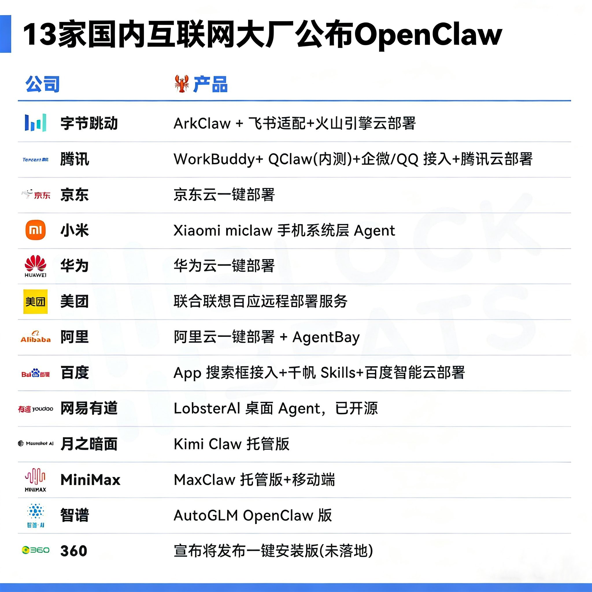

# OpenClaw：从对话到执行的 AI 革命

> ChatGPT 给你建议。OpenClaw 帮你做完。

2026 年初，[OpenClaw](https://github.com/openclaw/openclaw) 两个月斩获 247,000 GitHub 星标，超越 Linux 成为史上增长最快的开源项目。13 家国内大厂跟进，掀起"[百虾大战](#百虾大战)"。

它不是又一个聊天机器人。它是一个**住在你电脑里、真正能干活的 AI 员工**。

---

## 不是聊天，是干活

你可能习惯了这样的 AI：

```
你：帮我整理一下收件箱里的邮件
ChatGPT：我可以给你一些整理邮件的建议...
```

OpenClaw 不一样：

```
你：帮我整理一下收件箱里的邮件
OpenClaw：[正在连接 Gmail API...]
         [已读取 127 封未读邮件...]
         [按主题分类完成，生成摘要...]
         完成！已将邮件分为 5 类，重要邮件 3 封已标记。
```

**一个给建议，一个做事情。** 这就是本质区别。

OpenClaw（龙虾）能读写文件、执行命令、控制浏览器、收发消息、定时巡检——所有数据都在你自己的设备上。你可以让它每天早上推送新闻简报，自动回复邮件，甚至写代码、提 PR、跑测试。

<details>
<summary>OpenClaw 的本质：自主式 AI Agent</summary>

OpenClaw 是一个开源的自主式 AI Agent 执行引擎，由开发者 Peter Steinberger 创建。根据 [Wikipedia](https://en.wikipedia.org/wiki/OpenClaw) 的介绍，它是一个免费开源的自主人工智能代理项目，以消息平台（WhatsApp、Telegram、Discord、Slack 等）作为主要用户界面。

核心特征：

- **本地运行**：数据完全由你掌控，不送到别人的服务器
- **真正执行**：不只生成代码，而是直接运行、验证、修复
- **自主决策**：能分解任务、选择工具、自我检查、迭代优化
- **多平台集成**：通过 Telegram、Discord、Slack、飞书等随时随地控制

</details>

<details>
<summary>发展历程：从 Clawdbot 到 OpenClaw</summary>

- **2025.11**：以 Clawdbot 名称首次发布
- **短暂更名**：因 Anthropic 商标问题改为 Moltbot
- **2026.01**：正式定名 OpenClaw
- **2026.02**：病毒式传播，成为 GitHub 历史上增长最快的项目
- **2026.02.14**：开发者宣布加入 OpenAI，项目转移到开源基金会

</details>

---

## 龙虾为什么这么火？

和去年 DeepSeek 的爆火一样——**把一小撮人已经在享受的能力，第一次推到了更广泛的人群面前**。

| 设计决策 | 为什么有效 | trade-off |
|---------|-----------|-----------|
| **聊天界面作为入口** | 复用微信/飞书/WhatsApp 等现有习惯，学习成本几乎为零 | 线性对话，过程不可观测 |
| **统一上下文 + 持久化记忆** | 跨平台、跨会话记住你的一切，"它真的懂我" | 记忆是黑盒，跨项目易污染 |
| **丰富的 Skills 生态** | 16,000+ 技能可组合，AI 还能自己写新技能 | 12% 第三方技能含恶意代码 |

三者形成**飞轮效应**：记忆带来数据复利，技能带来自我进化，易用性带来使用频率——越转越快，越用越强。

> 更完整的分析见[附录 B：社区之声与生态展望](/cn/appendix/appendix-b)。

### 百虾大战

13 家国内大厂跟进 OpenClaw 全景图：


<small>图片来源：[TheBlockBeats](https://www.theblockbeats.info)</small>

<details>
<summary>深入了解：核心架构</summary>

OpenClaw 的架构分为四层：

1. **消息渠道（Channels）**：Telegram、Discord、Slack、飞书、CLI 等多种接入方式
2. **智能决策核心（Brain）**：LLM 推理、任务分解与规划、工具选择与调用
3. **技能插件系统（Skills）**：文件操作、Shell 命令、浏览器控制、API 集成等
4. **记忆与身份系统（Memory & Identity）**：一组 Markdown 文件——IDENTITY.md（身份）、SOUL.md（性格）、USER.md（你的信息）、MEMORY.md（长期记忆）等

这种分层设计让 OpenClaw 既灵活又可控。详细介绍见[第六章 智能体管理](/cn/adopt/chapter6/)。

</details>

<details>
<summary>深入了解：价值与代价</summary>

**优势**：

- **并行探索**：多个 Sub-agent 同时搜索、分析、汇总，比串行快得多
- **上下文隔离**：子任务在干净的上下文中执行，避免"上下文退化"
- **推理算力扩展**：突破单个 Agent 的上下文窗口限制

**代价**：

- Token 成本从 1x 跃升到 15x
- Agent 间传递会丢失上下文细节（"电话游戏"效应）
- 多 Agent 并行时可能产生隐式决策冲突

> Anthropic 的经验："有些团队投入数月构建复杂的多智能体架构，结果发现改进单智能体的提示词就能达到同等效果。"

**判断标准**：低耦合任务（搜索、信息收集）适合拆分；高耦合任务（架构设计、核心编码）保持单一。

</details>

<details>
<summary>深入了解：应用场景</summary>

**个人效率**：每天早上自动推送天气 + 日历 + 邮件简报；自动分类邮件并标记优先级。

**开发者工作流**：PR 提交后自动代码审查；函数签名变更时自动更新 API 文档。

**企业级应用**：多渠道客户支持自动化；每周自动生成数据分析报告。

</details>

---

## 开始你的旅程

### 四种使用方式

| 方式 | 适合谁 | 一句话说明 | 详见 |
|------|--------|-----------|------|
| **AutoClaw 一键安装** | 零基础用户 | 下载 → 双击 → 注册即用，内置模型和免费额度 | [第一章](/cn/adopt/chapter1/) |
| **手动安装** | 想完全掌控的用户 | 终端几行命令，自由选择模型和配置 | [第二章](/cn/adopt/chapter2/) |
| **安全优先 / 多智能体** | 隐私敏感 / 团队协作 | [IronClaw](https://www.ironclaw.com/)（WASM 沙盒）/ [HiClaw](https://hiclaw.org/)（多龙虾协作） | [第一章备选方案](/cn/adopt/chapter1/) |
| **云端托管 / Docker** | 服务器部署 | 各大云厂商托管方案 | [附录 C](/cn/appendix/appendix-c) |

### 领养四步法：像雇员工一样养龙虾

领养一只龙虾，本质上和雇一个员工一样——准备四样东西就行：


| 步骤 | 类比 | 你要做的 | 对应章节 |
|------|------|---------|---------|
| **租房子** | 给员工一个工位 | 安装 OpenClaw（本地电脑或云服务器） | [第 1 章](/cn/adopt/chapter1/) / [第 2 章](/cn/adopt/chapter2/) |
| **买粮食** | 给员工发工资 | 配置模型 API Key（Token 就是龙虾的"口粮"） | [第 2 章](/cn/adopt/chapter2/) / [第 5 章](/cn/adopt/chapter5/) |
| **给联系方式** | 让客户能找到员工 | 接入聊天平台（QQ / 飞书 / Telegram） | [第 4 章](/cn/adopt/chapter4/) |
| **培训上岗** | 教员工怎么干活 | 配置智能体、工具、定时任务 | [第 6 章](/cn/adopt/chapter6/) / [第 7 章](/cn/adopt/chapter7/) |

> 前两步（租房子 + 买粮食）是**最低要求**——装好 OpenClaw、配好一个模型 API Key，龙虾就能在终端里跟你对话了。后两步让它从"能说话"变成"能干活"。

### 学习路径

**第一部分：领养 Claw**——使用篇，11 章 + 7 附录：

- **🔵 安装**（第 1～3 章）——AutoClaw 一键体验 → 手动安装 → 配置向导
- **🟢 核心配置**（第 4～6 章）——聊天平台接入 → 模型管理 → 智能体管理
- **🟡 扩展运维**（第 7～9 章）——工具与定时任务 → 网关运维 → 远程访问
- **🔴 安全与客户端**（第 10～11 章）——安全防护 → Web 界面与客户端

**第二部分：构建 Claw**——开发篇，15 章，从"驾驶员"进阶为"工程师"。

<details>
<summary>注意事项</summary>

**安全**：首次使用建议在测试环境。谨慎授予文件系统权限，定期审查操作日志，敏感操作设置人工确认。

**成本**：设置 API 调用上限，优先使用缓存和本地模型，监控 Token 消耗。

**节奏**：从简单任务开始（天气查询、文件整理），逐步增加复杂度（邮件管理、代码审查）。

</details>

<details>
<summary>未来展望</summary>

- **更强的模型**：Claude 4.6、GPT-5 等新模型持续提升推理能力，1M+ token 上下文窗口
- **Agent 团队协作**：多个专业化 Agent 各司其职，分布式任务执行
- **更低的门槛**：图形化配置、自然语言定义技能、一键部署
- **成熟的生态**：技能市场、企业级认证、Agent 调试工具

</details>

让我们开始吧。🦞
