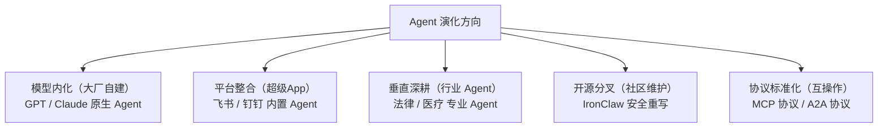

---
prev:
  text: '附录 A：学习资源汇总'
  link: '/cn/appendix/appendix-a'
next:
  text: '附录 C：类 Claw 方案对比与选型'
  link: '/cn/appendix/appendix-c'
---

# 附录 B：社区之声与生态展望

> 本附录整理自中文社区围绕 OpenClaw 的真实讨论，涵盖能力边界、企业落地、安全风险、成本体感、技术价值、未来趋势、产业生态利益链和理性反思八大议题。所有观点均已脱敏处理，不代表本教程立场，仅供参考与反思。

---

## 目录

1. [能力边界：AI 让你变强了，还是给了你幻觉？](#_1-能力边界-ai-让你变强了-还是给了你幻觉)
2. [个人工具 vs 企业落地：定位之争](#_2-个人工具-vs-企业落地-定位之争)
3. [安全与风险：社区踩坑实录](#_3-安全与风险-社区踩坑实录)
4. [Token 成本：到底烧不烧钱？](#_4-token-成本-到底烧不烧钱)
5. [技术价值：创新还是泡沫？](#_5-技术价值-创新还是泡沫)
6. [未来趋势："百虾大战"之后](#_6-未来趋势-百虾大战-之后)
7. [产业利益链：谁在为龙虾添柴？](#_7-产业利益链-谁在为龙虾添柴)
8. [理性反思：试错成本与经验积累](#_8-理性反思-试错成本与经验积累)
9. [金句精选](#_9-金句精选)

---

## 1. 能力边界：AI 让你变强了，还是给了你幻觉？

### 质疑方

> "AI 让你瞬间有了跨界的幻觉，一会是顶尖金融分析师，一会是资深产品经理。但 AI 不会给你超出你本身的能力，如果给了，那只是你觉得很新鲜但其实是常识的东西。"

> "你很难问出你认知之外的问题。"

> "而且认知不够也分辨不出它做的对不对。"

> "AI 写出的代码既不简洁，能用 20 行写完的写 100 行，也没有鲁棒性，到处是问题。"

### 支持方

> "如果 AI 不能让你做超越你能力的事，它有什么资格颠覆世界？"

> "你不会设计，它可以帮你做，这就是超出你能力了。文科生能写代码，能制作动漫短剧。"

> "我不会写代码，我会提需求让 AI 写，只要看能不能跑通就行了，后期再让 AI 改。"

> "有了 AI 辅助后，以前研究一个行业需要十几天，现在一天就可以了。"

### 编者按

OpenClaw 是**效率放大器**，不是能力替代品。它能大幅降低执行门槛（比如不懂代码也能写 Skill），但**决策质量仍取决于你自身的认知水平**。建议把 OpenClaw 当作"超级实习生"——它执行力强、速度快，但需要你把关方向和质量。

💡 深度解读：达克效应与 AI 放大

这场争论的本质是**达克效应**（Dunning-Kruger Effect）在 AI 时代的放大：

- **新手陷阱**：AI 降低了"做出东西"的门槛，但没有降低"做对东西"的门槛。不懂代码的人用 AI 写出能跑的代码，但无法判断代码质量、安全性和可维护性。
- **专家加速**：对于已有领域知识的人，AI 是真正的加速器——他们能提出正确的问题、判断输出质量、迭代优化结果。
- **实用建议**：在自己不熟悉的领域使用 AI 输出时，务必请该领域的人审核。OpenClaw 的 Skill 审核机制（详见[附录 C](/cn/appendix/appendix-c)）正是为此设计。

---

## 2. 个人工具 vs 企业落地：定位之争

### "只适合个人"派

> "OpenClaw 本来就不是给企业场景使用的。企业场景都先要解决权限与 HITL（人类在环）的问题。"

> "我们要用得先层层审批，跨单位协调，财务还要算 ROI。"

> "企业真正落地都希望稳且可控，所以会优先考虑 workflow 模式。"

> "OpenClaw 不能落地的原因是没有面向企业进行设计，没有角色权限数据等企业级配套管理方法。"

### "企业已在用"派

> "我的公司还有我在微软和英伟达的同学都说他们公司已经用了。"

> "全球市值前几的公司都在用，我们公司全力推。"

> "我司有十几万员工，在推在用。"

> "一个人用的好，一个人就变成了一个小公司。"

### 编者按

OpenClaw 的核心定位确实是**个人 AI 助理**，但"个人"和"企业"的边界正在模糊。许多开发者在企业环境中使用 OpenClaw 完成个人工作流自动化，而非替代企业级系统。如果你在企业中使用，务必注意：最小权限原则、沙箱隔离、数据安全（详见[第十章 安全防护与威胁模型](/cn/adopt/chapter10/)）。

💡 深度解读：企业级 Agent 的演进路径

社区争论反映了 Agent 技术在企业落地的三个阶段：

| 阶段 | 特征 | 代表方案 |
|------|------|---------|
| **个人探索期** | 开发者自发使用，非正式推广 | OpenClaw 个人部署 |
| **团队试点期** | IT 部门评估，小范围试用，建立使用规范 | OpenClaw + 企业安全加固 |
| **组织规模化** | 统一管理、权限体系、审计合规 | HiClaw 多智能体协作、企业定制方案 |

对于想在企业中推动 Agent 落地的读者，建议从"个人效率提升"切入，用实际成果说服团队，再逐步扩展。HiClaw（详见[第一章](/cn/adopt/chapter1/)）的 Manager-Worker 架构和企业级安全设计，就是专为这一场景打造的。

---

## 3. 安全与风险：社区踩坑实录

### 真实案例

> "OpenClaw 在执行自动化任务时，系统在调用 Shell 命令创建 GitHub Issue 过程中构造了错误的 Bash 指令，意外触发命令注入，导致大量敏感环境变量被公开。"

> "权限太高乱删，还有就是很多 Skills 是有后门的。"

> "10 多年前，这些玩意儿就是被杀毒软件追着跑的对象，现在批个 AI 外壳就敢随便往电脑上装了？"

> "把我文件服务器所有文件删除了。"

> "我司已经全面禁止个人部署了。"

### 社区共识

> "保密这一项就很难过关。"

> "肯定得禁止个人部署，搞完万一权限设置过高又暴露出去，全得瘫痪。"

> "用定制的有能力自家重写一个。"

### 编者按

安全是 OpenClaw 最大的短板之一，社区的担忧并非多虑。本教程强烈建议：

1. **最小权限原则**：不要给 OpenClaw 超出任务需要的系统权限，使用 `tools.profile: "coding"` 而非 `full`
2. **沙箱隔离**：生产环境务必启用沙箱和网络隔离
3. **技能安全审查**：谨慎安装来源不明的第三方 Skill，优先使用 ClawHub 官方审核的技能
4. **安全体系化**：完整的威胁模型、防护措施和自查清单，详见[第十章 安全防护与威胁模型](/cn/adopt/chapter10/)

💡 深度解读：社区安全事件分类

从社区报告的安全事件中，可以归纳为四类风险：

| 风险类型 | 典型表现 | 防护措施 |
|---------|---------|---------|
| **命令注入** | Shell 命令构造错误，环境变量泄露 | 启用沙箱，限制 Shell 工具权限 |
| **权限越界** | 删除文件、修改系统配置 | `tools.profile: "coding"`，最小权限 |
| **供应链攻击** | 第三方 Skill 含后门 | ClawHub 官方审核，skill-vetter 扫描 |
| **数据泄露** | 敏感信息发送到外部 API | 网络隔离，本地模型，SecretRef 凭证管理 |

详细的 MITRE ATLAS 威胁分类和攻击链分析，请参阅[第十章](/cn/adopt/chapter10/)。

---

## 4. Token 成本：到底烧不烧钱？

### "很烧"派

> "Token 如流水，简单的事情的确能解决，能用，但是没有那么神。需要人工调教很久。"

> "花了多少 Token？据说很费。"

> "不敢接 GPT，的确是很烧 Token。"

> "这些产品能大量消耗大模型 Token，都是大模型公司乐见的产品。"

### "还好"派

> "我接的 DeepSeek，还行。5 美金一星期用不完。"

> "我目前用来辅助闲鱼采集，写 Skill 以插件进行对接，这样 Token 非常少。"

### 编者按

Token 消耗差异巨大，取决于模型选择和使用方式。关键策略：

- **分级使用**：轻量任务用低成本模型（如 DeepSeek、阶跃星辰免费模型），重要任务用高端模型，详见[第五章 模型管理](/cn/adopt/chapter5/)
- **技能封装**：将重复任务封装成 Skill，避免每次从头对话，大幅降低对话轮次
- **记忆增强**：长对话场景考虑安装 OpenViking 记忆插件，实测降低 91% Token 消耗
- **免费入门**：OpenRouter 提供免费模型（如 `stepfun/step-3.5-flash:free`），零成本体验，详见[第二章](/cn/adopt/chapter2/)

💡 深度解读：Token 消耗优化策略对比

| 策略 | 节省幅度 | 适用场景 | 实施难度 |
|------|---------|---------|---------|
| **免费模型入门** | 100%（零成本） | 学习、体验、轻量任务 | ⭐ 极低 |
| **国产低价模型** | 70-90% | 日常对话、简单自动化 | ⭐ 低 |
| **Skill 封装复用** | 50-80% | 重复性任务 | ⭐⭐ 中 |
| **模型路由（Failover）** | 30-60% | 混合负载场景 | ⭐⭐ 中 |
| **OpenViking 记忆** | 最高 91% | 长期对话、复杂任务 | ⭐⭐⭐ 较高 |
| **本地模型（Ollama）** | 100%（仅电费） | 隐私敏感、离线场景 | ⭐⭐⭐ 较高 |

具体配置方法请参阅[第五章](/cn/adopt/chapter5/)和[附录 E 模型提供商速查表](/cn/appendix/appendix-e)。

---

## 5. 技术价值：创新还是泡沫？

### "没什么新东西"派

> "OpenClaw 是狐假虎威的狐狸，这玩意是一点技术难度都没有。"

> "代码就是一坨屎，唯一有价值的只有它的 Prompt 文件。"

> "Agent 理念本来也不是 OpenClaw 提的，OpenClaw 本身没啥价值和创新，只是营销吹的火罢了。"

> "AutoGPT 都多少年了，现在也没啥起色，这个理念很久前就出现了。"

### "架构有创新"派

> "工具可以退潮。但留下的理念不会。它具备 Skill、心跳、记忆能力的全新 Agent 时代。"

> "OpenClaw 对于 Skill 做了更格式化的约束，对于没有那么强的模型也可以较好地支持。"

> "Skill 和 Workflow 的沉淀才是个人和组织的终极资产。"

> "它是浪潮的起点，潮还没真正来呢。"

> "这是一种思路的突破，而非这个桥梁自身有多牛逼。这就是一种创新，被爱好者玩出了各种花活。"

### 编者按

OpenClaw 的核心创新不在于代码质量，而在于**架构理念**：Skill 技能系统 + 心跳机制 + 工作区记忆 + 多渠道接入，构成了一个完整的"AI 助理操作系统"范式。正如社区所说——"OpenClaw 会退潮，但 Agent 理念只会越来越火"。理解这套设计思路（详见[导言架构概览](/cn/adopt/intro/)），比单纯使用工具本身更有长期价值。

💡 深度解读：OpenClaw 与前代 Agent 框架对比

| 维度 | AutoGPT（2023） | OpenClaw（2025） | 差异 |
|------|----------------|-----------------|------|
| **任务持久化** | 内存中，重启丢失 | 工作区文件系统 + 心跳 | 可中断、可恢复 |
| **能力扩展** | Python 插件 | SKILL.md（Markdown Prompt） | 零代码门槛 |
| **多渠道** | 仅 Web UI | QQ/飞书/Telegram/WhatsApp 等 | 融入日常通讯 |
| **社区生态** | 碎片化 | ClawHub 16,000+ 技能 | 标准化复用 |
| **模型兼容** | 绑定 OpenAI | 任意 OpenAI/Anthropic 兼容模型 | 成本灵活 |

OpenClaw 的真正突破在于把 Agent 从"技术 Demo"变成了"日常工具"。这一范式转变的价值，远大于代码本身。

---

## 6. 未来趋势："百虾大战"之后

### 看衰派

> "已经退潮了。五花八门的开源套壳，然后大厂的迭代，最多一个月周期。"

> "大模型厂商不会久居 OpenClaw 之下。"

> "大模型一直在进化，趋向于人，错误率越来越低，后面只会越来越多的应用来替代人类。"

### 看好派

> "Agent 是未来十年的必然形态，聊天大模型的阉割对话模式一去不复返了。"

> "这么大规模的社区，光靠复制它的模式而不提出更颠覆性的模式是不可能超过它的。"

> "先把事做了，然后等着工具模型迭代。"

> "OpenClaw 代表的是智能体架构的思路，觉得退潮只能说你玩不明白。"

### 中间派

> "OpenClaw 更像是一种理念，对 AI OS 的一种探索，我们还远远没到最终答案。"

> "它确实是在我 AI Code 后，最爱用、做项目维护最好的东西。但除此之外确实没什么实际用途。"

> "其实很多事 RPA 可以做得更好，但是 RPA 需要自己弄有门槛。OpenClaw 把 RPA 的门槛拉低了，所以短时间很热门。但用于生产，还是需要 RPA 更合适更稳定。"

> "现在所谓的 Agent 都是大模型的壳，最后都会被模型内化掉。"

### 编者按

13 家国内大厂跟进（详见[导言"百虾大战"全景图](/cn/adopt/intro/)），恰恰说明 Agent 形态的价值已被产业验证。OpenClaw 本身可能会被更成熟的产品取代，但你在本教程中学到的 **Skill 编写、工作区配置、自动化任务编排、多 Agent 协作**等能力，在任何 Agent 平台上都是通用的。与其纠结"OpenClaw 会不会退潮"，不如把精力放在沉淀自己的 Skill 和 Workflow 资产上。

💡 深度解读：Agent 赛道的演化方向

从社区讨论和行业动态中，可以看到四条并行的演化路径：

- **模型内化**：GPT、Claude 等大模型厂商将 Agent 能力内建，OpenClaw 作为中间层的价值可能被压缩
- **平台整合**：企业 IM（飞书、钉钉）直接提供 Agent 能力，减少第三方部署需求
- **垂直深耕**：在法律、医疗、金融等专业领域，需要定制化的 Agent 方案
- **开源分叉**：IronClaw（安全重写）、HiClaw（多智能体协作）等针对特定场景优化
- **协议标准化**：MCP、A2A 等协议使不同 Agent 框架可互操作

无论哪条路径胜出，**理解 Agent 的核心设计模式**（技能系统、记忆机制、工具调用、多渠道通信）都是持久的技术资产。

---

## 7. 产业利益链：谁在为龙虾添柴？

> 这段社区反思揭示了 OpenClaw 生态中各方的利益关系，值得每位用户了解。

OpenClaw 的爆火并非偶然，背后有一条完整的产业利益链。社区总结如下：

### 受益方分析

| 角色 | 获益方式 | 社区原声 |
|------|---------|---------|
| **硬件厂商** | Mac Mini 等设备销量激增 | "苹果很开心，因为 Mac Mini 又疯狂销售了一波" |
| **OpenClaw 作者** | 知名度 + 被 OpenAI 收编 | "作者很开心，有了知名度也加入 OpenAI，赚得盆满钵满" |
| **大模型厂商** | Token 消耗带来 API 收入 | "OpenClaw 很费 Token，又卖了很多 API，而且 OpenClaw 越火就能拉来更多投资" |
| **云服务厂商** | 一键部署带动服务器销售 | "弄了一键部署，很多人尝鲜养虾会买一台服务器试试" |
| **安全研究者** | 攻击面增大 | "黑客很开心，从没打过这么富裕的仗" |
| **普通用户** | 体验 AI Agent，获得谈资 | "觉得自己养了一个龙虾就跟上时代潮流了" |

### 谁在推动"龙虾热"？

社区进一步分析了各方推动 OpenClaw 热度的动机：

| 推动者 | 动机 |
|-------|------|
| **创业者** | 需要新故事讲给投资人 |
| **模型厂商** | 需要持续消耗 Token 的应用场景 |
| **上市公司** | 需要 AI Agent 估值题材 |
| **知识付费** | 需要新概念包装课程 |
| **自媒体** | 需要新话题获取流量 |
| **硬件厂商** | 能卖新设备（Mac Mini、服务器） |
| **代装服务商** | 直接赚取服务费 |

### 编者按

这段分析虽然略显犀利，但逻辑清晰——每个新技术浪潮都有类似的利益结构。**了解利益链不是为了否定技术价值，而是为了保持清醒**：

- 不要被营销话术裹挟，按需使用，量力而行
- 关注真实的效率提升而非"看起来很酷"
- 免费/低成本方案完全能满足大多数个人需求（详见[第二章](/cn/adopt/chapter2/)）
- 付费前先评估 ROI：这个 Skill 每月能帮我省多少时间？

---

## 8. 理性反思：试错成本与经验积累

> 社区中一段广受认同的反思，为整个讨论画上了理性的句号。

> "想想看，最末端的普通用户，用这么低的整体成本，就可以体验 AI 行业的试错，积累一些经验，难道不是一件好事？都要去开个奶茶店、跑滴滴、送外卖，那样的试错成本才好嗎？"

### 编者按

这段话点出了一个容易被忽略的事实：**OpenClaw 的试错成本极低**。

| 试错方式 | 初始成本 | 时间投入 | 失败代价 |
|---------|---------|---------|---------|
| 开奶茶店 | 10-50 万元 | 6-12 个月 | 血本无归 |
| 跑滴滴/送外卖 | 1-3 万元 | 持续投入 | 时间沉没 |
| 学编程转行 | 0-5 万元 | 3-12 个月 | 机会成本 |
| **用 OpenClaw 体验 AI** | **0-50 元** | **几小时** | **几乎为零** |

即便 OpenClaw 明天就"退潮"，你在这个过程中获得的**认知升级**是真实的：

- 你理解了 AI Agent 的工作原理
- 你学会了用自然语言描述需求（Prompt Engineering）
- 你体验了自动化工作流的威力
- 你积累了评估 AI 工具的判断力

这些经验在任何未来的 AI 产品中都能复用。**真正承担不起的试错成本，是在 AI 时代选择完全不参与。**

---

## 9. 金句精选

> 从社区讨论中精选的高浓度观点，涵盖认知、实践和趋势。

### 🔍 关于认知

> "不要妄想 OpenClaw 能帮你搞定一切，你以为 OpenClaw 是 Agent，但真正的 Agent 是你自己。"

> "你知道它离退潮不远了"——"你貌似忽略了一个重要的事情：迭代。"

> "好产品不一定就要技术很牛逼，产品是满足用户需求的，和技术关系不大。"

### ⚡ 关于实践

> "牛马多花时间想想工作效率怎么提升，写个 Skill，或者工程化管理自己的 Workspace。腾出更多时间摸鱼吧。"——"摸鱼很关键。"

> "你会用它就是利器，你把它当玩具，那它就是玩具。"

> "先抢占先机，适应市场，确实版本迭代很快，开发者也在跟进。"

### 🌊 关于趋势

> "一边说 OpenClaw 全是漏洞，一边是大厂都在抄。"

> "OpenClaw 会退潮，但它的兄弟们会称霸世界。"

---

> **写在最后**：社区的声音是一面镜子，折射出技术浪潮中的期待与焦虑。无论你是刚入门的新手还是资深玩家，保持**开放心态 + 批判思维**的平衡，才是在 AI 时代最重要的能力。本教程的使命，就是帮你在这个平衡中找到自己的定位。
