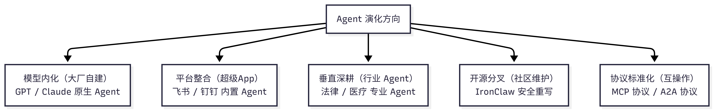
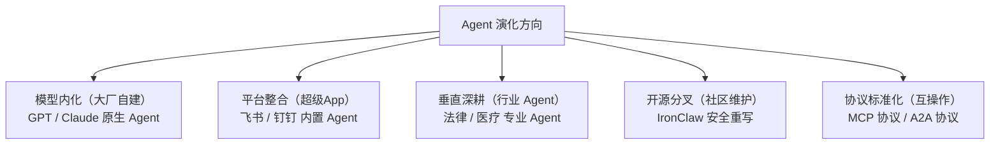

---
prev:
  text: '附录 A：学习资源汇总'
  link: '/cn/appendix/appendix-a'
next:
  text: '附录 C：类 Claw 方案对比与选型'
  link: '/cn/appendix/appendix-c'
---

# 附录 B：社区之声与生态展望

> 本附录分为两部分。前半部分整理自中文社区围绕 OpenClaw 的真实讨论，涵盖能力与价值、落地与趋势、安全风险、成本与利益链、理性反思五大议题。后半部分是一篇深度分析，从更高层的角度剖析 OpenClaw 为什么会火、它做对了什么、有哪些局限，以及这些认知如何转化为我们自己的生产力。所有社区观点均已脱敏处理，不代表本教程立场，仅供参考与反思。

---

## 目录

**第一部分：社区之声**

1. [能力与价值：AI 让你变强了，还是给了你幻觉？](#_1-能力与价值-ai-让你变强了-还是给了你幻觉)
2. [落地与趋势：从个人玩具到产业生态](#_2-落地与趋势-从个人玩具到产业生态)
3. [安全与风险：社区踩坑实录](#_3-安全与风险-社区踩坑实录)
4. [成本与利益链：谁在买单，谁在添柴？](#_4-成本与利益链-谁在买单-谁在添柴)
5. [理性反思：试错成本与经验积累](#_5-理性反思-试错成本与经验积累)

**第二部分：生态展望**

6. [深度分析：OpenClaw 为什么火，以及这跟我们有什么关系](#_6-深度分析-openclaw-为什么火-以及这跟我们有什么关系)

**附**

7. [金句精选](#_7-金句精选)

---

## 第一部分：社区之声

## 1. 能力与价值：AI 让你变强了，还是给了你幻觉？

### 质疑方

> "AI 让你瞬间有了跨界的幻觉，一会是顶尖金融分析师，一会是资深产品经理。但 AI 不会给你超出你本身的能力，如果给了，那只是你觉得很新鲜但其实是常识的东西。"

> "你很难问出你认知之外的问题。"

> "而且认知不够也分辨不出它做的对不对。"

> "AI 写出的代码既不简洁，能用 20 行写完的写 100 行，也没有鲁棒性，到处是问题。"

> "OpenClaw 是狐假虎威的狐狸，这玩意是一点技术难度都没有。"

> "代码就是一坨屎，唯一有价值的只有它的 Prompt 文件。"

> "Agent 理念本来也不是 OpenClaw 提的，OpenClaw 本身没啥价值和创新，只是营销吹的火罢了。"

> "AutoGPT 都多少年了，现在也没啥起色，这个理念很久前就出现了。"

### 支持方

> "如果 AI 不能让你做超越你能力的事，它有什么资格颠覆世界？"

> "你不会设计，它可以帮你做，这就是超出你能力了。文科生能写代码，能制作动漫短剧。"

> "我不会写代码，我会提需求让 AI 写，只要看能不能跑通就行了，后期再让 AI 改。"

> "有了 AI 辅助后，以前研究一个行业需要十几天，现在一天就可以了。"

> "工具可以退潮。但留下的理念不会。它具备 Skill、心跳、记忆能力的全新 Agent 时代。"

> "OpenClaw 对于 Skill 做了更格式化的约束，对于没有那么强的模型也可以较好地支持。"

> "Skill 和 Workflow 的沉淀才是个人和组织的终极资产。"

> "它是浪潮的起点，潮还没真正来呢。"

> "这是一种思路的突破，而非这个桥梁自身有多牛逼。这就是一种创新，被爱好者玩出了各种花活。"

### 编者按

OpenClaw 是**效率放大器**，不是能力替代品。它能大幅降低执行门槛（比如不懂代码也能写 Skill），但**决策质量仍取决于你自身的认知水平**。建议把 OpenClaw 当作"超级实习生"——它执行力强、速度快，但需要你把关方向和质量。与此同时，OpenClaw 的核心创新不在于代码质量，而在于**架构理念**：Skill 技能系统 + 心跳机制 + 工作区记忆 + 多渠道接入，构成了一个完整的"AI 助理操作系统"范式。正如社区所说——"OpenClaw 会退潮，但 Agent 理念只会越来越火"。理解这套设计思路（详见[导言架构概览](/cn/adopt/intro/)），比单纯使用工具本身更有长期价值。

深度解读：达克效应与 AI 放大 / OpenClaw 与前代框架对比

#### 达克效应与 AI 放大

这场争论的本质是**达克效应**（Dunning-Kruger Effect）在 AI 时代的放大：

- **新手陷阱**：AI 降低了"做出东西"的门槛，但没有降低"做对东西"的门槛。不懂代码的人用 AI 写出能跑的代码，但无法判断代码质量、安全性和可维护性。
- **专家加速**：对于已有领域知识的人，AI 是真正的加速器——他们能提出正确的问题、判断输出质量、迭代优化结果。
- **实用建议**：在自己不熟悉的领域使用 AI 输出时，务必请该领域的人审核。OpenClaw 的 Skill 审核机制（详见[附录 C](/cn/appendix/appendix-c)）正是为此设计。

#### OpenClaw 与前代 Agent 框架对比

| 维度 | AutoGPT（2023） | OpenClaw（2025） | 差异 |
|------|----------------|-----------------|------|
| **任务持久化** | 内存中，重启丢失 | 工作区文件系统 + 心跳 | 可中断、可恢复 |
| **能力扩展** | Python 插件 | SKILL.md（Markdown Prompt） | 零代码门槛 |
| **多渠道** | 仅 Web UI | QQ/飞书/Telegram/WhatsApp 等 | 融入日常通讯 |
| **社区生态** | 碎片化 | ClawHub 16,000+ 技能 | 标准化复用 |
| **模型兼容** | 绑定 OpenAI | 任意 OpenAI/Anthropic 兼容模型 | 成本灵活 |

OpenClaw 的真正突破在于把 Agent 从"技术 Demo"变成了"日常工具"。这一范式转变的价值，远大于代码本身。

---

## 2. 落地与趋势：从个人玩具到产业生态

### "只适合个人"派

> "OpenClaw 本来就不是给企业场景使用的。企业场景都先要解决权限与 HITL（人类在环）的问题。"

> "我们要用得先层层审批，跨单位协调，财务还要算 ROI。"

> "企业真正落地都希望稳且可控，所以会优先考虑 workflow 模式。"

> "OpenClaw 不能落地的原因是没有面向企业进行设计，没有角色权限数据等企业级配套管理方法。"

### "企业已在用"派

> "我的公司还有我在微软和英伟达的同学都说他们公司已经用了。"

> "全球市值前几的公司都在用，我们公司全力推。"

> "我司有十几万员工，在推在用。"

> "一个人用的好，一个人就变成了一个小公司。"

### 看衰派

> "已经退潮了。五花八门的开源套壳，然后大厂的迭代，最多一个月周期。"

> "大模型厂商不会久居 OpenClaw 之下。"

> "大模型一直在进化，趋向于人，错误率越来越低，后面只会越来越多的应用来替代人类。"

### 看好派

> "Agent 是未来十年的必然形态，聊天大模型的阉割对话模式一去不复返了。"

> "这么大规模的社区，光靠复制它的模式而不提出更颠覆性的模式是不可能超过它的。"

> "先把事做了，然后等着工具模型迭代。"

> "OpenClaw 代表的是智能体架构的思路，觉得退潮只能说你玩不明白。"

### 中间派

> "OpenClaw 更像是一种理念，对 AI OS 的一种探索，我们还远远没到最终答案。"

> "它确实是在我 AI Code 后，最爱用、做项目维护最好的东西。但除此之外确实没什么实际用途。"

> "其实很多事 RPA 可以做得更好，但是 RPA 需要自己弄有门槛。OpenClaw 把 RPA 的门槛拉低了，所以短时间很热门。但用于生产，还是需要 RPA 更合适更稳定。"

> "现在所谓的 Agent 都是大模型的壳，最后都会被模型内化掉。"

### 编者按

OpenClaw 的核心定位确实是**个人 AI 助理**，但"个人"和"企业"的边界正在模糊。许多开发者在企业环境中使用 OpenClaw 完成个人工作流自动化，而非替代企业级系统。如果你在企业中使用，务必注意：最小权限原则、沙箱隔离、数据安全（详见[第十章 安全防护与威胁模型](/cn/adopt/chapter10/)）。与此同时，13 家国内大厂跟进（详见[导言"百虾大战"全景图](/cn/adopt/intro/)），恰恰说明 Agent 形态的价值已被产业验证。OpenClaw 本身可能会被更成熟的产品取代，但你在本教程中学到的 **Skill 编写、工作区配置、自动化任务编排、多 Agent 协作**等能力，在任何 Agent 平台上都是通用的。与其纠结"OpenClaw 会不会退潮"，不如把精力放在沉淀自己的 Skill 和 Workflow 资产上。

深度解读：企业级 Agent 演进路径 / Agent 赛道演化方向

#### 企业级 Agent 的演进路径

社区争论反映了 Agent 技术在企业落地的三个阶段：

| 阶段 | 特征 | 代表方案 |
|------|------|---------|
| **个人探索期** | 开发者自发使用，非正式推广 | OpenClaw 个人部署 |
| **团队试点期** | IT 部门评估，小范围试用，建立使用规范 | OpenClaw + 企业安全加固 |
| **组织规模化** | 统一管理、权限体系、审计合规 | HiClaw 多智能体协作、企业定制方案 |

对于想在企业中推动 Agent 落地的读者，建议从"个人效率提升"切入，用实际成果说服团队，再逐步扩展。HiClaw（详见[第一章](/cn/adopt/chapter1/)）的 Manager-Worker 架构和企业级安全设计，就是专为这一场景打造的。

#### Agent 赛道的演化方向

从社区讨论和行业动态中，可以看到四条并行的演化路径：

- **模型内化**：GPT、Claude 等大模型厂商将 Agent 能力内建，OpenClaw 作为中间层的价值可能被压缩
- **平台整合**：企业 IM（飞书、钉钉）直接提供 Agent 能力，减少第三方部署需求
- **垂直深耕**：在法律、医疗、金融等专业领域，需要定制化的 Agent 方案
- **开源分叉**：IronClaw（安全重写）、HiClaw（多智能体协作）等针对特定场景优化
- **协议标准化**：MCP、A2A 等协议使不同 Agent 框架可互操作

无论哪条路径胜出，**理解 Agent 的核心设计模式**（技能系统、记忆机制、工具调用、多渠道通信）都是持久的技术资产。

---

## 3. 安全与风险：社区踩坑实录

### 真实案例

> "OpenClaw 在执行自动化任务时，系统在调用 Shell 命令创建 GitHub Issue 过程中构造了错误的 Bash 指令，意外触发命令注入，导致大量敏感环境变量被公开。"

> "权限太高乱删，还有就是很多 Skills 是有后门的。"

> "10 多年前，这些玩意儿就是被杀毒软件追着跑的对象，现在批个 AI 外壳就敢随便往电脑上装了？"

> "把我文件服务器所有文件删除了。"

> "我司已经全面禁止个人部署了。"

### 社区共识

> "保密这一项就很难过关。"

> "肯定得禁止个人部署，搞完万一权限设置过高又暴露出去，全得瘫痪。"

> "用定制的有能力自家重写一个。"

### 编者按

安全是 OpenClaw 最大的短板之一，社区的担忧并非多虑。本教程强烈建议：

1. **最小权限原则**：不要给 OpenClaw 超出任务需要的系统权限，使用 `tools.profile: "coding"` 而非 `full`
2. **沙箱隔离**：生产环境务必启用沙箱和网络隔离
3. **技能安全审查**：谨慎安装来源不明的第三方 Skill，优先使用 ClawHub 官方审核的技能
4. **安全体系化**：完整的威胁模型、防护措施和自查清单，详见[第十章 安全防护与威胁模型](/cn/adopt/chapter10/)

深度解读：社区安全事件分类

从社区报告的安全事件中，可以归纳为四类风险：

| 风险类型 | 典型表现 | 防护措施 |
|---------|---------|---------|
| **命令注入** | Shell 命令构造错误，环境变量泄露 | 启用沙箱，限制 Shell 工具权限 |
| **权限越界** | 删除文件、修改系统配置 | `tools.profile: "coding"`，最小权限 |
| **供应链攻击** | 第三方 Skill 含后门 | ClawHub 官方审核，skill-vetter 扫描 |
| **数据泄露** | 敏感信息发送到外部 API | 网络隔离，本地模型，SecretRef 凭证管理 |

详细的 MITRE ATLAS 威胁分类和攻击链分析，请参阅[第十章](/cn/adopt/chapter10/)。

---

## 4. 成本与利益链：谁在买单，谁在添柴？

### "很烧"派

> "Token 如流水，简单的事情的确能解决，能用，但是没有那么神。需要人工调教很久。"

> "花了多少 Token？据说很费。"

> "不敢接 GPT，的确是很烧 Token。"

> "这些产品能大量消耗大模型 Token，都是大模型公司乐见的产品。"

### "还好"派

> "我接的 DeepSeek，还行。5 美金一星期用不完。"

> "我目前用来辅助闲鱼采集，写 Skill 以插件进行对接，这样 Token 非常少。"

### 产业利益链：谁在为龙虾添柴？

> 这段社区反思揭示了 OpenClaw 生态中各方的利益关系，值得每位用户了解。

OpenClaw 的爆火并非偶然，背后有一条完整的产业利益链。社区总结如下：

#### 受益方分析

| 角色 | 获益方式 | 社区原声 |
|------|---------|---------|
| **硬件厂商** | Mac Mini 等设备销量激增 | "苹果很开心，因为 Mac Mini 又疯狂销售了一波" |
| **OpenClaw 作者** | 知名度 + 被 OpenAI 收编 | "作者很开心，有了知名度也加入 OpenAI，赚得盆满钵满" |
| **大模型厂商** | Token 消耗带来 API 收入 | "OpenClaw 很费 Token，又卖了很多 API，而且 OpenClaw 越火就能拉来更多投资" |
| **云服务厂商** | 一键部署带动服务器销售 | "弄了一键部署，很多人尝鲜养虾会买一台服务器试试" |
| **安全研究者** | 攻击面增大 | "黑客很开心，从没打过这么富裕的仗" |
| **普通用户** | 体验 AI Agent，获得谈资 | "觉得自己养了一个龙虾就跟上时代潮流了" |

#### 谁在推动"龙虾热"？

社区进一步分析了各方推动 OpenClaw 热度的动机：

| 推动者 | 动机 |
|-------|------|
| **创业者** | 需要新故事讲给投资人 |
| **模型厂商** | 需要持续消耗 Token 的应用场景 |
| **上市公司** | 需要 AI Agent 估值题材 |
| **知识付费** | 需要新概念包装课程 |
| **自媒体** | 需要新话题获取流量 |
| **硬件厂商** | 能卖新设备（Mac Mini、服务器） |
| **代装服务商** | 直接赚取服务费 |

### 编者按

Token 消耗差异巨大，取决于模型选择和使用方式。关键策略：

- **分级使用**：轻量任务用低成本模型（如 DeepSeek、阶跃星辰免费模型），重要任务用高端模型，详见[第五章 模型管理](/cn/adopt/chapter5/)
- **技能封装**：将重复任务封装成 Skill，避免每次从头对话，大幅降低对话轮次
- **记忆增强**：长对话场景考虑安装 OpenViking 记忆插件，实测降低 91% Token 消耗
- **免费入门**：OpenRouter 提供免费模型（如 `stepfun/step-3.5-flash:free`），零成本体验，详见[第二章](/cn/adopt/chapter2/)

而利益链分析虽然略显犀利，但逻辑清晰——每个新技术浪潮都有类似的利益结构。**了解利益链不是为了否定技术价值，而是为了保持清醒**：

- 不要被营销话术裹挟，按需使用，量力而行
- 关注真实的效率提升而非"看起来很酷"
- 免费/低成本方案完全能满足大多数个人需求（详见[第二章](/cn/adopt/chapter2/)）
- 付费前先评估 ROI：这个 Skill 每月能帮我省多少时间？

深度解读：Token 优化策略对比 / 受益方与推动者详析

#### Token 消耗优化策略对比

| 策略 | 节省幅度 | 适用场景 | 实施难度 |
|------|---------|---------|---------|
| **免费模型入门** | 100%（零成本） | 学习、体验、轻量任务 | 极低 |
| **国产低价模型** | 70-90% | 日常对话、简单自动化 | 低 |
| **Skill 封装复用** | 50-80% | 重复性任务 | 中 |
| **模型路由（Failover）** | 30-60% | 混合负载场景 | 中 |
| **OpenViking 记忆** | 最高 91% | 长期对话、复杂任务 | 较高 |
| **本地模型（Ollama）** | 100%（仅电费） | 隐私敏感、离线场景 | 较高 |

具体配置方法请参阅[第五章](/cn/adopt/chapter5/)和[附录 E 模型提供商速查表](/cn/appendix/appendix-e)。

#### 利益链详析

上文的受益方和推动者表格揭示了一个经典的平台经济结构：平台（OpenClaw）创造生态位，各方围绕生态位寻找商业机会。这不是 OpenClaw 独有的现象——iPhone 生态、微信生态、抖音生态都经历过类似的阶段。理解这个结构，有助于我们在面对 AI 产品营销时保持独立判断。

---

## 5. 理性反思：试错成本与经验积累

> 社区中一段广受认同的反思，为整个讨论画上了理性的句号。

> "想想看，最末端的普通用户，用这么低的整体成本，就可以体验 AI 行业的试错，积累一些经验，难道不是一件好事？都要去开个奶茶店、跑滴滴、送外卖，那样的试错成本才好嗎？"

### 编者按

这段话点出了一个容易被忽略的事实：**OpenClaw 的试错成本极低**。

| 试错方式 | 初始成本 | 时间投入 | 失败代价 |
|---------|---------|---------|---------|
| 开奶茶店 | 10-50 万元 | 6-12 个月 | 血本无归 |
| 跑滴滴/送外卖 | 1-3 万元 | 持续投入 | 时间沉没 |
| 学编程转行 | 0-5 万元 | 3-12 个月 | 机会成本 |
| **用 OpenClaw 体验 AI** | **0-50 元** | **几小时** | **几乎为零** |

即便 OpenClaw 明天就"退潮"，你在这个过程中获得的**认知升级**是真实的：

- 你理解了 AI Agent 的工作原理
- 你学会了用自然语言描述需求（Prompt Engineering）
- 你体验了自动化工作流的威力
- 你积累了评估 AI 工具的判断力

这些经验在任何未来的 AI 产品中都能复用。**真正承担不起的试错成本，是在 AI 时代选择完全不参与。**

---

## 第二部分：生态展望

## 6. 深度分析：OpenClaw 为什么火，以及这跟我们有什么关系

> 本节从更高层的角度抽丝剥茧：OpenClaw 到底做对了什么，为什么是它火，以及这跟我们有什么关系。

OpenClaw 在 2026 年 1 月底爆火。公众号铺天盖地都在介绍怎么配置，云服务厂商速度上线了一键部署，生怕错过这波热度。与此同时，各种行为艺术又满天飞：ClawdBot、MoltBot、OpenClaw，一周内改了三次名；结果改名的时候账号还被抢注，被一个叫 \$CLAWD 的代币诈骗了 1600 万美元。安全漏洞也层出不穷：有 12% 的第三方 Skills 含恶意代码，有不少人把控制台裸露在公网上没设密码。一时间让人感觉整个领域全是相互矛盾的噪音，无所适从：这东西到底要不要装？不装会错过什么？装了有什么风险？这到底是下一个生产力革命还是又一个两周就过气的玩具？

### 6.1 暴论：为什么会火

**OpenClaw 火的原因，和去年这个时候 DeepSeek 火的原因，是高度类似的。**

DeepSeek 流行的时候，当时国内大家用的 AI 主要是纯聊天，没有搜索功能也经常信口瞎编。ChatGPT 和 Claude 虽然有了思考和搜索功能，智能强很多，但国内用不了。DeepSeek 引入了推理功能和搜索功能以后，第一次让大家体验到了会搜索懂思考的 AI，带来了一种震撼——哇，AI 还能这么有用——就爆火了。换言之，这个火不是因为技术上比竞争对手更好，事实上 DeepSeek 在纯模型能力上并没有碾压同时代的 GPT-4o 或者 Claude 3.5。而是因为**把一小撮人享受/习惯的事情，一下子推广到另一群更大的用户群面前**，这才火起来。

OpenClaw 也是一样。2026 年初 Agentic AI 领域其实有一个断层：ChatGPT 这种产品虽然流行，但相比 Cursor/Claude Code/Codex 这种有本地权限的编程 Agentic AI，整体能力还是落后了至少一代（具体为什么后面有解释）。但 Cursor 这种工具非常小众，基本上只有程序员在用。大家用的还是 ChatGPT 这种消费级产品，就觉得 AI 这两年没啥进步，能力很有限。然后 OpenClaw 第一次把 Cursor 这种能本地编程的 Agent 和 WhatsApp/Slack/飞书这种流行通信软件接起来了，让非技术人员这种更广大的用户群第一次接触到了能读写文件、能执行命令、有记忆能持续迭代的 Agentic AI，就爆火了。换言之，这个火不是说 OpenClaw 在技术上做到了什么新的事情，而是因为把一小撮人享受/习惯的事情，一下子推广到另一群更大的非技术用户群面前，这才火起来。

但这不是说 OpenClaw、DeepSeek 是花架子，没必要学。恰恰相反，DeepSeek 从历史的角度提供了很多启发。比如 DeepSeek 火了以后，真正从中受益的是哪些人？有没有跟风第一时间玩上 DeepSeek 本身并不重要。很多人玩了一段时间就退烧了。**真正理解了 DeepSeek 为什么火，把搜索和推理这两个关键因素整合到了自己工作流里的人，才是真正受益的人。** 类似的，OpenClaw 火了以后，我们确实可以去跟风安装使用、体验一下，但这件事情本身并不会让我们一下就脱胎换骨生产力倍增了。因为这种现象级产品能爆火的重要前提是它面向最广泛的用户设计，因此设计决策上有很多妥协，直接用往往效率并不是最优。更关键的是要去理解它背后的设计哲学，分析它爆火的原因，从中吸取经验教训，改进自己的工作流。

> **毕竟，工具会过气，对工具本质的理解不会。把可迁移的认知抽出来，融入自己的工作流，这才是内行的做法。**

### 6.2 聊天界面：流行的基础，也是天花板

在具体分析 OpenClaw 的设计之前，先看一个具体的例子，来解释"面向最广泛的用户设计"这句话到底意味着什么。

OpenClaw 火起来非常关键的一点是，它选用了大家天天都用的聊天软件作为交互入口，而不是像 Cursor 一样让你在电脑上多装一个软件。这样可以复用现有的使用习惯和渠道，让用这个工具的心智负担特别低——你没事反正都要用 Slack/飞书，正好就看到了 OpenClaw 就会想着用用。另一方面，因为大家本身就非常熟悉这些软件的使用，所以它把学习成本也几乎压到了零。不需要装 IDE，不需要学编程的术语概念，拿起手机就能用，这是它能出圈的基础。

但如果你用过 Cursor 这种 Agentic AI 编程软件的话，就会发现 Slack 这种聊天窗口对 AI 来说是个相当受限的交互方式。具体来说，有三个层面的限制：

**线性对话的约束。** 像 Slack 和微信这样的聊天窗口主要就是一条条消息往下排。但深度的知识工作往往不是线性的。比如你需要引用另外一个 thread 的内容，需要把两个方向的探索 merge 在一起，需要在某个会话中 fork 出去。这些在桌面环境里比如 Cursor 和 OpenCode 里面都有专门的 UI 可以实现，但在聊天窗口里面做就特别别扭。

**信息密度不足。** 如果只是做玩具性质的调研和开发，聊天窗口没有问题。但凡要做更复杂一点的分析和思考，它的信息密度就捉襟见肘了。比如图文混排的分析报告、复杂的表格、带格式的长文，这些在聊天里面看还都蛮痛苦的。同时不同平台对 Markdown 的支持也参差不齐，体验很不稳定。

**过程不可观测。** 尤其是对要分好几步才能完成的任务，我把执行权交给 AI 以后，很自然地会想关心它到底在干啥。比如它是在稳步推进，还是在钻牛角尖鬼打墙？它调用了什么工具，改了哪些文件？这些在 Cursor 等工具里会有自然的呈现，但聊天窗口我们只能看见一条"对方正在打字"或者一个 emoji 表示正在处理。尤其是比较复杂的任务，OpenClaw 需要等蛮久才能等到一条消息告诉我们搞定了还是中间挂了。

这里面有个很明显的 trade-off。你要想把工具做得容易上手、面向最大的用户群，就必须用聊天工具这些人人都已经在用的工具作为载体。但这同时立刻又带来了对话形式、信息密度等弊端。在这个从"易用但是拧巴"到"原生但是小众"的连续的 trade-off 空间里，OpenClaw 选择了极致的易用性。这是它能爆火的基础。但我们也要清醒地认识到这种设计决策所带来的限制——在融合进自己工作流的时候，不是无脑地采用 OpenClaw 的所有设计，而是应该因地制宜，根据自己的需求来在这个 trade-off 轴线上找到属于自己的甜点区。

### 6.3 界面之外的流行要素

聊天界面是 OpenClaw 流行的基础，但只是最浅显的一点。真正让用户觉得这个 AI"真的智能，好用，懂我"的，是它背后的三个设计决策。

#### 统一的入口和上下文

对比一下 Cursor 就很清楚。在 Cursor 里每个项目的上下文是隔离的——打开项目 A，AI 只知道项目 A 的事；切到项目 B，之前关于项目 A 的对话就全没了。Claude Code、OpenCode 也一样，每次启动都绑定一个工作目录。但 OpenClaw 则完全相反。它默认把所有对话的上下文混在一个池子里。你上午在 Telegram 里让它帮你整理邮件，下午在 Slack 里让它写个报告，晚上在 WhatsApp 里让它安排明天的日程——它全都记得。给人的感觉就是它特别聪明，好像真的认识你。

#### 持久化记忆

但光把上下文混在一起是没用的，因为上下文窗口很快就会满了。OpenClaw 对记忆的处理非常巧妙。从大的原理上，它和 Manus 一样用的是基于文件的记忆系统。比如它维护了一个 SOUL.md，定义 AI 的核心人格和行为准则；USER.md 保存了对用户的画像，MEMORY.md 存长期记忆，再加上每日的原始日志等等。

这里面比较巧妙的是它有个**自我维护机制**：AI 会在每隔一段时间（heartbeat）自动 review 最近的原始日志，把有价值的信息提炼到 MEMORY.md 里，顺便清理过时的条目。整个过程不需要用户干预。这个自我维护机制就把记忆给分层了——原始日志是短期记忆，每天的 MEMORY.md 是中期记忆，提炼出来的个性和喜好是长期记忆。对用户来说，体验就从"每次重开都要重新交代一遍"变成了"它好像在成长"，这个感知差异是非常大的。

#### 丰富的 Skills

第三个设计是丰富的 Skills。这个意义要远超节省那么一点用户的时间。工具数量带来的好处不是线性的——6 个工具比 4 个工具的能力提升，远大于 4 个相对 2 个。这是因为**工具之间可以组合**。接 Slack 能管下达指令、状态汇报，接图像生成能画图，接 PPT 服务能出稿，接 deep research 能调研。这些凑在一起，就可以组合进化出很多完整的业务能力和应用场景。

#### 飞轮效应

这三个设计之间不是简单的加法，而是互相促进的。

**记忆 + 统一上下文 = 数据复利。** 因为有持久化记忆，对话可以跨会话积累；因为有统一入口，所有来源的数据汇进同一个记忆池。你在 Slack 里讨论的工作内容、在 Telegram 里安排的日程、在 WhatsApp 里的个人对话，全部混在一起，形成了对你越来越完整的理解，以后完成任务也会越来越贴心。

**记忆 + Skills = 自我进化。** 今天学到的用法明天还在，能力会累积；AI 自己能写新的 Skill 并且记住它的存在和用法，这就进入了正循环。这里面特别值得一提的是 coding 能力。因为 OpenClaw 自己能写代码，所以遇到没有现成 Skill 可用的时候，它就可以当场造一个。这个新 Skill 会被保存下来，下次遇到类似场景直接复用。这就形成了自我进化的闭环。

**能力 + 易用性 = 使用频率。** 入口越顺滑，调用越频繁，飞轮越转越快，能力越来越强。

总之，OpenClaw 是一个相当厉害的产品。它的各种决策，不论是技术的（入口、记忆、工具）还是非技术的（界面），都在为同一个飞轮服务，让普通人第一次摸到了 Agentic AI 的完整形态。

### 6.4 限制和 trade-off

前面说了它为什么牛，下面开始吐槽。但先要解释，下面介绍的这些限制不是说 OpenClaw 疏忽了没做好，而是前面说的那个 trade-off 的直接后果——为了爆款好用必须付出的代价。

界面的限制前面已经说过了：线性、低信息密度、低可观测性。在深度使用时这些很快会成为瓶颈，这里不再赘述。

#### 记忆的深层问题

OpenClaw 的记忆系统对小白很友好——你不用管，它自己就会打理和进化。但对想把知识沉淀成资产的人来说，这反而是一个障碍。

举个例子，比如我们做完一次调研，产出了一份 5000 字的长文或者一份 PRD。在 Cursor/文件系统里它就是一个文件：`docs/research.md`，想引用就 @，想升级就开新版本，想对比就 diff。但在 OpenClaw 里，这份东西像是人类记忆一样，说不定什么时候就会被自动摘要、自动重写，甚至整个被删除了（遗忘），整个过程完全不可控。你很难跟它说清楚：以后就以这份文档为准，遇到相关问题必须引用它，不要给我压缩成三行。总之就是，**知识没办法显式管理**。

更让人头疼的是整个更新过程也是一个**黑盒**。MEMORY.md 里存什么、怎么组织、什么时候清理，主要是 AI 在 heartbeat 期间自动做的。你看到的是结果，很难看到原因：它这次改了哪些条目，为什么删掉这一条，为什么把两个不相关的东西合并在一起。出了问题也很难定位根源，因而很难改进。

#### 跨场景的信息干扰

统一记忆当然带来"懂我"的感觉，但也意味着信息很容易跨项目污染：A 项目的偏好、甚至某个临时决定，可能会莫名其妙影响到 B 项目。对小白来说它好像什么都记得，但对真的想干活的进阶用户来说更像是"怎么又被它带偏了"。

#### Skills 的安全悖论

ClawHub 上的上千个技能中，安全审计发现有上百个包含恶意代码——加密货币盗窃、反向 shell 后门、凭证窃取都有。Simon Willison 提过一个**致命三角**的概念：一个 AI 系统同时具备访问私有数据、暴露于不可信环境、能够对外通信这三个能力时，风险是指数级放大的。OpenClaw 三个全中。

这就形成了一个奇特的悖论。你要想用得爽，就必须给它很多工具和权限。但这又会带来安全问题，所以就要把权限收得很紧。但权限收紧了就又变成类似 Manus 那样的云端 Agent 服务了，没了本地 Agent 的爽。安全和好用，似乎成了一对矛盾。

### 6.5 So What：从认知到行动

讲到这里，自然会有人问：分析了一堆，然后呢？这跟我有什么关系呢？

回答是：可以用这些认知，在已有的工具上搭一套比 OpenClaw 更顺手的东西。下面讲几个关键决策。

#### 复用 Agentic Loop，而不是自己造

第一个决策，也是最重要的一个，是不自己从头实现一套 Agentic AI 系统，而是**复用 OpenCode 这样的开源 CLI 编程工具作为基础**。

这个决策背后有一个更深层的判断。做一个能用的 Agentic Loop——也就是调 API、解析工具调用、执行工具、把结果返回给 AI、请求下一次回答这个循环——说起来简单，但要做到能支撑真实使用的水平，有很多细节：文件系统的读写，文件内容的新增删除替换，沙箱环境，权限管理……每个都是坑。这些东西写起来繁杂、充满陷阱，而且和我们最终想创造的价值没有多少关系。核心观点是，**Agentic Loop 是体力活，应该外包；真正值得花精力的是 Agentic Architecture**，也就是怎么把业务逻辑注入 AI 系统让它直接创造价值。

而 OpenCode、Claude Code 这类工具，恰恰就是一个特别好的外包。它们已经把 Agentic Loop 做得非常成熟了——能读写文件、能跑命令、能持续迭代，而且还在飞速进化中。用它们做基石，等于是白嫖了整个 Agentic 编程工具链，可以把自己的开发成本降到最低。而且选 OpenCode 还有一些额外的好处：它完全开源可以魔改，支持并行的 subagent（Cursor 和 Codex 到现在都还没有），还支持多种 coding plan——不用像直接调 API 那么烧钱。

#### 文件即记忆：继承和发展 OpenClaw 的哲学

第二个决策是在记忆体系上。OpenCode/Claude Code 这类工具天生就有**磁盘即记忆**的思想——毕竟它们作为编程工具处理的基础单元就是文件。当我们又有基于磁盘的记忆，又有对文件直接的操纵权和透明度的时候，就解决了前面分析中 OpenClaw 记忆系统的问题。想沉淀资产就写文件，想强制 AI 遵守某些规则就写 AGENTS.md，想管理记忆结构就直接编辑 Markdown。前面说的那些知识没法显式管理、更新过程是黑盒的问题，用 OpenCode 的细粒度控制和文件系统天然就解决了。

但光有文件系统还不够，还可以把 OpenClaw 那套 persona 自我进化的机制移植过来。具体来说，把记忆分成两层：project-level 的记忆（每个项目自己的上下文、决策记录、技术方案）和 persona-level 的记忆（用户画像、行为偏好、沟通风格）。然后在 AGENTS.md 里加入 persona 维护的 workflow，让 AI 在 session 结束时自动 review 对话、更新 MEMORY.md 和 USER.md。同样的自我进化，但跑在完全可控的文件系统上，还能用 Git 做版本管理。

至于统一上下文的问题，可以用一个简单粗暴的方案：**Mono Repo**。把不同项目放在同一个 repo 的不同文件夹下，AI 天然就可以跨项目访问所有上下文。想隔离就隔离，想共享就共享，想 merge 两个方向的探索就直接 @，想 fork 出去就复制文件——全都是文件系统和 OpenCode 的原生操作，比 OpenClaw 在聊天窗口里拧巴地做这些事情自然太多了。

#### Skills 和安全

Skills 方面，OpenCode 生态有大量 MCP server 和 Skills 可以接入——日历、邮件、浏览器、搜索等等——功能覆盖和 ClawHub 大差不差。安全性上，建议的做法是不直接安装第三方 Skill，而是**让 AI 先审查源码、理解逻辑，然后重写一个干净版本**。在 AI 辅助编程的今天这个过程通常只要几分钟，但可以极大降低供应链攻击的风险。

#### 最后一公里：移动端

前面三个决策解决了底座、记忆和工具的问题，但还差一个关键的东西：入口。OpenClaw 火的一个重要原因是你不用坐在电脑前面。但现有的编程工具在这方面确实拉胯——VSCode 有个 Code Server 可以远程访问，但对 iPad 非常不友好；OpenCode 有个 Web Client，但说实话只是解决了有和无的问题，非常难用；Cursor 的 Web Client 高度绑定 GitHub；Claude Code 则完全没有 Web Client。

为了解决这个问题，可以做一个原生的移动端 App 作为 OpenCode 的远程客户端。注意这个 App 不是把聊天窗口搬到手机上——它是一个真正为移动端设计的工作界面：能看到 AI 的实时工作进度，每一步工具调用、每一个文件操作；能切换模型做 A/B 测试；能浏览 Markdown 文件和审查更改；支持语音输入；支持基于 HTTPS 或者 SSH 隧道的公网访问；iPad 上还有三栏分屏。效果是吃灰很久的 iPad 重新变成了生产力工具，在沙发上指挥 AI 干活的体验比 OpenClaw 的聊天窗口爽得多。外出吃饭的时候接到 oncall，也可以直接给 AI 布置任务，当场就搞清楚了原因——而且全程都有对 AI 完全的掌控。

### 6.6 总结

回到开头的暴论。OpenClaw 和 DeepSeek 的火，本质上是同一件事：**把一小撮人已经在享受的能力，第一次推到了更广泛的人群面前。** DeepSeek 让大家第一次用上了会搜索懂推理的 AI，OpenClaw 让大家第一次摸到了能读写文件、有记忆、会自我进化的 Agentic AI。

但也正因为要面向最广大的普通用户，这类产品必然在设计上做大量妥协。DeepSeek 如此，OpenClaw 也如此。聊天界面带来了易用性但牺牲了表达力，统一记忆带来了"懂我"的感觉但牺牲了可控性，开放的 Skills 生态带来了能力但引入了安全风险。

对于已经在用 Cursor/Claude Code/OpenCode 的人来说，更值得做的不是无脑跟风装一个 OpenClaw，而是理解它为什么火——统一入口、持久化记忆、工具生态，以及它们之间的飞轮——然后把这些认知融入自己已有的工具链里，扬长避短。

> **毕竟，工具会过气，对工具本质的理解不会。**

---

## 7. 金句精选

> 从社区讨论中精选的高浓度观点，涵盖认知、实践和趋势。

### 关于认知

> "不要妄想 OpenClaw 能帮你搞定一切，你以为 OpenClaw 是 Agent，但真正的 Agent 是你自己。"

> "你知道它离退潮不远了"——"你貌似忽略了一个重要的事情：迭代。"

> "好产品不一定就要技术很牛逼，产品是满足用户需求的，和技术关系不大。"

### 关于实践

> "牛马多花时间想想工作效率怎么提升，写个 Skill，或者工程化管理自己的 Workspace。腾出更多时间摸鱼吧。"——"摸鱼很关键。"

> "你会用它就是利器，你把它当玩具，那它就是玩具。"

> "先抢占先机，适应市场，确实版本迭代很快，开发者也在跟进。"

### 关于趋势

> "一边说 OpenClaw 全是漏洞，一边是大厂都在抄。"

> "OpenClaw 会退潮，但它的兄弟们会称霸世界。"

### 关于"OpenClaw 解决的问题"

> "解决了 Token 消耗过慢、供应商赚钱太慢的问题。"

> "解决了跟不上 AI 潮流的精神焦虑。"

> "解决了技术爱好者发文分享和卖教程的需求。"

> "解决了自嗨和情绪价值的需求。"

> "解决了产品经理不知道写什么需求的问题。"

> "解决了飞书/QQ/企业微信/钉钉日活增长的问题。"

---

> **写在最后**：社区的声音是一面镜子，折射出技术浪潮中的期待与焦虑。无论你是刚入门的新手还是资深玩家，保持**开放心态 + 批判思维**的平衡，才是在 AI 时代最重要的能力。本教程的使命，就是帮你在这个平衡中找到自己的定位。
