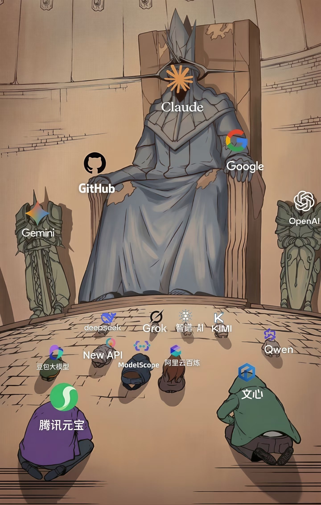

---
prev:
  text: '附录 D：技能开发与发布指南'
  link: '/cn/appendix/appendix-d'
next:
  text: '附录 F：命令速查表'
  link: '/cn/appendix/appendix-f'
---

# 附录 E：模型提供商选型指南

> 最后更新：2026-03-12 | 价格与功能可能随时调整，请以各提供商官网最新信息为准。

OpenClaw 的核心能力来自大语言模型。选对模型提供商，直接决定你的龙虾有多聪明、响应多快、每月花多少钱。本附录系统梳理所有主流模型提供商，帮你根据预算、网络环境和使用场景快速选型。

**目录**

- [1. 全景总览](#_1-全景总览)
- [2. 快速选型：30 秒找到你的方案](#_2-快速选型-30-秒找到你的方案)
- [3. 聚合网关（推荐入门）](#_3-聚合网关-推荐入门)
- [4. 国内模型提供商](#_4-国内模型提供商)
- [5. 国际模型提供商](#_5-国际模型提供商)
- [6. 本地部署](#_6-本地部署)
- [7. 选型决策框架](#_7-选型决策框架)
- [8. 定价速查表](#_8-定价速查表)

---

## 1. 全景总览

模型提供商可分为四大类：

| 分类 | 代表 | 适合谁 |
|------|------|--------|
| **聚合网关** | OpenRouter、硅基流动 | 一个 Key 用多家模型，入门首选 |
| **国内直连** | DeepSeek、Qwen、GLM、Kimi、豆包、混元等 | 国内网络直连、支付宝付款、低延迟 |
| **国际直连** | OpenAI、Anthropic、Google、xAI、Mistral | 追求最强模型能力，需科学上网或海外节点 |
| **本地部署** | Ollama、LM Studio | 完全离线、零成本、数据不出本机 |

> **本教程推荐路径**：零成本入门用 **OpenRouter 免费模型**（第二章）→ 日常使用切 **硅基流动**（国内付费首选）→ 追求极致用 **DeepSeek / OpenAI / Anthropic 直连**。

---

## 2. 快速选型：30 秒找到你的方案

**按你的情况选：**

| 你的情况 | 推荐方案 | 理由 |
|---------|---------|------|
| 零成本体验，不想花一分钱 | [**OpenRouter**](#_3-1-openrouter) + `stepfun/step-3.5-flash:free` | 免费模型，注册即用 |
| 国内用户，想花最少的钱 | [**DeepSeek**](#_4-1-一键对比) 直连 | 国产最强性价比，¥1/百万 token |
| 国内用户，想要一站式体验 | [**硅基流动**](#_3-2-硅基流动-siliconflow) | 聚合 200+ 模型，新用户送 ¥16 |
| 需要最强推理能力 | [**OpenAI**](#_5-1-一键对比) o3 / GPT-5 | 当前综合最强，需科学上网 |
| 需要最强编程能力 | [**Anthropic**](#_5-1-一键对比) Claude Opus 4.5 | 编程领域标杆 |
| 需要超长上下文 | [**Google**](#_5-1-一键对比) Gemini 2.5 Pro | 1M token 上下文窗口 |
| 需要搜索增强 | [**Perplexity**](#_5-2-各提供商详解) | 内置实时搜索，回答带引用 |
| 数据不能出本机 | [**Ollama**](#_6-本地部署) + DeepSeek R1 | 完全本地，零网络依赖 |
| 想要免费无限量 | [**混元**](#_4-2-各提供商详解) hunyuan-lite | 腾讯免费模型，不限量 |
| 预算敏感 + 要求质量 | [**DeepSeek**](#_4-1-一键对比) V3 | ¥1/百万 token，接近 GPT-4 水平 |
| 编程 + 代码补全 | [**Mistral**](#_5-2-各提供商详解) Codestral | 专为代码优化的模型 |

---

## 3. 聚合网关（推荐入门）

不想注册一堆账号？聚合网关让你用**一个 API Key 访问多家模型**，还能在模型之间自由切换。

### 3.1 OpenRouter

> **本教程第二章的默认推荐方案。**

[OpenRouter](https://openrouter.ai) 是全球最大的模型聚合网关，接入 300+ 模型，包括 OpenAI、Anthropic、Google、Meta、Mistral、DeepSeek 等几乎所有主流提供商。

**核心优势：**
- **有免费模型**：`stepfun/step-3.5-flash:free`、`google/gemma-3-4b-it:free` 等，零成本入门
- **一个 Key 用所有模型**：注册后生成一个 API Key，通过 `provider/model-name` 格式切换模型
- **透明定价**：在每个模型页面直接显示价格，按用量付费，无月费
- **中国可访问**：部分地区可直连，或通过硅基流动等国内代理访问

**定价模式：**
- 免费模型：$0（有速率限制）
- 付费模型：按各提供商原价 + 小幅加价（通常 5-15%）
- 支付方式：国际信用卡、Crypto

**OpenClaw 配置：**
```bash
# 环境变量
export OPENROUTER_API_KEY="sk-or-v1-..."

# openclaw.json 中的模型配置
# model: "openrouter:stepfun/step-3.5-flash:free"
```

**链接：** [openrouter.ai](https://openrouter.ai)

### 3.2 硅基流动（SiliconFlow）

> **国内付费场景首选。**

[硅基流动](https://cloud.siliconflow.cn) 是国内领先的模型聚合平台，提供 200+ 开源和商用模型的统一 API 接口。

**核心优势：**
- **新用户送 ¥16**：注册即送，足够体验数天
- **国内直连**：无需科学上网，低延迟
- **支付宝付款**：对国内用户最友好
- **模型丰富**：DeepSeek、Qwen、GLM、Llama、Mistral 等全覆盖
- **有免费模型**：部分开源模型提供免费推理额度

**定价模式：**
- 新用户：¥16 免费额度
- 按量付费：不同模型价格不同，通常比直连略高
- 充值方式：支付宝、微信支付

**OpenClaw 配置：**
```bash
export SILICONFLOW_API_KEY="sk-..."

# 模型格式：siliconflow:provider/model-name
# 例如：siliconflow:deepseek-ai/DeepSeek-V3
```

**链接：** [cloud.siliconflow.cn](https://cloud.siliconflow.cn)

### 3.3 Vercel AI Gateway

[Vercel AI Gateway](https://sdk.vercel.ai/docs/ai-sdk-core/settings#api-configuration) 是 Vercel 提供的统一 AI 网关，主要面向开发者。

**特点：**
- 统一 SDK（`ai` npm 包）接入多家模型
- 内置负载均衡、故障转移、缓存
- 与 Vercel 部署平台深度集成
- 更适合应用开发场景，而非直接用于 OpenClaw

> Vercel AI Gateway 更偏向开发框架而非 API 代理，对 OpenClaw 用户来说，OpenRouter 和硅基流动是更直接的选择。

### 3.4 聚合网关对比

| | OpenRouter | 硅基流动 | Vercel AI Gateway |
|---|---|---|---|
| **模型数量** | 300+ | 200+ | 取决于配置 |
| **免费模型** | ✅ 多个 | ✅ 部分 | — |
| **新用户福利** | — | ¥16 免费额度 | — |
| **国内直连** | 部分地区 | ✅ | ✅ |
| **支付宝** | ❌ | ✅ | — |
| **OpenClaw 集成** | ✅ 原生支持 | ✅ 原生支持 | 需自行配置 |
| **适合谁** | 海外用户 / 想用免费模型 | 国内用户 / 付费首选 | 开发者 |

---

## 4. 国内模型提供商

国内提供商的共同优势：**直连无需科学上网**、**支付宝/微信支付**、**中文优化好**。

### 4.1 一键对比

| 提供商 | 旗舰模型 | 输入价格 (¥/百万token) | 输出价格 (¥/百万token) | 免费额度 | 上下文 | 特色 |
|--------|---------|----------------------|----------------------|---------|--------|------|
| **DeepSeek** | DeepSeek V3 | 1 | 2 | 新用户送额度 | 128K | 性价比之王，推理能力强 |
| **DeepSeek** | DeepSeek R1 | 4 | 16 | — | 128K | 深度推理，数学/编程 |
| **通义千问** | Qwen3.5-plus | 2 | 6 | 有免费额度 | 128K | 阿里系，中文理解好 |
| **智谱** | GLM-5 | 5 | 5 | 新用户送额度 | 128K | 学术背景，工具调用强 |
| **月之暗面** | Kimi K2.5 | 8 | 8 | 有限免费 | 256K | 超长上下文 |
| **豆包** | Doubao-Seed-2.0 | 0.3 | 0.6 | Coding Plan 含 | 128K | 字节系，极致低价 |
| **混元** | hunyuan-lite | **免费** | **免费** | **无限量** | 32K | 腾讯免费模型 |
| **混元** | hunyuan-pro | 15 | 50 | — | 128K | 腾讯旗舰 |
| **MiniMax** | MiniMax-M2.5 | 1 | 4 | 欢迎积分 | 200K+ | MoE 架构，多模态 |
| **阶跃星辰** | Step-3.5-flash | 免费(via OR) | 免费(via OR) | OpenRouter 免费 | 128K | 通过 OpenRouter 免费用 |
| **文心** | ERNIE-4.5-turbo | 4 | 12 | 有免费额度 | 128K | 百度系 |

> **价格说明**：以上为 API 直连价格（2026 年 3 月），通过聚合网关（硅基流动/OpenRouter）使用时价格可能略有不同。

### 4.2 各提供商详解

<details>
<summary>DeepSeek（深度求索）— 性价比之王</summary>

[DeepSeek](https://platform.deepseek.com) 凭借开源策略和极致性价比，成为国内最受欢迎的 API 提供商之一。

**模型矩阵：**
- **DeepSeek V3**：通用旗舰，128K 上下文，MoE 架构（671B 参数，37B 活跃），性能接近 GPT-4o，价格仅为其 1/30
- **DeepSeek R1**：深度推理模型，擅长数学、编程、逻辑推理，思维链输出
- **DeepSeek Coder**：代码专用模型

**优势：**
- 国产模型中综合能力最强之一
- 价格极低（V3 输入 ¥1/百万 token）
- 支持支付宝充值
- 开源模型可本地部署（通过 Ollama）
- API 兼容 OpenAI 格式，接入简单

**注意：**
- 高峰期可能排队（热门程度高）
- R1 模型输出较慢（深度推理需要时间）

**OpenClaw 配置：**
```bash
export DEEPSEEK_API_KEY="sk-..."
# model: "deepseek:deepseek-chat"      # V3
# model: "deepseek:deepseek-reasoner"  # R1
```

**链接：** [platform.deepseek.com](https://platform.deepseek.com)

</details>

<details>
<summary>通义千问 Qwen（阿里云百炼）</summary>

[通义千问](https://dashscope.console.aliyun.com) 是阿里云旗下的大模型平台，通过百炼（DashScope）平台提供 API 服务。

**模型矩阵：**
- **Qwen3.5-plus**：旗舰通用模型，128K 上下文
- **Qwen3.5-turbo**：高性价比版本
- **Qwen-VL**：视觉理解模型
- **Qwen-Audio**：语音理解模型
- **Qwen-Coder**：代码专用

**优势：**
- 中文理解能力优秀（阿里电商+搜索数据训练）
- 模型矩阵完整（文本/视觉/语音/代码）
- 新用户有免费额度
- 支持函数调用（Function Calling）
- Coding Plan Lite ¥10/月（18,000 次请求）

**OpenClaw 配置：**
```bash
export DASHSCOPE_API_KEY="sk-..."
# model: "qwen:qwen-max"
# model: "qwen:qwen-plus"
```

**链接：** [dashscope.console.aliyun.com](https://dashscope.console.aliyun.com) | [百炼平台](https://bailian.console.aliyun.com)

</details>

<details>
<summary>智谱 GLM</summary>

[智谱](https://open.bigmodel.cn) 由清华大学孵化，是国内最早的大模型公司之一。

**模型矩阵：**
- **GLM-5**：最新旗舰，综合能力与 GPT-4o 对标
- **GLM-4-plus**：均衡性价比
- **GLM-4-flash**：低成本快速响应
- **CogView**：图像生成
- **CogVideoX**：视频生成

**优势：**
- 学术背景深厚（清华 KEG 实验室）
- 工具调用（Tool Use）能力突出——OpenClaw 的技能系统依赖此能力
- AutoClaw（澳龙）内置 Pony-Alpha-2 就是基于 GLM 架构
- 新用户有免费额度

**OpenClaw 配置：**
```bash
export ZHIPUAI_API_KEY="..."
# model: "glm:glm-4-plus"
```

**链接：** [open.bigmodel.cn](https://open.bigmodel.cn)

</details>

<details>
<summary>月之暗面 Moonshot / Kimi</summary>

[月之暗面](https://platform.moonshot.cn) 以超长上下文闻名，Kimi K2.5 支持 256K token 上下文窗口。

**模型矩阵：**
- **Kimi K2.5**：旗舰模型，256K 上下文
- **Moonshot-v1-128k**：128K 上下文版本
- **Moonshot-v1-32k**：32K 经济版

**优势：**
- 超长上下文（256K）——适合处理长文档、大代码库
- Kimi Claw 托管服务（见[附录 C](/cn/appendix/appendix-c)）
- 搜索增强能力（集成 Yahoo Finance 等数据源）

**注意：**
- 价格在国内提供商中偏高
- 长上下文场景下 token 消耗大

**OpenClaw 配置：**
```bash
export MOONSHOT_API_KEY="sk-..."
# model: "moonshot:moonshot-v1-128k"
```

**链接：** [platform.moonshot.cn](https://platform.moonshot.cn) | [Kimi.com](https://kimi.com)

</details>

<details>
<summary>豆包 Doubao（火山方舟）</summary>

[火山方舟](https://console.volcengine.com/ark) 是字节跳动旗下的模型服务平台，提供豆包系列模型。

**模型矩阵：**
- **Doubao-Seed-2.0**：最新旗舰，MoE 架构
- **Doubao-pro**：通用高性能
- **Doubao-lite**：轻量快速

**优势：**
- **价格极低**：输入 ¥0.3/百万 token，输出 ¥0.6/百万 token（可能是主流模型中最低价）
- ArkClaw 全托管服务深度集成（见[附录 C](/cn/appendix/appendix-c)）
- Coding Plan：¥9.9/首月起，同时支持 ArkClaw + Claude Code + Cursor
- 飞书深度集成

**注意：**
- 模型能力在国内第一梯队但不是最顶尖
- 部分功能需要通过 Coding Plan 订阅

**OpenClaw 配置：**
```bash
export ARK_API_KEY="..."
# 需要在火山方舟控制台创建推理接入点
# model: "doubao:doubao-seed-2.0"
```

**链接：** [console.volcengine.com/ark](https://console.volcengine.com/ark) | [Coding Plan](https://www.volcengine.com/activity/codingplan)

</details>

<details>
<summary>混元 Hunyuan（腾讯）</summary>

[腾讯混元](https://cloud.tencent.com/product/tclm) 提供从免费到旗舰的完整模型矩阵。

**模型矩阵：**
- **hunyuan-lite**：**免费无限量**——目前唯一完全免费不限量的主流模型
- **hunyuan-standard**：标准版
- **hunyuan-pro**：旗舰版

**优势：**
- **hunyuan-lite 免费无限量**——零成本 7×24 运行 OpenClaw
- 腾讯云部署深度集成（见[附录 C](/cn/appendix/appendix-c)）
- QQ/企微/微信生态协同
- 支持函数调用

**注意：**
- hunyuan-lite 能力有限（32K 上下文，适合简单任务）
- 旗舰版价格在国内偏高

**OpenClaw 配置：**
```bash
export HUNYUAN_SECRET_ID="..."
export HUNYUAN_SECRET_KEY="..."
# model: "hunyuan:hunyuan-lite"   # 免费
# model: "hunyuan:hunyuan-pro"    # 旗舰
```

**链接：** [cloud.tencent.com/product/tclm](https://cloud.tencent.com/product/tclm)

</details>

<details>
<summary>MiniMax（稀宇科技）</summary>

[MiniMax](https://platform.minimaxi.com) 以 MoE 架构和多模态能力著称。

**模型矩阵：**
- **MiniMax-M2.5**：旗舰 MoE 模型（229B 参数，~10B 活跃），200K+ 上下文
- **MiniMax-Text**：文本专用
- **MiniMax-VL**：视觉理解

**优势：**
- MoE 架构成本低（活跃参数少，推理便宜）
- 多模态内置（图像/视频理解、文生图/视频）
- MaxClaw 全托管服务（见[附录 C](/cn/appendix/appendix-c)）
- 200K+ 长上下文

**OpenClaw 配置：**
```bash
export MINIMAX_API_KEY="..."
# model: "minimax:MiniMax-M2.5"
```

**链接：** [platform.minimaxi.com](https://platform.minimaxi.com) | [MaxClaw](https://maxclaw.ai/)

</details>

<details>
<summary>阶跃星辰（StepFun）</summary>

[阶跃星辰](https://platform.stepfun.com) 以高性能推理模型见长。

**模型矩阵：**
- **Step-3.5**：旗舰模型
- **Step-3.5-flash**：轻量快速版——**可通过 OpenRouter 免费使用**

**优势：**
- `stepfun/step-3.5-flash:free` 通过 OpenRouter 免费（本教程第二章入门方案）
- 直连 API 价格也较低
- 推理速度快

> 如果你通过 OpenRouter 使用 StepFun 的免费模型，则不需要单独注册 StepFun 账号。

**链接：** [platform.stepfun.com](https://platform.stepfun.com)

</details>

<details>
<summary>文心一言 ERNIE（百度千帆）</summary>

[百度千帆](https://console.bce.baidu.com/qianfan) 提供文心系列模型。

**模型矩阵：**
- **ERNIE-4.5-turbo**：旗舰版
- **ERNIE-4.0**：上一代旗舰
- **ERNIE-Speed/Lite**：经济版

**优势：**
- 百度搜索数据加持，中文知识库丰富
- 千帆平台提供 7 个官方 OpenClaw 技能
- 有免费体验额度
- 与百度云部署方案集成（见[附录 C](/cn/appendix/appendix-c)）

**链接：** [console.bce.baidu.com/qianfan](https://console.bce.baidu.com/qianfan) | [千帆文档](https://cloud.baidu.com/doc/qianfan)

</details>

<details>
<summary>Z.AI</summary>

[Z.AI](https://z.ai) 提供模型 API 服务。

**特点：**
- OpenClaw 官方支持的提供商之一
- 具体定价和模型详情请参考官网

**链接：** [z.ai](https://z.ai)

</details>

---

## 5. 国际模型提供商

国际提供商通常提供最前沿的模型能力，但**需要科学上网**且**需国际信用卡支付**。如果你在国内且不方便直连，可以通过 [OpenRouter](#_3-1-openrouter) 或 [硅基流动](#_3-2-硅基流动-siliconflow) 间接使用这些模型。

### 5.1 一键对比

| 提供商 | 旗舰模型 | 输入价格 ($/百万token) | 输出价格 ($/百万token) | 免费额度 | 上下文 | 特色 |
|--------|---------|----------------------|----------------------|---------|--------|------|
| **OpenAI** | GPT-5 | ~30 | ~60 | ❌ | 128K | 综合最强，生态最完善 |
| **OpenAI** | GPT-4o | ~2.5 | ~10 | ❌ | 128K | 高性价比多模态 |
| **OpenAI** | o3 | ~15 | ~60 | ❌ | 200K | 深度推理 |
| **Anthropic** | Claude Opus 4.5 | ~15 | ~75 | ❌ | 200K | 编程最强，超长输出 |
| **Anthropic** | Claude Sonnet 4.5 | ~3 | ~15 | ❌ | 200K | 性价比编程 |
| **Google** | Gemini 2.5 Pro | ~1.25 | ~10 | ✅ 免费层 | **1M** | 超长上下文之王 |
| **Google** | Gemini 2.5 Flash | ~0.15 | ~0.6 | ✅ 免费层 | 1M | 极致性价比 |
| **xAI** | Grok 4 | ~5 | ~15 | ✅ 免费积分 | 128K | 实时信息（X/Twitter） |
| **Mistral** | Mistral Large | ~2 | ~6 | ✅ 免费层 | 128K | 欧洲开源领军 |
| **Mistral** | Codestral | ~0.3 | ~0.9 | ✅ 免费层 | 256K | 代码专用，FIM 支持 |
| **Perplexity** | Sonar Pro | ~3 | ~15 | ❌ | 128K | 搜索增强，带引用 |

> **价格说明**：以上为 2026 年 3 月参考价格，实际价格请以各提供商官网为准。OpenAI/Anthropic 价格波动较频繁。

### 5.2 各提供商详解

<details>
<summary>OpenAI — 行业标杆</summary>

[OpenAI](https://platform.openai.com) 是大模型行业的开创者，GPT 系列模型在综合能力上长期领先。

**模型矩阵：**
- **GPT-5**：最新旗舰，综合能力最强
- **GPT-4o**：多模态旗舰，支持文本/图像/音频输入
- **GPT-4o-mini**：轻量高性价比
- **o3 / o3-mini**：深度推理模型（类似 DeepSeek R1，但更强）
- **o1**：上一代推理模型

**优势：**
- 综合能力长期领先
- 生态最完善（函数调用、JSON 模式、结构化输出）
- OpenClaw 原生支持最好（大量技能默认适配 OpenAI 格式）
- 多模态能力强（图像理解、语音）

**注意：**
- 需科学上网
- 需国际信用卡（Visa/Mastercard）
- 价格在主流提供商中偏高
- 中国手机号无法注册（需海外手机号或虚拟号）

**OpenClaw 配置：**
```bash
export OPENAI_API_KEY="sk-..."
# model: "openai:gpt-4o"
# model: "openai:o3"
```

**链接：** [platform.openai.com](https://platform.openai.com)

</details>

<details>
<summary>Anthropic（Claude）— 编程之王</summary>

[Anthropic](https://console.anthropic.com) 的 Claude 系列在编程、长文本处理和安全性方面表现突出。

**模型矩阵：**
- **Claude Opus 4.5**：旗舰，编程能力业界最强
- **Claude Sonnet 4.5**：性价比编程选手
- **Claude Haiku 4.5**：轻量快速

**优势：**
- 编程能力业界标杆（SWE-bench 排名持续领先）
- 200K 上下文窗口
- 安全性设计突出（Constitutional AI）
- 超长输出能力（一次生成数千行代码）

**注意：**
- 需科学上网
- 需国际信用卡
- API 价格较高（Opus 4.5 输出 $75/百万 token）
- 速率限制相对严格

**OpenClaw 配置：**
```bash
export ANTHROPIC_API_KEY="sk-ant-..."
# model: "anthropic:claude-sonnet-4-5-20250514"
```

**链接：** [console.anthropic.com](https://console.anthropic.com)

</details>

<details>
<summary>Google（Gemini）— 超长上下文</summary>

[Google AI Studio](https://aistudio.google.com) 提供 Gemini 系列模型，以超长上下文窗口著称。

**模型矩阵：**
- **Gemini 2.5 Pro**：旗舰，**1M token 上下文**（百万级！）
- **Gemini 2.5 Flash**：轻量高速，也支持 1M 上下文
- **Gemini 2.5 Flash-8B**：超轻量

**优势：**
- **1M token 上下文**——可以一次性读入整本书或整个代码库
- 有免费层（AI Studio 免费使用，有速率限制）
- 多模态能力强（原生支持图像、视频、音频输入）
- Gemini 2.5 Flash 价格极低（$0.15/百万 token 输入）

**注意：**
- 需科学上网（AI Studio）
- 中文支持不如国内模型
- 免费层有速率限制

**OpenClaw 配置：**
```bash
export GOOGLE_API_KEY="..."
# model: "google:gemini-2.5-pro"
# model: "google:gemini-2.5-flash"
```

**链接：** [aistudio.google.com](https://aistudio.google.com) | [Vertex AI](https://cloud.google.com/vertex-ai)

</details>

<details>
<summary>xAI（Grok）</summary>

[xAI](https://console.x.ai) 由 Elon Musk 创立，Grok 模型与 X/Twitter 平台深度集成。

**模型矩阵：**
- **Grok 4**：最新旗舰
- **Grok 3**：上一代旗舰

**优势：**
- 实时信息访问（整合 X/Twitter 数据流）
- 新用户有免费 API 积分
- 幽默风格的对话体验

**注意：**
- 需科学上网
- 需国际信用卡
- 模型生态和工具调用支持不如 OpenAI

**链接：** [console.x.ai](https://console.x.ai)

</details>

<details>
<summary>Mistral — 欧洲开源领军</summary>

[Mistral](https://mistral.ai) 是欧洲最重要的 AI 公司，以开源模型和代码能力著称。

**模型矩阵：**
- **Mistral Large**：旗舰通用模型，128K 上下文
- **Codestral**：专为代码设计，256K 上下文，支持 Fill-in-the-Middle（FIM）
- **Mistral Small**：轻量经济版
- **Pixtral**：视觉理解模型

**优势：**
- 有免费层（La Plateforme 免费使用部分模型）
- **Codestral 代码能力强**：专为编程优化，支持 80+ 语言
- 开源模型可本地部署
- 欧洲数据合规（GDPR）

**OpenClaw 配置：**
```bash
export MISTRAL_API_KEY="..."
# model: "mistral:mistral-large-latest"
# model: "mistral:codestral-latest"
```

**链接：** [mistral.ai](https://mistral.ai) | [La Plateforme](https://console.mistral.ai)

</details>

<details>
<summary>Perplexity — 搜索增强</summary>

[Perplexity](https://docs.perplexity.ai) 提供搜索增强的模型 API，回答自动附带网页引用来源。

**模型矩阵：**
- **Sonar Pro**：旗舰搜索增强模型
- **Sonar**：标准版

**优势：**
- **内置实时网页搜索**——不需要额外配置搜索技能
- 回答自动附带引用来源（URL）
- 适合需要实时信息的场景（新闻、研究、事实核查）

**注意：**
- 价格较高（搜索成本包含在 token 价格中）
- 不适合纯创作/编程场景
- 需科学上网

**链接：** [docs.perplexity.ai](https://docs.perplexity.ai)

</details>

---

## 6. 本地部署

不想把数据发送到云端？本地部署让模型完全在你的电脑上运行——**零成本、零延迟、完全隐私**。代价是需要足够的硬件资源，且模型能力通常弱于云端旗舰。

| | Ollama | LM Studio |
|---|---|---|
| **类型** | CLI 工具 | GUI 应用 |
| **支持平台** | macOS / Linux / Windows | macOS / Linux / Windows |
| **界面** | 命令行 | 图形界面（对新手友好） |
| **模型格式** | GGUF (llama.cpp) | GGUF (llama.cpp) |
| **模型库** | ollama.com/library | 内置模型搜索下载 |
| **API 兼容** | ✅ OpenAI 格式（localhost:11434） | ✅ OpenAI 格式（localhost:1234） |
| **资源占用** | 低（仅推理） | 中（含 GUI） |
| **适合谁** | 技术用户 / 已有终端经验 | 新手 / 喜欢 GUI |

<details>
<summary>Ollama 快速上手</summary>

```bash
# 安装
curl -fsSL https://ollama.com/install.sh | sh   # Linux/macOS
# Windows: 下载 ollama.com 安装包

# 下载并运行模型
ollama pull deepseek-r1:8b        # 8B 参数版，需 ~6GB 显存/内存
ollama pull qwen2.5:14b           # 14B 参数版，需 ~10GB
ollama pull llama3.3:8b           # Meta Llama 3.3

# 启动 API 服务（默认 http://localhost:11434）
ollama serve
```

**OpenClaw 配置：**
```bash
# openclaw.json 中配置本地模型
# API base: http://localhost:11434/v1
# model: "ollama:deepseek-r1:8b"
```

**硬件推荐：**

| 模型大小 | 最低内存 | 推荐 GPU | 推荐场景 |
|---------|---------|---------|---------|
| 1-3B | 4GB | 无需 | 简单问答 |
| 7-8B | 8GB | 6GB VRAM | 日常对话、简单编程 |
| 14B | 16GB | 12GB VRAM | 较复杂任务 |
| 32B+ | 32GB+ | 24GB+ VRAM | 接近云端质量 |

> **Apple Silicon 用户**：M 系列芯片的统一内存对本地模型特别友好。16GB M4 可以流畅运行 8B 模型，24GB+ 可以运行 14B 模型。

</details>

<details>
<summary>LM Studio 快速上手</summary>

1. 从 [lmstudio.ai](https://lmstudio.ai) 下载安装
2. 打开应用，搜索模型（如 "deepseek"）
3. 一键下载，点击 "Start" 即可启动
4. 在设置中开启 "Local Server"（默认 http://localhost:1234）

**优势：** 纯 GUI 操作，适合不熟悉命令行的用户。内置模型性能测试，可以直观看到推理速度。

</details>

<details>
<summary>Hugging Face 开源模型</summary>

[Hugging Face](https://huggingface.co) 是全球最大的开源模型托管平台，几乎所有开源大模型都在此发布。

**使用方式：**
- **直接下载**：下载 GGUF 格式模型文件，用 Ollama 或 LM Studio 加载
- **Inference API**：Hugging Face 提供云端推理 API（有免费层）
- **Inference Endpoints**：付费部署专属推理实例

**推荐开源模型：**

| 模型 | 参数 | 特点 | HF 链接 |
|------|------|------|---------|
| DeepSeek R1 | 1.5B-671B | 深度推理，多种尺寸 | deepseek-ai/DeepSeek-R1 |
| Qwen 2.5 | 0.5B-72B | 均衡通用 | Qwen/Qwen2.5 |
| Llama 3.3 | 8B-70B | Meta 开源旗舰 | meta-llama/Llama-3.3 |
| Mistral | 7B-24B | 欧洲开源 | mistralai/ |
| Gemma 3 | 2B-27B | Google 开源 | google/gemma-3 |

> 开源模型通常需要量化（如 Q4_K_M）才能在消费级硬件上运行。Ollama 默认提供量化版本。

</details>

---

## 7. 选型决策框架

### 7.1 四维评估

选模型提供商需要权衡四个维度：

| 维度 | 权重建议 | 说明 |
|------|---------|------|
| **能力** | 核心 | 模型的推理、编程、中文、工具调用能力 |
| **成本** | 重要 | API 价格 × 你的用量 = 月度开支 |
| **可达性** | 前提 | 能否从你的网络环境直接访问，支付方式是否可用 |
| **生态** | 加分 | 与 OpenClaw 的集成程度、社区支持 |

### 7.2 场景化推荐

| 场景 | 首选 | 备选 | 理由 |
|------|------|------|------|
| **零成本入门** | OpenRouter 免费模型 | 混元 hunyuan-lite | 免费使用，快速体验 |
| **国内日常使用** | 硅基流动 + DeepSeek V3 | 通义千问 | 性价比最优，一站式 |
| **深度推理/数学** | DeepSeek R1 | OpenAI o3 | R1 国内直连且便宜 |
| **编程开发** | Anthropic Claude Sonnet 4.5 | Mistral Codestral | 编程能力最强 |
| **超长文档处理** | Google Gemini 2.5 Pro | 月之暗面 Kimi K2.5 | 1M 上下文 |
| **实时信息查询** | Perplexity Sonar | xAI Grok | 内置搜索 |
| **多模态（图/视频）** | OpenAI GPT-4o | Google Gemini 2.5 | 原生多模态 |
| **企业合规** | Anthropic Claude | Mistral（GDPR） | 安全/合规设计 |
| **完全隐私** | Ollama + 本地模型 | LM Studio | 数据不出本机 |
| **7×24 低成本运行** | 混元 hunyuan-lite | 豆包 Doubao-lite | 免费/超低价 |

### 7.3 模型能力梯队（2026Q1 参考）

下面这张在社区广泛流传的"大模型王座"图，直观展示了当前主流模型的江湖地位：



> 图片来源：社区创作，仅供参考。实际排名因评测基准和使用场景而异。

**T0（顶级）：** GPT-5、Claude Opus 4.5、Gemini 2.5 Pro、o3
> 综合能力最强，适合复杂推理、高质量创作、困难编程任务。价格最高。

**T1（主力）：** GPT-4o、Claude Sonnet 4.5、DeepSeek V3/R1、Grok 4、Qwen3.5-plus、GLM-5
> 日常使用完全够用，性价比优秀。DeepSeek V3 以 1/30 的价格达到接近 T0 的能力。

**T2（经济）：** GPT-4o-mini、Gemini 2.5 Flash、Doubao-Seed-2.0、DeepSeek V3(通过聚合)、Step-3.5-flash
> 简单任务的最佳选择，价格极低，响应快速。

**T3（免费/本地）：** 混元 hunyuan-lite、OpenRouter 免费模型、Ollama 本地模型
> 零成本运行，能力有限，适合体验和轻量场景。

---

## 8. 定价速查表

> 以下为各提供商 API 门户地址及关键信息速查。价格仅供参考，以官网实时价格为准。

### 8.1 国内提供商

| 提供商 | 门户地址 | 支付方式 | 免费额度 | 备注 |
|--------|---------|---------|---------|------|
| **硅基流动** | [cloud.siliconflow.cn](https://cloud.siliconflow.cn) | 支付宝/微信 | ¥16 新用户 | 聚合平台，模型最全 |
| **DeepSeek** | [platform.deepseek.com](https://platform.deepseek.com) | 支付宝 | 新用户送额度 | 性价比最高 |
| **通义千问** | [dashscope.console.aliyun.com](https://dashscope.console.aliyun.com) | 支付宝 | 有免费额度 | 阿里云旗下 |
| **智谱** | [open.bigmodel.cn](https://open.bigmodel.cn) | 支付宝/微信 | 新用户送额度 | 清华系 |
| **月之暗面** | [platform.moonshot.cn](https://platform.moonshot.cn) | 支付宝 | 有限免费 | 超长上下文 |
| **豆包** | [console.volcengine.com/ark](https://console.volcengine.com/ark) | 支付宝 | Coding Plan 含 | 字节系，极低价 |
| **混元** | [cloud.tencent.com/product/tclm](https://cloud.tencent.com/product/tclm) | 微信/支付宝 | **lite 免费无限** | 腾讯系 |
| **MiniMax** | [platform.minimaxi.com](https://platform.minimaxi.com) | 支付宝 | 欢迎积分 | MoE 多模态 |
| **阶跃星辰** | [platform.stepfun.com](https://platform.stepfun.com) | 支付宝 | — | 或用 OpenRouter 免费 |
| **文心** | [console.bce.baidu.com/qianfan](https://console.bce.baidu.com/qianfan) | 支付宝 | 有免费额度 | 百度系 |

### 8.2 国际提供商

| 提供商 | 门户地址 | 支付方式 | 免费额度 | 国内可达 |
|--------|---------|---------|---------|---------|
| **OpenRouter** | [openrouter.ai](https://openrouter.ai) | 国际信用卡/Crypto | ✅ 免费模型 | 部分地区 |
| **OpenAI** | [platform.openai.com](https://platform.openai.com) | 国际信用卡 | ❌ | ❌ 需科学上网 |
| **Anthropic** | [console.anthropic.com](https://console.anthropic.com) | 国际信用卡 | ❌ | ❌ 需科学上网 |
| **Google** | [aistudio.google.com](https://aistudio.google.com) | 国际信用卡 | ✅ 免费层 | ❌ 需科学上网 |
| **xAI** | [console.x.ai](https://console.x.ai) | 国际信用卡 | ✅ 免费积分 | ❌ 需科学上网 |
| **Mistral** | [console.mistral.ai](https://console.mistral.ai) | 国际信用卡 | ✅ 免费层 | ❌ 需科学上网 |
| **Perplexity** | [docs.perplexity.ai](https://docs.perplexity.ai) | 国际信用卡 | ❌ | ❌ 需科学上网 |

### 8.3 本地部署

| 工具 | 下载地址 | 费用 | 备注 |
|------|---------|------|------|
| **Ollama** | [ollama.com](https://ollama.com) | 免费 | CLI 工具，技术用户首选 |
| **LM Studio** | [lmstudio.ai](https://lmstudio.ai) | 免费 | GUI 应用，新手友好 |
| **Hugging Face** | [huggingface.co](https://huggingface.co) | 免费（下载） | 开源模型托管平台 |
