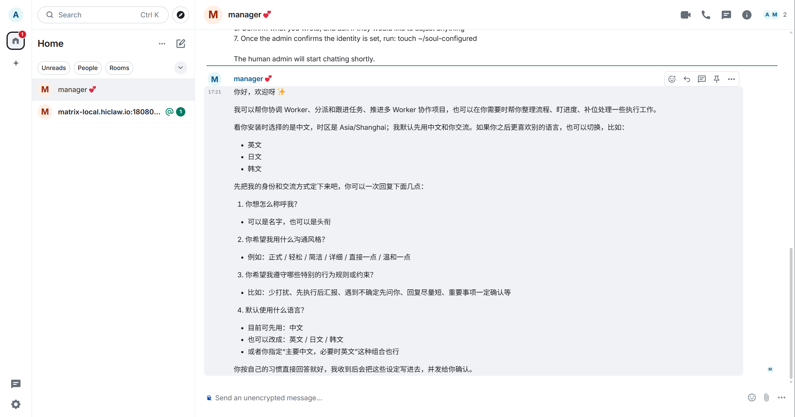
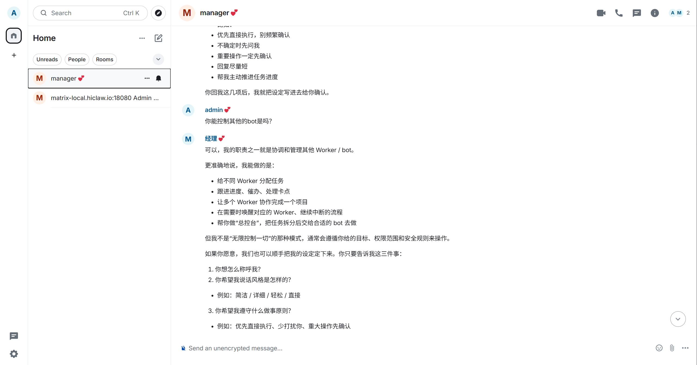
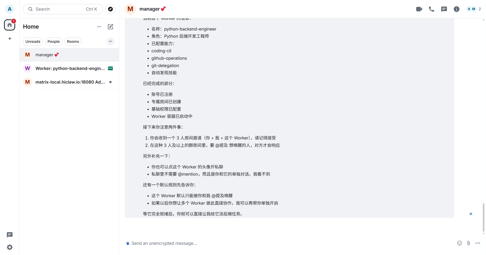

# 第十七章 部署 HiClaw（单机版）

本章采用 **Windows + WSL2 + Docker** 路线来部署 HiClaw。按照本教程操作，约 30 分钟可完成启动，并创建第一个 Worker。

---

## 前置要求

### 环境要求

| 项目 | 要求 | 检查命令 |
|-----|------|---------|
| WSL2 | Ubuntu 20.04+（本文路线使用） | `wsl --list --verbose` |
| Docker | 20.10+ | `docker --version` |
| 内存 | 4GB+（建议 8GB） | `free -h` |
| 磁盘 | 10GB+ 可用 | `df -h .` |

> 说明：HiClaw 官方文档的通用前置条件是“有 Docker 即可”。这里额外检查 WSL2，是因为本章选择的是 Windows 下的 WSL2 部署路线。

### 需要准备的材料

- **API Key**：你的 LLM 服务密钥
- **Base URL**：LLM 服务地址（如 `https://dashscope.aliyuncs.com/compatible-mode/v1`）
- **模型名称**：如 `qwen-plus`、`qwen-turbo` 等

---

## 步骤一：环境检查

在继续之前，先记住本文有两种终端环境：

- 标记为 `powershell` 的命令：在 Windows PowerShell 里执行
- 标记为 `bash` 的命令：在 WSL 的 Ubuntu 终端里执行，不是在 Windows PowerShell 里执行

如果你已经进入了 Ubuntu 终端，那么 `cat`、`source`、`mkdir -p`、`df -h` 这类命令都可以直接使用；如果你还在 Windows PowerShell 里，就不要直接运行这些 `bash` 命令。

### 1.1 如果还没安装 WSL，先安装

以**管理员身份**打开 PowerShell，执行：

```powershell
wsl --install
```

如果你想和本文保持一致，明确安装 Ubuntu 22.04：

```powershell
wsl --install -d Ubuntu-22.04
```

安装完成后，按提示重启 Windows。第一次启动 Ubuntu 时，系统会要求你创建 Linux 用户名和密码。

如果你的环境比较老，`wsl --install` 不可用，就先参考微软官方的 WSL 安装文档排查系统版本和安装方式：<https://learn.microsoft.com/windows/wsl/install>

安装完成后，你可以用下面两种方式进入 Ubuntu 终端：

**方式一：在 PowerShell 中启动**

```powershell
wsl -d Ubuntu-22.04
```

**方式二：从开始菜单启动**

在 Windows 开始菜单里搜索 `Ubuntu 22.04`，直接打开即可。

进入成功后，你会看到类似下面的提示符：

```bash
ke@your-pc:~$
```

从这一步开始，你就已经进入了 **WSL 的 Ubuntu 终端**，后面所有标记为 `bash` 的命令，都应该在这里执行。

### 1.2 检查 WSL2 状态

```powershell
wsl --list --verbose
```

应看到 `Ubuntu-22.04` 或类似发行版，状态为 `Running`。

### 1.3 如果还没安装 Docker Desktop，先安装

HiClaw 官方文档的前置条件是 Docker Desktop（Windows / macOS）或 Docker Engine（Linux）。本文是 Windows 路线，因此这里使用 Docker Desktop。

安装步骤：

1. 打开 Docker Desktop 官方下载页，下载 Windows 安装程序：<https://www.docker.com/products/docker-desktop/>
2. 双击运行 `Docker Desktop Installer.exe`。
3. 安装向导里确认使用 **WSL 2 backend**。
4. 完成安装后启动 Docker Desktop。
5. 首次启动时接受许可协议，等待 Docker Engine 启动完成。

安装完成后，建议在 PowerShell 中先检查：

```powershell
docker --version
docker info
```

如果你的管理员账户和当前使用账户不是同一个，Docker 官方文档还建议确认当前用户已加入 `docker-users` 组。安装与排错文档可参考：<https://docs.docker.com/desktop/setup/install/windows-install/>

### 1.4 检查 Docker

在 WSL 中执行：

```bash
docker --version
docker ps
```

应返回版本信息，且 `docker ps` 不报错。

### 1.5 检查端口占用

HiClaw 默认使用以下端口：

```bash
ss -tuln | grep -E ':(18080|18001|18088)'
```

如无输出，表示端口空闲。如有占用，后续可更换端口。

### 1.6 检查磁盘空间

```bash
df -h .
```

确保可用空间大于 10GB。

---

## 步骤二：准备非交互安装配置

### 2.1 创建工作目录

下面开始的命令，都默认在 **WSL 的 Ubuntu 终端** 里执行。

```bash
mkdir -p ~/projects/hiclaw-deployment
cd ~/projects/hiclaw-deployment
```

### 2.2 创建配置脚本

创建 `env.sh` 文件：

```bash
cat > env.sh << 'EOF'
#!/bin/bash
# 全自动模式（跳过所有交互提示）
export HICLAW_NON_INTERACTIVE=1

# LLM 配置
export HICLAW_LLM_PROVIDER="openai-compat"
export HICLAW_OPENAI_BASE_URL="https://your-endpoint/v1"
export HICLAW_DEFAULT_MODEL="your-model"
export HICLAW_LLM_API_KEY="sk-your-key"

# 管理员密码（最少8位）
export HICLAW_ADMIN_PASSWORD="admin123456"
EOF
```

### 2.3 根据你的 LLM 服务修改配置

HiClaw 官方 quickstart 默认走**交互式安装**：直接执行安装脚本，按提示输入 API Key 和管理员密码即可。  
这里改成 `env.sh` 的方式，主要是为了让部署过程更适合 **AI 全自动协助**：

- 配置项都提前写成环境变量，AI 可以按文档逐项检查和补全
- 安装过程不需要人在终端里一问一答，更适合自动执行
- 步骤更稳定，也更方便复现、排错和二次修改

如果你平时就会让 AI 帮你装环境、跑命令、排查错误，那也可以直接把这一章交给 AI 阅读，让它按文档帮你完成部署。

**阿里云百炼**：

```bash
export HICLAW_OPENAI_BASE_URL="https://dashscope.aliyuncs.com/compatible-mode/v1"
export HICLAW_DEFAULT_MODEL="qwen-plus"  # 或 qwen-turbo, qwen-max, qwen3.5-plus
export HICLAW_LLM_API_KEY="sk-your-dashscope-key"
```

阿里云百炼支持的常用模型：

| 模型 | 定位 | 适用场景 |
|-----|------|---------|
| `qwen-plus` | 主力模型 | 平衡能力和成本，推荐日常使用 |
| `qwen-turbo` | 轻量级 | 快速响应，成本敏感场景 |
| `qwen-max` | 最强能力 | 复杂任务，需要最强模型时 |
| `qwen3.5-plus` | 新一代旗舰 | 最新能力，支持长上下文 |

**其他 OpenAI 兼容服务**：

```bash
export HICLAW_OPENAI_BASE_URL="https://your-endpoint/v1"
export HICLAW_DEFAULT_MODEL="gpt-4o-mini"
export HICLAW_LLM_API_KEY="sk-your-key"
```

---

## 步骤三：执行安装

### 3.1 加载配置并执行

```bash
cd ~/projects/hiclaw-deployment
source env.sh
bash <(curl -sSL https://higress.ai/hiclaw/install.sh)
```

### 3.2 观察安装过程

安装分为三个阶段：

| 阶段 | 耗时 | 现象 |
|-----|------|------|
| 生成配置 | 10秒 | 显示配置信息 |
| 拉取镜像 | 5-15分钟 | 显示 `docker pull` 进度 |
| 启动服务 | 30秒 | 显示服务启动日志 |

### 3.3 安装完成标志

看到以下输出表示成功：

```
[HiClaw] === HiClaw Manager Started! ===
  Open: http://127.0.0.1:18088
  Login: admin / [your-password]
```

---

## 步骤四：验证服务

### 4.1 检查容器状态

```bash
docker ps | grep hiclaw
```

应看到 `hiclaw-manager` 状态为 `Up`。

### 4.2 检查配置文件

这里的 `cat` 命令是在 **WSL 的 Ubuntu 终端** 里执行。

```bash
cat ~/hiclaw-manager.env | grep -E 'LLM|BASE_URL|MODEL'
```

确认配置正确写入。

如果你想在 Windows PowerShell 里查看同一个文件，可以用：

```powershell
Get-Content $HOME\hiclaw-manager.env | Select-String 'LLM|BASE_URL|MODEL'
```

### 4.3 访问 Element Web

浏览器打开：http://127.0.0.1:18088

登录信息：
- 用户名：`admin`
- 密码：你设置的 `HICLAW_ADMIN_PASSWORD`

如果登录界面要求手动填写 Homeserver，再填写：`http://127.0.0.1:18080`

登录成功后，你会看到 Element Web 首页：


左侧列表中可以看到 `manager` 用户，这是 HiClaw 的 Manager Agent。

### 4.4 访问 Higress 控制台

浏览器打开：http://127.0.0.1:18001

默认账号：`admin` 
默认密码：`admin123456`（或你设置的密码）

你还会自动加入一个 Admin Room（管理室），用于接收系统通知：


---

## 步骤五：创建 Worker

### 5.1 给 Manager 发送指令

在 Element Web 中：

1. 点击左对话历史列表里面的`manager`可以直接进行对话。
2. 进入对话后，先了解 Manager 能做什么：



Manager 会说明它的职责：
- 给不同 Worker 分配任务
- 跟进进度、催办、处理卡点
- 让多个 Worker 协作完成项目
- 在需要时唤醒对应的 Worker



3. 发送消息创建 Worker（示例：创建后端工程师）：
   > 创建一个后端工程师 Worker

   Manager 会展示创建的 Worker 详情：

   

   包括：
   - Worker 名称（如 `python-backend-engineer`）和角色
   - 已配置的能力（如 coding-cli、github-operations 等）
   - 已完成的部分（账号注册、房间创建、权限配置、容器启动）

### 5.2 接受房间邀请

约一会后，你会收到 Worker 房间邀请：


点击"接受"加入房间。

### 5.3 创建另一个 Worker（可选）

如果发现 Worker 名字太长（如 `python-backend-engineer`），可以创建一个更简短的 Worker：

> 创建一个名为 alice 的 Worker

Manager 会回复创建进度：


创建过程包括：
- 注册 `alice` 的 Matrix 账号
- 在 Higress 创建 `worker-alice` Consumer
- 创建三方房间（你、Manager、Alice）
- 启动 Worker 容器

加入房间后，你也可以邀请其他人（如其他 Worker 或人类）加入：


---

## 步骤六：测试 LLM 调用

### 6.1 在 Worker 房间发送消息

在 "Worker: Alice" 房间发送：

> 你好呀

为了让消息明确指向 Alice，建议直接 `@alice` 或在她所在的 Worker 房间里向她发消息。

### 6.2 验证正常回复

如果 Alice 正常回复，说明：
- Matrix 通信正常
- Higress 权限配置正确
- Worker 能调用 LLM

实际对话示例：


Alice 成功回复"你好~"，表示 Worker 已就绪，可以开始分配任务。

---

## 故障排查

### 端口被占用

**现象**：安装报错 `bind: address already in use`

**解决**：修改 `env.sh`，更换端口：

```bash
export HICLAW_PORT_GATEWAY=28080
export HICLAW_PORT_CONSOLE=28001
export HICLAW_PORT_ELEMENT_WEB=28088
```

重新执行安装。

## 卸载和清理

### 停止服务

```bash
docker stop hiclaw-manager
docker start hiclaw-manager  # 再次启动
```

### 完全卸载

```bash
docker rm -f hiclaw-manager
docker volume rm hiclaw-data
rm -rf ~/hiclaw-manager
rm ~/hiclaw-manager.env
```

---


**参考文档**：
- [HiClaw 官方文档](https://github.com/higress-group/hiclaw)
- `docs/zh-cn/quickstart.md`
- `docs/zh-cn/architecture.md`

---

*本章完*
