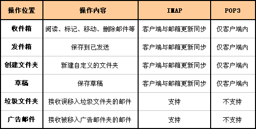
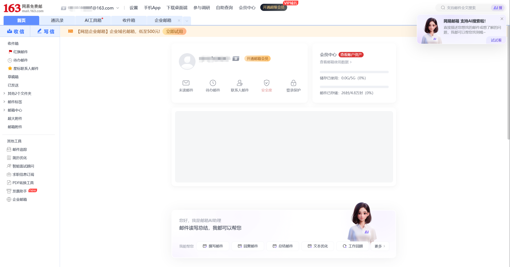
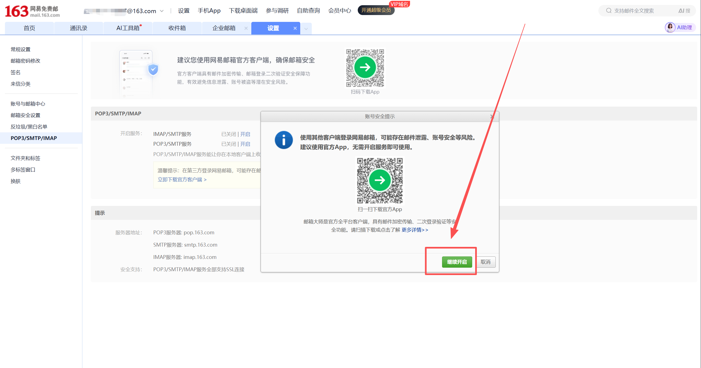
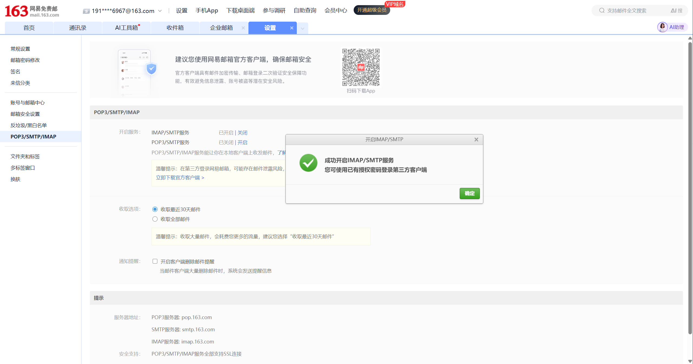
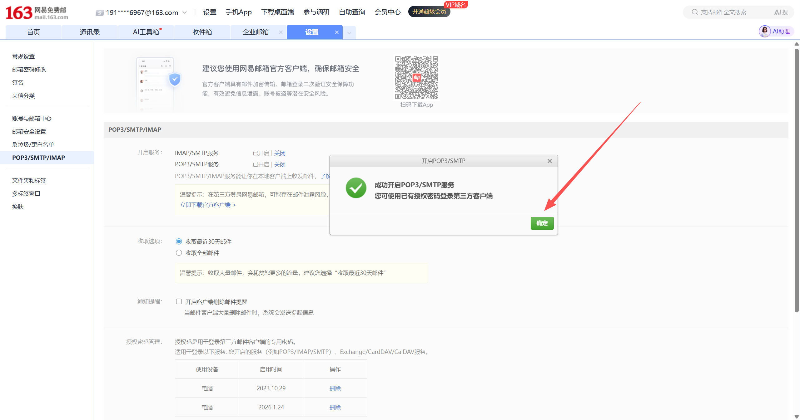

# 邮箱助手实战：以网易 163 邮箱为例

如果你只是想让脚本定时读取网易 163 邮箱，最短路径其实很清楚：

1. 在网页端开启 `IMAP/SMTP`
2. 生成并保存授权码
3. 用 `imap.163.com:993` 跑通第一版 Python 脚本

这篇文章写给第一次做邮箱自动化的人。看完之后，你应该能直接拿走三样东西：

- 什么时候该优先用 `IMAP`，而不是 `POP3`
- 163 邮箱从网页端到授权码的完整开启路径
- 一段够用的 Python 验证脚本

其他邮箱这次只做迁移提示，不展开逐步截图。

还有一个环境边界先提前说清楚：

- 这次 163 邮箱 `IMAP` 脚本读取，是在 `WSL Ubuntu` 里实跑验证的
- 但邮箱协议本身不依赖 `WSL`，只要你的 Python 运行环境能连到 `imap.163.com:993`，在 Windows、macOS、Linux 都可以跑
- `WSL` 这次主要影响的是 `OpenClaw cron / gateway` 这一层的运行细节，不是邮件协议本身

## 1. 先拿走结论：163 邮箱自动化读取，主路径是 IMAP 加授权码

很多人第一次做邮箱自动化，会先去找网页接口、Cookie，或者所谓的“邮箱 token”。  
对 163 邮箱这类个人邮箱来说，真正更稳的入口还是标准邮件协议。

- `IMAP`：适合读取邮件、同步状态
- `POP3`：也能收邮件，但更接近“下载收件箱”
- `SMTP`：负责发信，不负责读信

凭证这件事也一样。  
脚本侧真正该优先准备的，通常不是网页登录密码，而是网页邮箱设置页里生成的**授权码**。

所以这篇文章的主线非常简单：

- 读信优先走 `IMAP`
- 登录优先尝试授权码
- 先跑通联通性，再做自动化编排

## 2. 先理解协议：为什么这里更推荐 IMAP

如果你的目标只是把邮件下载到本地，`POP3` 也能完成任务。  
但如果你想做一个后续还能继续扩展的“邮箱助手”，`IMAP` 更合适。

原因不复杂。`IMAP` 更接近“远程操作服务器上的邮箱”，而不只是把邮件拽下来：

- 已读 / 未读状态更容易和网页端保持一致
- 多个客户端查看时，状态更容易同步
- 后续要按文件夹处理邮件时，扩展空间更大

网易帮助中心对这一点有明确说明：开启 `IMAP` 后，客户端上的删除、已读等操作会反馈到服务器，因此网页端和客户端里看到的状态通常是一致的。

下面这张对照图能更直观看出差异：



如果只记一句话，可以先这么理解：

- `POP3` 更像下载器
- `IMAP` 更像同步协议

## 3. 第一步：进入 163 邮箱网页端

先打开网易邮箱入口：<https://email.163.com/>


登录完成后，你会进入 163 邮箱主页。



到这里为止，你还只是完成了“网页邮箱登录”。  
这一步离脚本可读邮件还差关键一步：开启邮件协议服务并生成授权码。

## 4. 第二步：从设置页进入 POP3/SMTP/IMAP

在顶部导航里点击“设置”，再进入 `POP3/SMTP/IMAP`。


这也是网易帮助中心给出的官方开启路径：

- 先登录网页邮箱
- 再进入 `设置 -> POP3/SMTP/IMAP`
- 根据实际需求开启服务并完成验证

对这篇文章来说，重点只放在 `IMAP/SMTP`。

## 5. 第三步：优先开启 IMAP/SMTP

如果你的目标是“让脚本读取 163 邮箱”，优先开启 `IMAP/SMTP` 这一组。

点击“开启”后，页面会先弹出继续开启的确认提示：



完成页面要求的验证后，会看到开启成功的提示：



如果你后面还要兼容某些历史设备、旧系统，或者沿用既有的 `POP3` 收信流程，也可以额外开启 `POP3/SMTP`。  
对应的成功提示长这样：



但对 Python 自动化读取来说，第一优先级仍然是先把 `IMAP/SMTP` 跑通。

## 6. 第四步：进入授权码管理，并保存新授权码

`IMAP/SMTP` 开启完成后，页面下方会出现授权码管理区域。这里要重点看两件事：

- 你当前是否已经生成过授权码
- 你是否需要重新生成一枚新的授权码给脚本使用


如果你这里已经有旧授权码记录，先处理掉不再使用的旧记录，再重新生成新的授权码会更稳。

如果你点击新增或重新生成，页面会弹出授权码窗口。这里展示的这串字符，就是后面第三方客户端或 Python 脚本要使用的登录凭证。


一个很重要的细节是：授权码不会像网页密码那样一直摆在那里。  
复制之后，就消失了，所以注意复制好之后保管好。

所以这里最稳的做法是：

1. 生成授权码
2. 立刻复制
3. 先保存到安全位置
4. 再去写脚本配置

## 7. 你真正要准备的脚本参数

如果你要读取网易 163 邮箱，第一版最小配置通常就是这几个：

```env
MAIL_HOST=imap.163.com
MAIL_PORT=993
MAIL_USER=your_name@163.com
MAIL_PASSWORD=replace_with_authorization_code
MAIL_FOLDER=INBOX
MAIL_FETCH_LIMIT=10
```

这里最容易填错的是两项：

1. `MAIL_HOST` 不要写成网页地址 `email.163.com`
2. `MAIL_PASSWORD` 不要优先填网页登录密码，应先尝试授权码

要把这两个地址分开看：

- `https://email.163.com/` 是给人用的网页入口
- `imap.163.com:993` 是脚本连接邮件协议时更常用的服务端点

163 邮箱设置页里也能看到这组协议服务器地址：


这点也能和华为官方支持页里的第三方邮箱配置说明对上。

## 8. 3 分钟跑通：从配置到第一次读取

如果你现在就想先跑通，不想自己拼步骤，直接照着下面做。

### 第一步：准备示例目录

这一节对应的现成文件都在同目录 `examples/` 里：

- `examples/imap_connect_test.py`
- `examples/yesterday_mail_report.py`
- `examples/.env.example`
- `examples/requirements.txt`
- `examples/README.md`
- `examples/openclaw_setup_prompt.md`

### 第二步：复制 `.env.example`

在 `examples/` 目录里，把 `.env.example` 复制成 `.env`，然后填入你自己的邮箱地址和授权码。

```env
MAIL_HOST=imap.163.com
MAIL_PORT=993
MAIL_USER=your_name@163.com
MAIL_PASSWORD=replace_with_authorization_code
MAIL_FOLDER=INBOX
MAIL_FETCH_LIMIT=5
```

### 第三步：执行命令

如果你本地已经有可用的 `python`：

```powershell
pip install -r requirements.txt
python imap_connect_test.py
```

如果你更适合直接用 `uv`，可以一步跑完：

```powershell
uv run --with python-dotenv imap_connect_test.py
```

### 第四步：看什么结果算跑通

至少出现下面这些信号，就说明链路已经打通：

- `tcp_tls = success`
- `login_status = OK`
- `id_status = OK`
- `result = success`

如果还能看到最近几封邮件的 `subject / from / date / preview`，说明脚本已经不只是连通，而是真的把邮件读出来了。

## 9. 第一版 Python 脚本：先验证“能不能连上”

第一版脚本的目标不需要太大。  
先验证你的 163 邮箱能不能通过 `IMAP` 被 Python 读到，就已经足够。

下面这版脚本只依赖 Python 标准库，适合做第一次联通性验证：

```python
import email
import imaplib
import os
from email.header import decode_header


def decode_mime_words(value: str) -> str:
    if not value:
        return ""
    parts = decode_header(value)
    decoded = []
    for text, encoding in parts:
        if isinstance(text, bytes):
            decoded.append(text.decode(encoding or "utf-8", errors="replace"))
        else:
            decoded.append(text)
    return "".join(decoded)


def fetch_recent_emails():
    host = os.environ["MAIL_HOST"]
    port = int(os.environ.get("MAIL_PORT", "993"))
    user = os.environ["MAIL_USER"]
    password = os.environ["MAIL_PASSWORD"]
    folder = os.environ.get("MAIL_FOLDER", "INBOX")
    limit = int(os.environ.get("MAIL_FETCH_LIMIT", "10"))

    mail = imaplib.IMAP4_SSL(host, port)
    mail.login(user, password)
    mail.select(folder)

    status, data = mail.search(None, "ALL")
    if status != "OK":
        raise RuntimeError("failed to search mailbox")

    mail_ids = data[0].split()
    target_ids = mail_ids[-limit:]

    results = []
    for mail_id in reversed(target_ids):
        status, msg_data = mail.fetch(mail_id, "(RFC822)")
        if status != "OK":
            continue

        raw_message = msg_data[0][1]
        message = email.message_from_bytes(raw_message)

        results.append(
            {
                "id": mail_id.decode(),
                "subject": decode_mime_words(message.get("Subject", "")),
                "from": decode_mime_words(message.get("From", "")),
                "date": message.get("Date", ""),
            }
        )

    mail.close()
    mail.logout()
    return results


if __name__ == "__main__":
    emails = fetch_recent_emails()
    for item in emails:
        print("=" * 60)
        print("ID:", item["id"])
        print("From:", item["from"])
        print("Date:", item["date"])
        print("Subject:", item["subject"])
```

这段脚本只做三件事：

- 登录 163 邮箱
- 读取最近若干封邮件
- 打印主题、发件人和日期

只要这一版能跑通，后面再加未读筛选、正文提取、附件下载、定时任务，都是增量扩展。

不过如果你要直接拿去连 163 邮箱，建议优先用同目录 `examples/` 里的实跑版本。  
原因很简单：163 这边在真实联通测试里，实跑版脚本已经把连接细节补完整了，更适合直接复用。

如果你想直接照着做，优先看：

- `examples/README.md`
- `examples/imap_connect_test.py`
- `examples/.env.example`
- `examples/requirements.txt`

### 本地实跑结果（2026-03-14，WSL Ubuntu 环境）

这次我已经在当前环境里实跑过一次，成功链路可以直接收成下面几点：

- `TCP/TLS` 连接成功
- `LOGIN` 成功
- 服务端能力检查通过
- `SELECT INBOX` 成功
- 成功拿到了邮箱列表和最近 5 封邮件的主题、发件人、日期与预览

脱敏后的实际输出如下。为了节省篇幅，下面只保留其中一条邮件记录作为示例：

```json
{
  "host": "imap.163.com",
  "port": 993,
  "user": "191***67@163.com",
  "tcp_tls": "success",
  "login_status": "OK",
  "connection": "login_success",
  "imap_id": {
    "capability_status": "OK",
    "capabilities": [
      "IMAP4rev1 XLIST SPECIAL-USE ID LITERAL+ STARTTLS APPENDLIMIT=71680000 XAPPLEPUSHSERVICE UIDPLUS X-CM-EXT-1 SASL-IR AUTH=XOAUTH2"
    ],
    "id_supported": true,
    "id_sent": true,
    "id_status": "OK"
  },
  "mailbox": {
    "folder": "INBOX",
    "total_messages": 5,
    "fetched_items": [
      {
        "message_id": "5",
        "subject": "新设备登录提醒",
        "from": "网易邮箱账号安全 <safe@service.netease.com>",
        "date": "Sat, 14 Mar 2026 11:59:43 +0800 (CST)",
        "preview": "@media screen and (min-width:750px)..."
      }
    ]
  },
  "result": "success"
}
```

这个结果已经足够说明：你的 163 邮箱 `IMAP` 地址、授权码和脚本读取链路，在当前环境里是跑通的。

这里也顺手把验证边界说清楚：

- 已验证的是：`WSL Ubuntu + Python + 163 IMAP + 授权码` 这条链路
- 可以合理迁移的是：同样的 Python 脚本放到其他能联网的本机环境里，通常也能工作
- 需要额外注意的是：如果你后面要接 `OpenClaw cron`，不同宿主环境的 gateway 启动方式可能会不一样

## 10. 让龙虾自己接管：脚本、环境变量、提示词、定时器

如果你接下来的目标不是“手动跑脚本”，而是让龙虾每天早上自动汇报昨天的邮件，建议把这件事拆成四层：

1. 脚本层：只负责读取邮箱和输出结构化数据
2. 环境变量层：只负责凭证和连接参数
3. 提示词层：只负责分类、摘要和汇报格式
4. 定时器层：只负责每天什么时候触发

### 10.1 脚本怎么放

第一版最省事的做法，不是先封成 Skill，而是先把脚本放进龙虾当前工作目录。

一个够用的目录结构可以是：

```text
your-openclaw-workspace/
  .env
  scripts/
    yesterday_mail_report.py
```

这里直接复用同目录 `examples/` 里的脚本即可：

- `examples/yesterday_mail_report.py`

如果你不想手动创建 `scripts/` 和复制文件，也可以直接把这个脚本文件上传给龙虾，再用现成提示词让它自己落盘：

- `examples/openclaw_setup_prompt.md`

### 10.2 环境变量怎么放

本仓库关于 OpenClaw 环境变量的说明很清楚：  
加载优先级依次是：

1. 父进程环境变量
2. 当前工作目录的 `.env`
3. `~/.openclaw/.env`

所以最短路径就是把邮箱配置写进**当前工作目录 `.env`**：

```env
MAIL_HOST=imap.163.com
MAIL_PORT=993
MAIL_USER=your_name@163.com
MAIL_PASSWORD=replace_with_authorization_code
MAIL_FOLDER=INBOX
```

### 10.3 提示词怎么写

这里建议把职责分开：

- `yesterday_mail_report.py` 只输出 JSON
- 汇报格式交给龙虾自己按提示词组织

你可以直接给龙虾这段提示词：

```text
请运行当前工作目录下的 scripts/yesterday_mail_report.py。

读取脚本输出的 JSON，只汇报昨天 00:00-23:59 的邮件内容。

输出时按四类整理：
1. 需要我处理
2. 安全提醒
3. 系统通知
4. 可忽略邮件

每封邮件只保留：
- 主题
- 发件人
- 时间
- 一句话摘要

最后再给一个「今天需要优先处理的事项」小节。

如果 total_messages = 0，就直接告诉我：昨天没有需要汇报的新邮件。
```

如果你希望龙虾连“保存脚本到工作目录”这一步也一起做，而不是先手动复制文件，直接用：

- `examples/openclaw_setup_prompt.md`

里面已经给了三种可直接复制的提示词：

1. 只让龙虾保存脚本和 `.env.example`
2. 只让龙虾创建每天早上 9 点的 cron
3. 一次性让龙虾完成“存脚本 + 设 cron”

### 10.4 每天早上 9 点怎么设

OpenClaw 支持 `cron` 调度。  
如果你要每天早上 9 点汇报昨天的邮件，可以这样加：

```bash
openclaw cron add \
  --name "163 昨日邮件摘要" \
  --cron "0 9 * * *" \
  --session isolated \
  --message "请运行当前工作目录下的 scripts/yesterday_mail_report.py。读取脚本输出的 JSON，只汇报昨天 00:00-23:59 的邮件内容，按需要我处理、安全提醒、系统通知、可忽略四类整理；如果 total_messages = 0，就直接告诉我昨天没有需要汇报的新邮件。" \
  --announce
```

创建之后，可以用下面这个命令确认：

```bash
openclaw cron list --json
```

本仓库关于 `cron` 的文档还提醒了一点：整点任务可能会自动分散到 `0-5` 分钟内执行。  
所以这里更准确的理解是“以 9:00 为目标的晨间任务”。

### 10.5 如果你是 Windows + WSL 环境

这篇文章不是强制要求 WSL。  
如果你的 OpenClaw 本来就在 macOS、Linux 或 Windows 本机环境里跑，直接按你自己的安装方式执行即可。

但如果你和这次实测环境一样，是 **Windows 宿主机 + WSL Ubuntu**，有两个细节值得提前写清楚：

1. `cron` 相关命令依赖 gateway 先启动
2. 在当前这套 WSL 环境里，默认用 `cron list --json` 做检查更稳

这次实测里，WSL 中需要先执行：

```bash
systemctl --user start openclaw-gateway.service
```

然后再去跑 `cron status`、`cron add`、`cron rm` 之类的命令。

这次补测时还确认了一点：  
如果 gateway 刚重启就立刻执行 `cron`，有机会碰到：

```text
gateway closed (1006 abnormal closure)
```

更稳的做法是：先启动或重启 gateway，再等 `2-3` 秒，再去执行 `cron list`、`cron add`、`cron rm`。

还有一个这次实测出的现象：  
在当前 WSL 环境里，优先把 `cron list --json` 当成检查命令更稳。  
一方面它更适合程序化判断；另一方面，gateway 如果还没 ready，文本版和 JSON 版都可能一起报错，这时候先补一次等待再重试，比直接把结果理解成“没有任务”更可靠。

所以如果你是 WSL 路线，建议把下面这条当成检查任务的默认命令：

```bash
openclaw cron list --json
```

如果你发现 `openclaw` 命令本身不在当前 shell 的 `PATH` 里，也不要急着判断成“没有安装”。  
先检查：

- OpenClaw 是否通过 `nvm` 之类的方式安装在其他路径
- 当前 shell 是否继承了正确的 Node 环境
- gateway 服务是否真的已经起来

也就是说，WSL 在这里更像是一个**已验证过可行、但要注意启动顺序和 PATH** 的运行环境，而不是“必须路线”。

### 10.6 提示词式和命令式，都是有效路径

这件事不需要只押一种方式。

- 你自己执行 `openclaw cron add`，属于命令式部署
- 你把脚本附件和提示词交给龙虾，让它自己存放并建 cron，属于提示词式部署

这两种方式都成立。  
如果你想先确保细节不走偏，命令式更可控；如果你想把这件事彻底交给龙虾接管，提示词式更省手。

### 10.7 什么时候再封装成 Skill

如果你只是自己先跑通，这一版已经够用。  
如果后面你要长期复用，或者想让多个工作空间都能直接调起这个邮箱助手，再把它封装成工作空间技能更合适。

本仓库文档给出的工作空间技能目录是：

```text
~/.openclaw/workspace/skills/
```

## 11. 脚本默认通常是轮询，先不用急着做实时监听

第一次写邮箱助手时，一个很常见的问题是：`IMAP` 能不能像消息推送一样实时来信？

工程上更准确的理解是：

- 大多数第一版脚本，都会先做成**轮询**
- `IMAP` 协议本身也支持 `IDLE`，更接近“等服务器通知”
- 真正落地时，很多项目仍然会先从轮询做起

最简单的轮询思路就是：

```python
import time

while True:
    fetch_recent_emails()
    time.sleep(60)
```

这样做的原因很现实：

- 最容易写
- 最容易排查
- 对 163 邮箱接入来说，先把认证和协议跑通更重要

如果后面你真的需要更强的实时性，再去研究 `IMAP IDLE` 和长连接重连策略会更稳。

## 12. 最容易踩的 4 个坑

### 坑 1：把网页地址当成脚本连接地址

这两个地址的角色不同：

- `email.163.com` 是网页邮箱入口
- `imap.163.com` 才是脚本读取邮件时更常用的协议服务地址

### 坑 2：把网页登录密码直接填进脚本

如果你已经开启了 `IMAP/SMTP`，脚本却还是报认证失败，优先检查这一点。  
很多问题不是 Python 写错了，而是凭证填错了。

### 坑 3：页面看起来开了服务，但验证没走完

网易帮助中心明确提到，开启相关服务时要按页面提示完成验证。  
流程没走完，脚本侧依然可能无法登录。

### 坑 4：一开始就把工作流做得太复杂

更稳的顺序应该是：

1. 先验证账号能不能连通
2. 再验证邮件能不能被枚举出来
3. 最后再叠加规则、定时器、自动摘要和消息提醒

这样排错成本会低很多。

## 13. 其他邮箱怎么迁移

这篇主要以 163 为例，其他邮箱只给迁移思路。

### 126 邮箱

和 163 基本是同一类处理方式：

- 开启 `IMAP/POP3/SMTP` 相关服务
- 按页面提示完成验证
- 脚本优先使用授权码接入

### QQ 邮箱

思路也接近：

- 先开 `IMAP` 或 `POP3`
- 生成第三方客户端可用的授权码
- 脚本登录时优先用授权码

### 自建邮箱

自建邮箱的关键不在“是不是自建”，而在于：

- 服务器有没有开 `IMAP`
- 服务器是否允许密码认证
- 你拿到的是主密码、应用密码，还是别的认证方式

如果服务端允许 `IMAP + 密码认证`，脚本通常就能直接读取。  
如果基础认证被关闭，只开放 OAuth 或其他认证方式，那就不能照搬 163 这一套。

## 14. 参考资料

- 网易邮箱登录页：<https://email.163.com/>
- 网易帮助中心：  
  <https://help.mail.163.com/faqDetail.do?code=d7a5dc8471cd0c0e8b4b8f4f8e49998b374173cfe9171305fa1ce630d7f67ac2ce06e19477e7f498>  
  <https://help.mail.163.com/faqDetail.do?code=d7a5dc8471cd0c0e8b4b8f4f8e49998b374173cfe9171305fa1ce630d7f67ac25ef2e192b234ae4d>
- 华为官方支持：第三方邮箱配置与授权码说明  
  <https://consumer.huawei.com/cn/support/content/zh-cn15952466/>
- 华为官方支持：163 邮箱服务器地址与端口  
  <https://consumer.huawei.com/cn/support/content/zh-cn15842561/>

### 补充参考：关于 IMAP / POP3 与客户端兼容性的判断

- Apple Support: iCloud Mail server settings for other email client apps  
  <https://support.apple.com/102525>
- Thunderbird Help: The difference between IMAP and POP3  
  <https://support.mozilla.org/en-US/kb/difference-between-imap-and-pop3>
- Thunderbird Help: Manual Account Configuration  
  <https://support.mozilla.org/en-US/kb/manual-account-configuration>
- Microsoft Support: POP, IMAP, and SMTP settings for Outlook.com  
  <https://support.microsoft.com/en-gb/office/pop-imap-and-smtp-settings-for-outlook-com-d088b986-291d-42b8-9564-9c414e2aa040>

先做哪一步最划算？  
先在网页端开启 `IMAP/SMTP`，保存授权码，然后用 `imap.163.com:993` 跑通第一版 Python 脚本。只要这一步成功，后面的邮箱助手就有了一个可靠起点。
