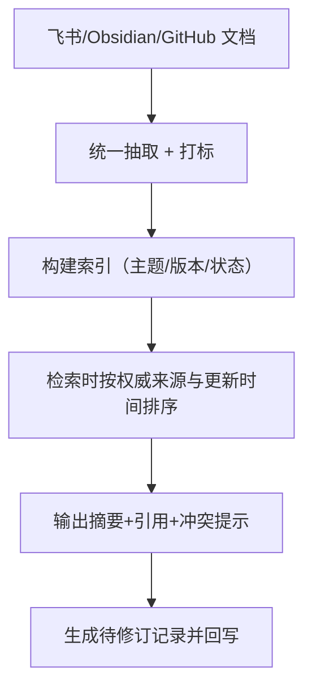

# 多智能体协作实战：知识库共享与检索

> **适用场景**：团队智能体、客户支持和多个业务部门都在用不同媒体写文档，最新版本难找，重复问答频发。本文以“统一索引+分层检索+可追溯引用”为主线，让你先跑通搜到最新最权威的信息，再慢慢丰富自定义能力。

## 1. 你将得到什么

跑通后你会拿到：

- 多来源文档统一入库并自动打标签
- 检索时先展示“最相关 + 最新”结果，默认带出处链接
- 回答时自动生成“摘要 + 引用 + 建议”，便于决策
- 多智能体共享同一知识底座，重复问答明显少了

## 2. 先复制这一句给龙虾

```text
请帮我搭一个“知识库共享与检索”流程：先抓飞书/Obsidian/GitHub 三个来源，检索时按最近更新时间与生效状态排序，回答必须提供摘要、来源链接和是否过期，并自动生成“待修订记录”告知哪些冲突需人工处理。
```

如果你只想快速校对版本，再补一句“优先返回 GitHub docs，因为我们把它定为权威来源”。

## 3. 需要哪些 Skills

先看每个 Skill 是做什么的：

- `skill-vetter`
  链接：<https://llmbase.ai/openclaw/skill-vetter/>
  作用：安装前安全扫描。
- `feishu-doc`
  链接：<https://www.tmser.com/2026/03/02/%E6%AF%8F%E5%A4%A9%E4%B8%80%E4%B8%AAopenclaw-skill-feishu-doc/>、<https://clawhub.ai/skills/feishu-doc>
  作用：读取飞书文档并提取结构化内容。
- `github`
  链接：<https://playbooks.com/skills/openclaw/skills/github>
  作用：补充 README、PRD、Issue 里的知识。
- `summarize`
  链接：<https://termo.ai/skills/summarize>
  作用：把长文压成摘要和对比结论。
- `obsidian`
  链接：<https://openclawskills.wiki/skill/obsidian>
  作用：管理本地笔记和长期知识沉淀。

安装命令如下：

```bash
clawhub install skill-vetter
clawhub install feishu-doc
clawhub install github
clawhub install summarize
clawhub install obsidian
```

| 技能 | 作用 |
| --- | --- |
| `skill-vetter` | 安全扫描 |
| `feishu-doc` | 飞书文档读取与结构化提取 |
| `github` | 同步 README/PRD/Issue 的知识 |
| `summarize` | 压缩长文并提炼对比内容 |
| `obsidian` | 本地笔记归档与长期管理 |

如果你还想接入更多私有源，就在第 6 节里把自定义检索 skill 当作 fallback。

## 4. 跑通后你会看到什么

```text
【3 行摘要】
“客户交接流程”以飞书 PRD v3 为准，最新更新时间 2026-03-20，GitHub docs 里仍写 “48 小时”，建议按 PRD 执行。

【详细引用】
1) 飞书 PRD：《客户交接流程 v3》 2026-03-20 王五
2) GitHub docs /handoff.md 2026-02-28（与 PRD 冲突）

【建议动作】
已生成“待修订记录”：把 GitHub docs 中的“48 小时” 更新为“24 小时”。
```

如果输出只能给结论没带引用，就说明还没拿到可用的 skill 组合。

## 5. 怎么一步步配出来

### 工作流架构



### 配置步骤

1. 定义权威来源顺序，比如 “GitHub docs > 飞书 PRD > Obsidian 笔记”。
2. 统一元数据字段：主题、状态（草稿/生效/归档）、负责人、更新时间。
3. Prompt 里要求“先给摘要、再给引用、最后给冲突/建议”。
4. 给 `summarize` 设定“最多 3 行摘要、每条加链接、若冲突再问”。
5. 用 `feishu-doc` 回写“待修订记录”，每次都记录来源与更新原因。

## 6. 如果没有现成 Skill，就让 Claw 帮你造

如果你的知识源太私有，可以写个最小 skill：

```
kb-retrieval/
├── SKILL.md
└── scripts/
    └── search.py
```

最小 `SKILL.md`。

```md
---
name: kb-retrieval
description: 多来源知识检索 + 源引用
---

# KB Retrieval

当需要综合飞书/GitHub/Obsidian 信息时调用。
```

脚本只要能“读取多个来源、按更新时间排序、输出结构化引用、生成待修订记录”就够了。

## 7. 再往下优化

- 给每条引用配上“负责人+更新时间+状态”，方便判定是否过时。
- 在 Prompt 里加“冲突时按权威来源给出原因”以便钉住复盘。
- 让 Claw 定期生成知识更新周报（比如每周五追踪 5 条变更）。

## 8. 常见问题

**Q1：检索结果太多，看不过来？**  
A：先只显示“权威且最近”的三条，再提供“全部选项”链接。

**Q2：不同来源结论冲突怎么办？**  
A：在提示词里加入“若冲突，先给出冲突内容+建议处理方案”。

**Q3：知识库越来越大难维护？**  
A：设定“状态”字段，按 “草稿/生效/归档” 自动降权，过期内容也可以自动归档。

## 9. 相关阅读

- [客户支持与 CRM 协同助手](/cn/university/revops-assistant/)
- [会议预约与纪要自动化](/cn/university/meeting-ops/)
