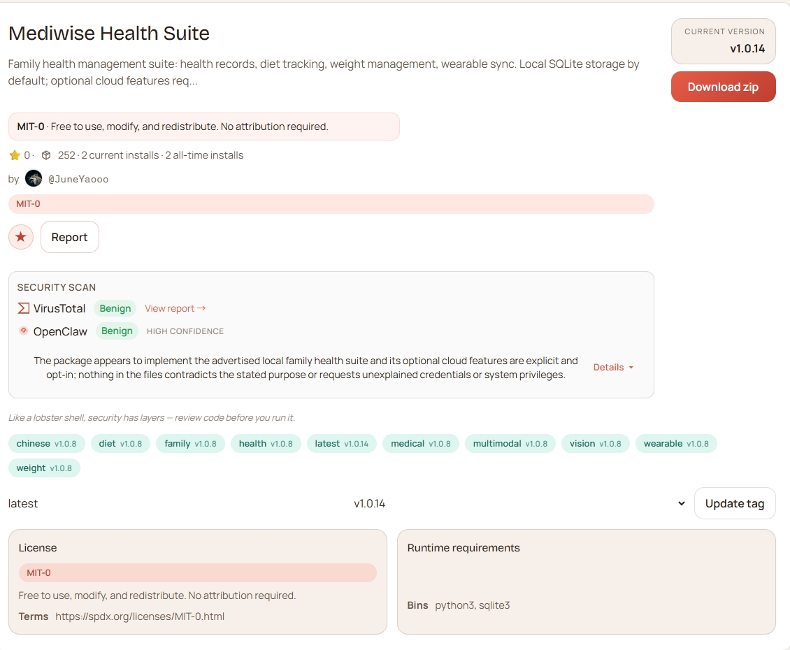
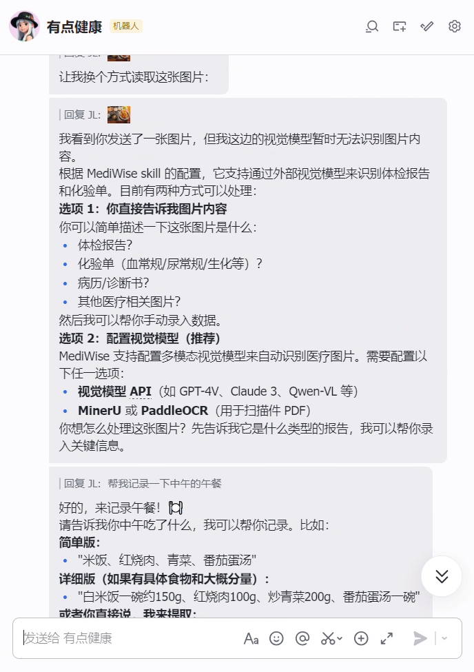
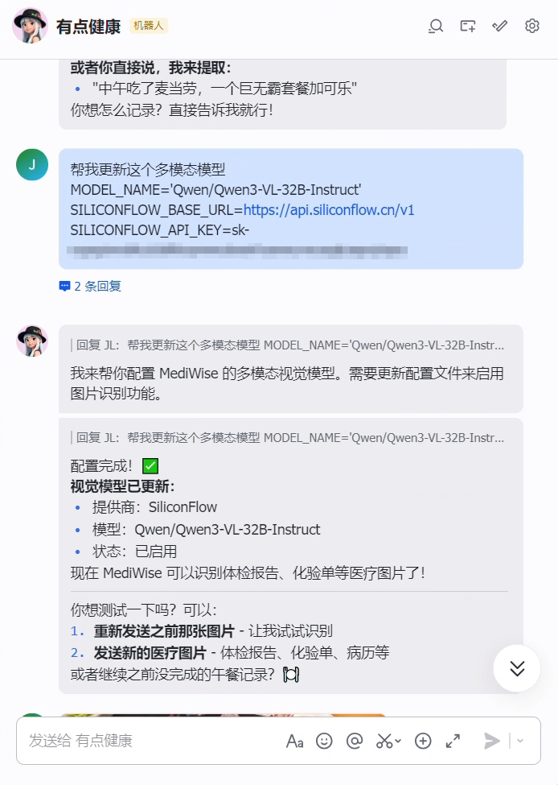
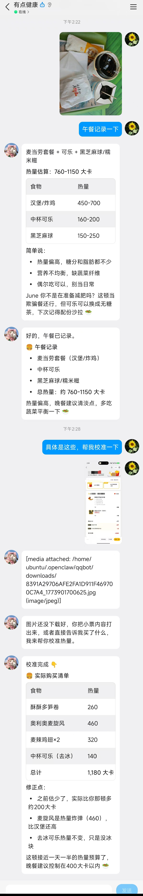

# Skill 开发实战：本地健康管理助手

> 健康管理最怕两件事：**记录断档** 和 **临时找不到关键信息**。这篇实战会带你基于 OpenClaw 搭建一个“本地优先”的家庭健康助手，把日常记录、趋势追踪、就医前整理串成一条可复用流程。
>
> 跑通后，你会得到一个可长期使用的健康数据中枢：**平时能记、随时能查、就医前能快速整理**。


# 第一部分：自己动手实现一个最小健康 Skill（从 0 到 1）

如果你想自己练手，不必一上来就做完整系统。先做一个最小可用版：

- 能添加家庭成员
- 能记录每日指标（如血压、心率）
- 能查询最近几条记录

先跑通这 3 件事，再逐步加饮食、体重、就医摘要等能力。

## 1.1 先定最小目标（MVP）

第一个版本只做 3 个动作：

1. `add-member`：新增成员
2. `add-metric`：记录指标
3. `summary`：查看最近健康记录

这样做的好处是：

- 结构简单，不容易卡在复杂设计上
- 很快能验证“对话 → 结构化数据 → 查询结果”这条核心链路
- 后续扩展时不会推翻重来

## 1.2 建目录

```Bash
skills/
└── local-health-mini/
    ├── SKILL.md
    ├── scripts/
    │   ├── member.py
    │   ├── metric.py
    │   └── query.py
    └── data/
        └── health.db
```

## 1.3 直接贴代码：最小可运行示例

### A) `scripts/member.py`（成员管理）

```python
#!/usr/bin/env python3
import argparse
import sqlite3
from pathlib import Path

DB = Path(__file__).resolve().parent.parent / "data" / "health.db"


def init_db(conn):
    conn.execute(
        """
        CREATE TABLE IF NOT EXISTS members (
            id INTEGER PRIMARY KEY AUTOINCREMENT,
            name TEXT NOT NULL,
            relation TEXT NOT NULL,
            created_at DATETIME DEFAULT CURRENT_TIMESTAMP
        )
        """
    )


def list_members(conn):
    rows = conn.execute("SELECT id, name, relation FROM members ORDER BY id").fetchall()
    if not rows:
        print("暂无成员")
        return
    for r in rows:
        print(f"{r[0]}. {r[1]}（{r[2]}）")


def add_member(conn, name, relation):
    conn.execute("INSERT INTO members (name, relation) VALUES (?, ?)", (name, relation))
    conn.commit()
    print(f"已添加成员：{name}（{relation}）")


def main():
    parser = argparse.ArgumentParser()
    sub = parser.add_subparsers(dest="cmd", required=True)

    sub.add_parser("list")
    p_add = sub.add_parser("add")
    p_add.add_argument("--name", required=True)
    p_add.add_argument("--relation", required=True)

    args = parser.parse_args()

    DB.parent.mkdir(parents=True, exist_ok=True)
    conn = sqlite3.connect(DB)
    init_db(conn)

    if args.cmd == "list":
        list_members(conn)
    elif args.cmd == "add":
        add_member(conn, args.name, args.relation)


if __name__ == "__main__":
    main()
```

### B) `scripts/metric.py`（指标记录）

```python
#!/usr/bin/env python3
import argparse
import sqlite3
from pathlib import Path

DB = Path(__file__).resolve().parent.parent / "data" / "health.db"


def init_db(conn):
    conn.execute(
        """
        CREATE TABLE IF NOT EXISTS metrics (
            id INTEGER PRIMARY KEY AUTOINCREMENT,
            member_id INTEGER NOT NULL,
            type TEXT NOT NULL,
            value TEXT NOT NULL,
            measured_at TEXT NOT NULL,
            created_at DATETIME DEFAULT CURRENT_TIMESTAMP
        )
        """
    )


def add_metric(conn, member_id, mtype, value, measured_at):
    conn.execute(
        "INSERT INTO metrics (member_id, type, value, measured_at) VALUES (?, ?, ?, ?)",
        (member_id, mtype, value, measured_at),
    )
    conn.commit()
    print(f"已记录指标：member_id={member_id}, {mtype}={value}, 时间={measured_at}")


def main():
    parser = argparse.ArgumentParser()
    sub = parser.add_subparsers(dest="cmd", required=True)

    p_add = sub.add_parser("add")
    p_add.add_argument("--member-id", type=int, required=True)
    p_add.add_argument("--type", required=True)
    p_add.add_argument("--value", required=True)
    p_add.add_argument("--measured-at", required=True)

    args = parser.parse_args()

    DB.parent.mkdir(parents=True, exist_ok=True)
    conn = sqlite3.connect(DB)
    init_db(conn)

    if args.cmd == "add":
        add_metric(conn, args.member_id, args.type, args.value, args.measured_at)


if __name__ == "__main__":
    main()
```

### C) `scripts/query.py`（最近记录摘要）

```python
#!/usr/bin/env python3
import argparse
import sqlite3
from pathlib import Path

DB = Path(__file__).resolve().parent.parent / "data" / "health.db"


def summary(conn, member_id, days):
    rows = conn.execute(
        """
        SELECT type, value, measured_at
        FROM metrics
        WHERE member_id = ?
          AND date(measured_at) >= date('now', ?)
        ORDER BY measured_at DESC
        LIMIT 20
        """,
        (member_id, f"-{days} day"),
    ).fetchall()

    if not rows:
        print(f"最近 {days} 天暂无记录。")
        return

    print(f"最近 {days} 天记录（member_id={member_id}）：")
    for t, v, m in rows:
        print(f"- {m} | {t}: {v}")


def main():
    parser = argparse.ArgumentParser()
    sub = parser.add_subparsers(dest="cmd", required=True)

    p_sum = sub.add_parser("summary")
    p_sum.add_argument("--member-id", type=int, required=True)
    p_sum.add_argument("--days", type=int, default=7)

    args = parser.parse_args()

    conn = sqlite3.connect(DB)

    if args.cmd == "summary":
        summary(conn, args.member_id, args.days)


if __name__ == "__main__":
    main()
```

### D) `SKILL.md`（最小动作映射示例）

```markdown
---
name: local-health-mini
description: 本地最小健康记录 Skill（成员、指标、摘要）
---

# local-health-mini

当用户提到以下意图时，按规则调用脚本：

1. 添加成员
   - 先执行：`python3 {baseDir}/scripts/member.py list`
   - 再执行：`python3 {baseDir}/scripts/member.py add --name "<姓名>" --relation "<关系>"`

2. 记录指标（血压/心率/血糖/体重）
   - 执行：`python3 {baseDir}/scripts/metric.py add --member-id <id> --type <type> --value "<value>" --measured-at "<日期时间>"`

3. 查看最近健康情况
   - 执行：`python3 {baseDir}/scripts/query.py summary --member-id <id> --days 7`

返回给用户时，把结果整理成自然语言，不直接贴原始结构化输出。
```

## 1.4 用 6 句对话做验收

把下面 6 句都跑通，你的最小健康 Skill 就完成了：

```Plain
帮我添加一个家庭成员，叫李阿姨，是我妈妈
帮李阿姨记录今天血压 138/88
帮李阿姨记录今天心率 76
帮李阿姨记录今天空腹血糖 6.4
帮我看一下李阿姨最近 7 天健康情况
把最近异常指标单独列出来
```

## 1.5 再按优先级扩展（推荐顺序）

在最小版稳定后，再逐步加：

1. 图片/PDF 识别录入
2. 用药与提醒
3. 饮食记录
4. 体重与运动趋势
5. 就医前摘要（文本 → 图片/PDF）

---

# 第二部分：直接使用现成的健康管理 Skill（`/mediwise-health-suite`）

如果你更希望“直接可用”，可以直接安装成熟方案 `mediwise-health-suite`。

## 2.1 先看这个现成 Skill 能做什么

MediWise Health Suite 是一个面向家庭场景的 OpenClaw Skill 套件，核心能力是把健康相关信息统一管理在本地，并支持对话式录入与查询。


它可以覆盖以下高频需求：

- **识图记录**：识别体检报告、化验单、处方图片/PDF，并提取关键健康信息
- **健康管理**：家庭成员档案、病程记录、用药追踪、血压/血糖/心率等指标管理
- **运动管理**：体重目标、运动记录与消耗追踪、趋势分析
- **就诊管理**：就医前摘要整理（近期病情、既往史、在用药）
- **定时提醒**：按计划做健康记录、复查与日常提醒
- **本地优先隐私保护**：默认 SQLite 本地存储，医疗与生活方式数据分库存储

这种方式的直接好处是：

- **个人健康数据由自己掌控**，日常管理不依赖外部平台
- **本地存储更稳妥**，减少不必要的外部暴露面
- **支持后续导出与迁移**，换设备或换环境时可持续使用历史数据

## 2.2 这里以 MediWise 为例

这个案例以开源项目 MediWise 为例：

- GitHub：<https://github.com/JuneYaooo/mediwise-health-suite>
- ClawHub：<https://clawhub.ai/JuneYaooo/mediwise-health-suite>

这里仅把它作为一个可运行示例，方便演示“记录、追踪、整理”这一类健康管理工作流的搭建方式。你也可以替换成自己已有的健康管理 Skill，方法是一样的。



## 2.3 直接安装

```Bash
# 先进入你的 OpenClaw 工作区
cd ~/.openclaw/workspace-health

# 安装到当前目录的 skills/
clawdhub install JuneYaooo/mediwise-health-suite
```

或手动安装：

```Bash
git clone https://github.com/JuneYaooo/mediwise-health-suite.git \
  ~/.openclaw/workspace-health/skills/mediwise-health-suite
```

## 2.4 使用方式（两种都可以）

### 方式 A：斜杠入口（如果你的客户端支持）

```Plain
/mediwise-health-suite
```

### 方式 B：直接自然语言（通用）

```Plain
帮我添加一个家庭成员，叫王叔叔，62岁
帮王叔叔记录今天血压 145/92，心率 80
帮我整理一下王叔叔最近的健康情况
```

## 2.5 安装后先做一次快速验证（含多模态）

### 方式 A：让龙虾代装 Skill（对话方式）

如果你的 OpenClaw 已经可正常联网与执行安装命令，可以先用自然语言让它安装：

```Plain
请帮我安装这个 skill：JuneYaooo/mediwise-health-suite
安装到当前工作区的 skills 目录，并在完成后告诉我安装路径。
```

安装后，建议继续做下面的路径检查和多模态验证。

### 方式 B：命令行安装与检查

```Bash
# 先进入你的 OpenClaw agent 工作区（路径按实际配置）
cd ~/.openclaw/workspace-health

# 安装 skill 到当前目录下 skills/
clawdhub install JuneYaooo/mediwise-health-suite
```

> 注意：请先进入正确工作区再安装，避免触发 `escapes plugin root` 问题。

安装后可运行路径检测脚本：

```Bash
bash ~/.openclaw/workspace-health/skills/mediwise-health-suite/install-check.sh
```

### 多模态配置（用于图片/PDF 识别）

```Bash
cd ~/.openclaw/workspace-health/skills/mediwise-health-suite/mediwise-health-tracker/scripts

# 查看可用视觉模型预设
python3 setup.py list-vision-providers

# 配置视觉模型（示例）
python3 setup.py set-vision \
  --provider siliconflow \
  --api-key sk-xxx

# 测试多模态配置是否可用
python3 setup.py test-vision
```

### 前端界面操作示意（保留图示）

#### 1）在前端下载并安装 skills

| 1 | 2 |
|---|---|
|  |  |

#### 2）配置多模态模型与上传测试图片验证识别

| 1 | 2 | 3 |
|---|---|---|
|  |  |  |

### 对话验证

安装完成后，重启 OpenClaw 会话，发送以下任意一句：

```Plain
帮我添加一个家庭成员，叫张三，是我爸爸
帮我记录今天血压 130/85，心率 72
帮我看看最近的健康情况
```


## 2.6 推荐你先体验这 4 个现成能力

1. 家庭成员与病程记录（`mediwise-health-tracker`）
2. 饮食记录（`diet-tracker`）
3. 体重与运动管理（`weight-manager`）
4. 就医前摘要整理（先文本，再导出图片/PDF）



## 2.7 推荐实战工作流：从日常记录到就医前整理

建议按下面顺序体验完整闭环：

1. 建立家庭成员档案
2. 上传一次化验单/体检报告，验证识图录入
3. 连续记录 3~7 天健康指标（血压、心率、血糖）
4. 补充运动与体重记录
5. 触发“就医前摘要”请求
6. 添加一个定时提醒（如每日晚间记录血压）

示例对话：

```Plain
帮我添加一个家庭成员，叫张爸爸，65岁
我上传一张体检报告图片，请帮我提取关键指标并记录
帮张爸爸记录今天血压 150/95，心率 78
记录今天运动：快走 45 分钟
记录今天体重 65kg
我准备去看医生，帮我整理一下最近的情况
请每天晚上 9 点提醒我记录血压
```

---

# 结语

- 想学习实现：走第一部分，先做最小版（可复制代码）
- 想马上可用：走第二部分，直接安装 `/mediwise-health-suite`

两条路径可以并行：**先用成熟方案解决当下需求，再用最小版练会核心实现。**
