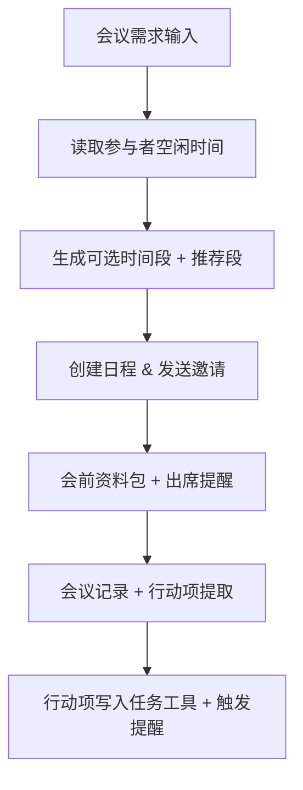

# 商务销售实战：会议预约与纪要自动化

> **适用场景**：销售/项目团队会议频繁、约会冲突、会前准备不足、会后纪要丢失。本文对应 README 中的“会议预约与纪要”，目标是把预约→会前→会中→会后一整片流程交给龙虾闭环处理。

## 1. 你将得到什么

跑通后你会拿到一个可复用的会议操作系统：

- 发现冲突并给出三个可选时间段，再返回最推荐的那个
- 会议创建后马上生成议程和背景资料包
- 会后 5 分钟内输出结构化纪要，并把行动项写入任务系统
- 逾期行动项每天 09:30 和 17:00 自动提醒，避免“会开完就没下文”

## 2. 先复制这一句给龙虾

```text
请帮我搭一个“会议预约与纪要自动化”流程：先读参与者日历、给我 3 个可选时间段并推荐一个、会前自动发资料包、会后 5 分钟内输出结论/风险/行动项，并每天 09:30/17:00 发送逾期提醒。输出先给摘要再给完整版。
```

如果你只想先管预约阶段，再补一句“推荐时间时优先保证客户会议不冲突”就是一个简化版。

## 3. 需要哪些 Skills

先看每个 Skill 是做什么的：

- `skill-vetter`
  链接：<https://llmbase.ai/openclaw/skill-vetter/>
  作用：安全检查，防止风险 skill 进入流程。
- `caldav-calendar`
  链接：<https://playbooks.com/skills/openclaw/skills/caldav-calendar>
  作用：抓空闲时间、识别冲突、创建和更新会议。
- `feishu-doc`
  链接：<https://www.tmser.com/2026/03/02/%E6%AF%8F%E5%A4%A9%E4%B8%80%E4%B8%AAopenclaw-skill-feishu-doc/>、<https://clawhub.ai/skills/feishu-doc>
  作用：输出议程、纪要和行动项。
- `agentmail`
  链接：<https://docs.agentmail.to/integrations/openclaw>
  作用：生成并发送对外确认邮件。

安装命令如下：

```bash
clawhub install skill-vetter
clawhub install caldav-calendar
clawhub install feishu-doc
clawhub install agentmail
```

| 技能 | 作用 |
| --- | --- |
| `skill-vetter` | 安全检查，防止风险技能进入生产流程 |
| `caldav-calendar` | 抓空闲时间、识别冲突、创建/更新时间段 |
| `feishu-doc` | 输出议程、纪要与行动项，并沉淀归档 |
| `agentmail` | 生成对外确认邮件并发出 |

定时提醒能力在公开目录里暂未找到稳定 slug，推荐直接用 `openclaw cron` + 飞书消息脚本拼出来，或在“进阶”部分让 Claw 帮你写一个 reminder skill。

## 4. 跑通后你会看到什么

```text
【会议推荐】
客户会议 14:00（无冲突，建议优先采纳），周五 16:00 与内部例会冲突，建议顺延至周三 15:30。

【会前资料包】
目标：确认交付范围与资源
关注点：预算、风险、依赖（详见附带链接）

【会后纪要】
结论：客户接受分阶段交付
行动项：
- 李四：周四前交付正式提案
- 王五：周一前补进度表
```

结构清楚、只要一屏就能读完，就说明 Prompt 已经能落地。

## 5. 怎么一步步配出来

### 工作流架构



### 配置步骤

1. 把预约规则写成“允许 10:00-18:00 作息、客户会议优先、防止撞会超过 15 分钟即提醒”。
2. 固定会前资料包模板（会议目标+需确认问题+背景链接）。
3. 会后指令只输出“结论 / 风险 / 行动项”，行动项附 owner + ddl。
4. 用 `openclaw cron` 设置两条提醒：每天 09:30 提醒今日行动项，每周五 17:00 汇总逾期清单。
5. optional：接入 `agentmail` 生成确认邮件草稿，提示“先人工确认再发送”。

## 6. 如果没有现成 Skill，就让 Claw 帮你造

你可以先把提醒相关能力当成一个小 skill，结构如下：

```
meeting-reminder/
├── SKILL.md
└── scripts/
    └── remind.py
```

`SKILL.md` 内容只需要告诉 Claw 三件事：触发条件、会前/会后/逾期三种模式、调用 `python scripts/remind.py --mode before|after|overdue`。初版只要能生成三类提醒即可，后续再把 `feishu-doc` 或 `todoist` 等向下扩展进去。

## 7. 再往下优化

- 把会议来源（客户、内部、对外）写成元数据，方便不同模板切换。
- 加入多时区支持：“输出同时附带所有参与者当地时间和 UTC”。
- 让纪要自己生成可点击链接、附件 ID、并把变更结果写入复盘文档。

## 8. 常见问题

**Q1：多人跨时区，推荐时间总不合适怎么办？**  
A：在提示词里统一以参会者本地时区计算，并把跨时区窗口设为硬约束。

**Q2：纪要太长没人看怎么办？**  
A：把输出限定在“摘要 + 1 段完整版”，并要求行动项必须带 owner+ddl。

**Q3：行动项没人认领怎么办？**  
A：规则上强制“无负责人不出会”，自动化只执行这个规则。

## 9. 相关阅读

- [客户支持与 CRM 协同助手](/cn/university/revops-assistant/)
- [知识库共享与检索](/cn/university/knowledge-base/)
- [语音调研实战](/cn/university/voice-research/)
