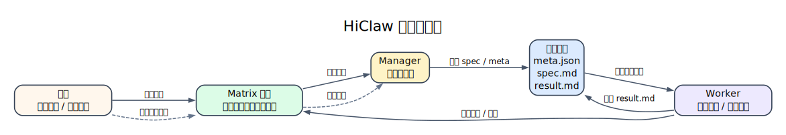
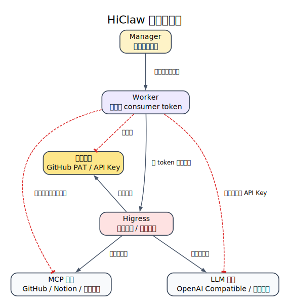
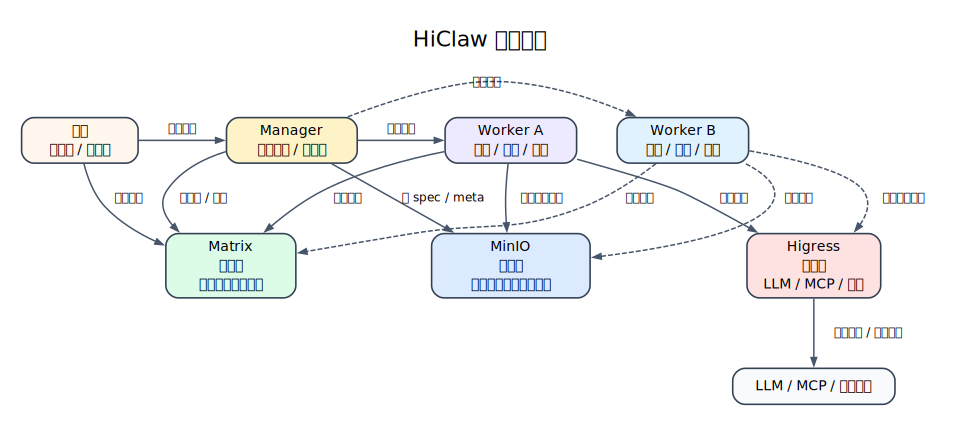
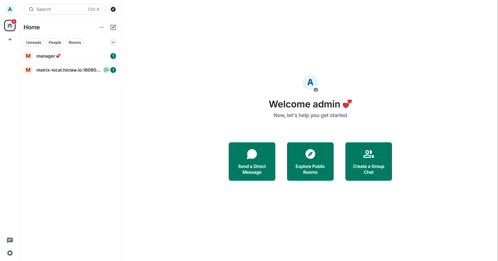
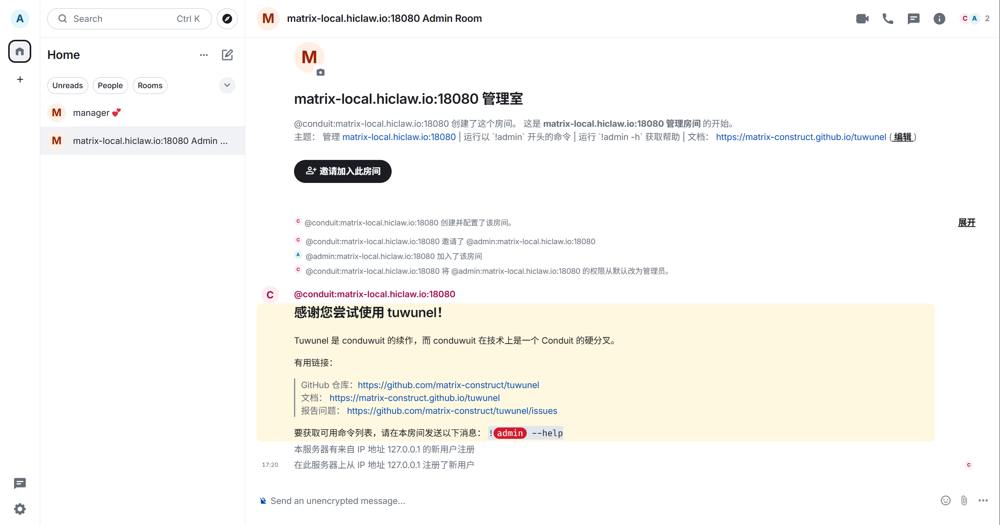
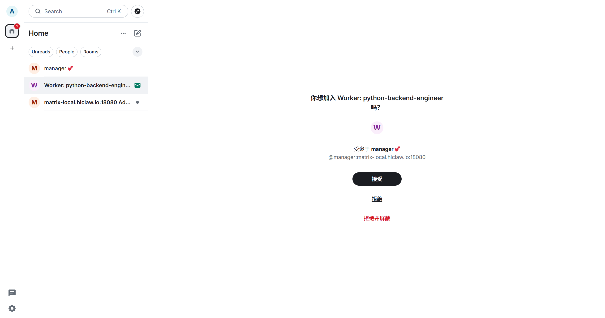
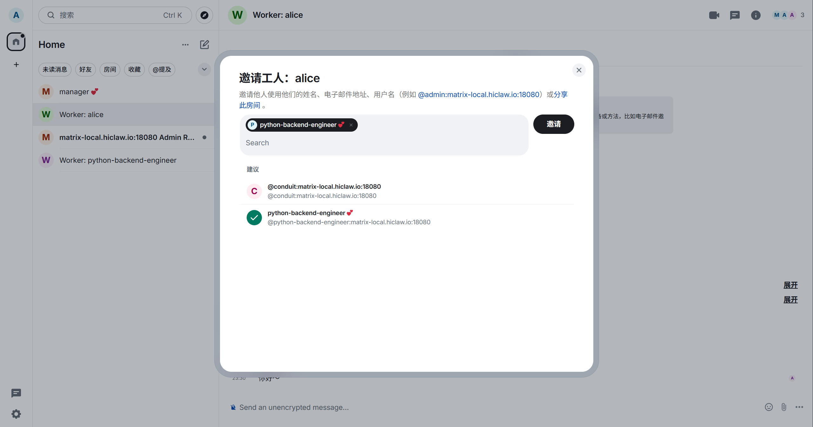

# 龙虾大学：多智能体协作（Multi OpenClaw / HiClaw）

如果你只是偶尔问几个问题，顺手改几行代码，这篇内容对你帮助不大。  
但如果你的项目已经持续很多天，开始出现上下文失忆、多人协作困难、过程不可追踪、密钥边界不清这些问题，那就说明单 Worker 路线快到头了。HiClaw 这类多智能体协作系统，解决的正是这个阶段的问题。

这篇内容分成两部分。前半部分解释为什么单 Worker 会卡住，以及 HiClaw 到底解决了什么。后半部分直接带你走一遍 Windows + WSL2 + Docker 的本地部署路线，最后完成第一个 Worker 的创建和验证。

---

## 一、为什么单 Worker 会卡住

先看一个很常见的项目过程。

第 1 天，你让 AI 写后端 API，进展很顺，用户认证模块很快就出来了。第 3 天你回来继续，AI 已经忘了最初的数据库设计约定，你不得不重新解释。第 5 天你想并行推进前端，只能另开一个新对话，结果两个 AI 开始各做各的，风格也越来越不一致。第 10 天你想回头查一周前确认过的接口协议，却发现它已经埋在长长的聊天记录里。等到第 15 天项目快收尾时，AI 连最早的需求背景都记不清了。

这里真正出问题的，通常不是模型不够聪明，而是协作结构太原始。单 Worker 路线在复杂项目里会反复撞上四个问题：

- 上下文失忆。早期约定只存在会话里，对话一长就会被后面的内容淹没。
- 无法并行。一个会话一次只能推进一条执行流，多角色协作会非常别扭。
- 过程黑箱。中间状态不落盘，人类很难监督，也很难中途介入。
- 无法追溯。需求、结果、状态都散在消息里，后期接手和复盘成本很高。

HiClaw 不是把同一个聊天窗口聊得更长，而是把“会话堆积”改成“任务对象 + 明确分工 + 可见流程”。

---

## 二、HiClaw 到底解决了什么

HiClaw 的思路并不复杂。它不是简单地多开几个 AI，而是把多个 Worker 当成一个可以被管理的小团队来用。Manager 负责统筹和分配，Worker 负责执行，人类则始终可以在同一个协作空间里查看进度、补充要求、打断和调整。

这套方式之所以成立，主要靠下面四个机制。

### 1. 双轨通信：消息看得见，文件留得住

如果任务全靠聊天交代，三天后再去问做到哪了，你只能翻消息。需求改了三次之后，你也很难分清到底哪个版本才是最终版本。

HiClaw 的做法是把协作拆成两条线。消息线负责通知、追问和协调，通常通过 Matrix Rooms 完成；文件线负责存需求、存结果、存状态，通常通过 MinIO 这类共享存储完成。这样聊天不再承载任务本体，它只负责同步动作。

一个典型流转通常是这样：

1. Manager 在房间里说有个新任务。
2. 需求写进 `shared/tasks/task-001/spec.md`。
3. Worker 去共享存储读取需求文件。
4. 做完后把结果写回 `result.md`。
5. 再回房间汇报完成情况。

这样做的好处很直接。沟通过程对人类可见，任务资料有固定地址，外部能力和密钥也可以放到更清楚的边界里去管理。

### 2. 任务对象化：口头指令变成可追踪卡片

如果 Manager 在群里只说一句“做个登录功能”，Worker 很可能会按自己的理解先做出一个表单，等做完才发现真正要的是 OAuth 登录。问题不在执行，而在需求从一开始就没有被对象化。

HiClaw 里，一个任务通常会落成这样的目录：

```text
shared/tasks/task-001/
├── meta.json     # 任务状态、负责人、优先级
├── spec.md       # 需求文档、验收标准
└── result.md     # 结果产出、完成说明
```

这三个文件的分工很清楚。`spec.md` 负责把需求和验收标准写清楚，`meta.json` 负责存状态、负责人和优先级，`result.md` 负责说明最终做了什么。这样你查任务时，先看任务对象本身，不需要先翻聊天记录。



这张图最重要的意思是：聊天负责沟通，任务目录负责承载任务本体。需求变化时，Manager 更新任务卡片，Worker 按最新文件继续执行。

### 3. Worker 身份定义：不是所有 Worker 都是“万能 AI”

如果所有 Worker 都只是“通用 AI”，前端 Worker 和后端 Worker 的边界会非常模糊。你也很难说清楚，哪个 Worker 能访问测试环境，哪个 Worker 只能做文档整理，哪个 Worker 又被允许调 GitHub 能力。

HiClaw 的做法是先定义 Worker 的身份文件，例如 `SOUL.md`。在这个文件里，通常会把角色、任务范围、能力和权限边界都约定清楚。Manager 创建 Worker 时会读取这些定义，让 Worker 从第一天起就有明确定位。

你可以把这一步理解成“先发入职档案，再分配工作”。这样前端 Worker、后端 Worker、测试 Worker 不再只是同一个模型换了个名字，而是职责明确的角色实例。

### 4. 分层边界：Manager 管调度，Worker 管执行，网关管能力

多智能体协作最怕的，不是调度复杂，而是权限失控。如果 5 个 Worker 都拿着同一个 OpenAI Key 或 GitHub PAT，一旦某个 Worker 被错误配置或者被滥用，后果会非常难收拾。

HiClaw 在这里做的是分层。Manager 负责统筹和调度，Worker 负责执行，MinIO 负责保存任务和结果，Higress 这类网关负责统一代理外部能力和密钥。这样 Worker 持有的通常只是内部凭证，而不是直接把外部密钥塞进每个容器里。

这带来的好处是：

- Worker 不需要直接持有 GitHub PAT 或 LLM API Key。
- 真实密钥可以集中放在网关侧管理。
- 哪个 Worker 能调哪个 API，可以单独授权，也可以单独撤销。



这张图要表达的重点很简单：Worker 持有的是内部 token，不是直接把所有外部密钥塞进去。

---

## 三、整体架构怎么理解

以前后端协作为例，HiClaw 的整体关系可以先看这张图：



看这张图时，先抓住三条线就够了。

第一条是通信线。人类、Manager 和 Worker 在 Matrix 房间里协作，任务推进、追问和同步都会在这里发生。  
第二条是文件线。任务说明、状态和结果不会埋在消息里，而是落到共享存储里。  
第三条是能力线。Worker 如果要访问 LLM、MCP 或其他外部服务，不是随便直连，而是通过受控网关来走。

如果你把这三条线记住，再回头看前面的四个机制，整套系统就不会显得抽象了。

---

## 四、什么情况下值得上 HiClaw

HiClaw 适合的是持续项目，不是一次性问答。

如果你的项目要持续多天甚至多周，还需要前端、后端、测试、文档这些角色并行推进，同时你又想让人类随时查看进度、插手修正，那 HiClaw 这类协作系统会开始有意义。特别是当你已经不想把生产环境密钥直接交给每个 Worker 的时候，它的边界设计会很有价值。

反过来，如果你只是临时写几段代码，偶尔问几个问题，不想维护 Matrix、MinIO、Docker 这些额外组件，或者你追求的就是一个极简 CLI，那就没必要引入这套系统。

---

## 五、从零跑起来：Windows + WSL2 + Docker 路线

下面开始进入教程部分。这里不是泛泛讲思路，而是按可执行步骤来走。  
完成这一节之后，你应该能做到三件事：

1. 在本地启动单机版 HiClaw。
2. 登录 Element Web 和 Higress 控制台。
3. 创建第一个 Worker，并验证它真的能回复。

先记住一个边界：后面的命令会分成两种环境。

- 标记为 `powershell` 的命令，在 Windows PowerShell 中执行。
- 标记为 `bash` 的命令，在 WSL 的 Ubuntu 终端中执行。

如果你已经进入 Ubuntu 终端，那么 `cat`、`source`、`mkdir -p`、`df -h` 这类命令都应该直接在那里执行，不要回到 Windows PowerShell 里跑。

### 第一步：准备环境

先把需要准备的东西放在脑子里：

- 一台可用的 Windows 机器。
- 一个可用的 LLM API Key。
- 对应的 Base URL 和模型名称。
- Docker Desktop。
- WSL2 的 Ubuntu 环境。

如果还没安装 WSL，先在管理员 PowerShell 里执行：

```powershell
wsl --install
```

如果你想明确安装 Ubuntu 22.04，可以再执行：

```powershell
wsl --install -d Ubuntu-22.04
```

安装完成后按提示重启 Windows。第一次启动 Ubuntu 时，系统会让你创建 Linux 用户名和密码。

安装好后，建议先用下面这个命令确认 WSL 状态：

```powershell
wsl --list --verbose
```

你应该能看到 `Ubuntu-22.04` 或类似发行版，状态最好是 `Running`。

如果 Docker Desktop 还没装，就去官方下载页安装：<https://www.docker.com/products/docker-desktop/>。安装时记得确认使用 `WSL 2 backend`。装好后，先在 Windows PowerShell 里检查：

```powershell
docker --version
docker info
```

然后再进入 WSL Ubuntu，用下面两条命令确认 Docker 在 WSL 里也能工作：

```bash
docker --version
docker ps
```

如果这两条都不报错，说明宿主机和 WSL 里的 Docker 路线基本通了。

在继续之前，再做两个小检查。先看端口：

```bash
ss -tuln | grep -E ':(18080|18001|18088)'
```

如果没有输出，说明 HiClaw 默认端口大概率是空闲的。然后再看磁盘空间：

```bash
df -h .
```

最好保证可用空间大于 10GB。

### 第二步：准备非交互安装配置

下面开始的命令，都默认在 WSL 的 Ubuntu 终端里执行。

先创建工作目录：

```bash
mkdir -p ~/projects/hiclaw-deployment
cd ~/projects/hiclaw-deployment
```

然后创建一个 `env.sh`，把后面安装会用到的核心变量先写进去：

```bash
cat > env.sh << 'EOF'
#!/bin/bash
export HICLAW_NON_INTERACTIVE=1

export HICLAW_LLM_PROVIDER="openai-compat"
export HICLAW_OPENAI_BASE_URL="https://your-endpoint/v1"
export HICLAW_DEFAULT_MODEL="your-model"
export HICLAW_LLM_API_KEY="sk-your-key"

export HICLAW_ADMIN_PASSWORD="admin123456"
EOF
```

这里改成 `env.sh` 路线，不是为了炫技，而是为了让流程更适合 AI 协助，也更容易复现和排错。交互式安装当然也能跑，但如果后面要让 AI 帮你检查配置、反复修改变量，环境变量文件会顺手很多。

如果你用的是阿里云百炼，可以把核心配置改成这样：

```bash
export HICLAW_OPENAI_BASE_URL="https://dashscope.aliyuncs.com/compatible-mode/v1"
export HICLAW_DEFAULT_MODEL="qwen-plus"
export HICLAW_LLM_API_KEY="sk-your-dashscope-key"
```

如果你走的是其他 OpenAI 兼容服务，也可以用这样的形式：

```bash
export HICLAW_OPENAI_BASE_URL="https://your-endpoint/v1"
export HICLAW_DEFAULT_MODEL="gpt-4o-mini"
export HICLAW_LLM_API_KEY="sk-your-key"
```

### 第三步：执行安装

准备好 `env.sh` 之后，在 WSL Ubuntu 里执行：

```bash
cd ~/projects/hiclaw-deployment
source env.sh
bash <(curl -sSL https://higress.ai/hiclaw/install.sh)
```

安装过程通常会经历三个阶段。先是生成配置，然后是拉取镜像，最后是启动服务。拉镜像这一步可能要花 5 到 15 分钟，取决于你的网络和机器情况。

如果安装顺利，最后应该能看到类似这样的输出：

```text
[HiClaw] === HiClaw Manager Started! ===
  Open: http://127.0.0.1:18088
  Login: admin / [your-password]
```

看到这段信息，说明服务已经基本起来了，可以进入下一步验证。

### 第四步：验证服务是否真的起来了

先别急着去聊天，先确认服务状态。

第一步，在 WSL 里检查容器：

```bash
docker ps | grep hiclaw
```

如果一切正常，你应该能看到 `hiclaw-manager` 状态为 `Up`。

第二步，检查配置是否真的写进了环境文件：

```bash
cat ~/hiclaw-manager.env | grep -E 'LLM|BASE_URL|MODEL'
```

如果你更习惯在 Windows PowerShell 中看同一个文件，也可以执行：

```powershell
Get-Content $HOME\hiclaw-manager.env | Select-String 'LLM|BASE_URL|MODEL'
```

第三步，打开 Element Web：

`http://127.0.0.1:18088`

登录信息是：

- 用户名：`admin`
- 密码：你设置的 `HICLAW_ADMIN_PASSWORD`

如果登录界面要求你手动填写 Homeserver，再补上：

`http://127.0.0.1:18080`

登录成功后，你应该会看到类似下面的首页：



左侧列表中如果能看到 `manager` 用户，说明你已经进入了可交互状态。

第四步，再打开 Higress 控制台：

`http://127.0.0.1:18001`

默认账号是 `admin`，默认密码通常是 `admin123456`，或者你在配置里设置的密码。进入之后，你还会自动加入一个 Admin Room，用来接收系统通知：



到这里为止，你已经完成了“服务起来了”的验证。下一步才是“协作真的能工作”的验证。

### 第五步：创建第一个 Worker

现在回到 Element Web。

先点击左侧对话历史里的 `manager`，进入对话窗口。第一次进去时，先看看它的欢迎说明和能力范围：


Manager 一般会说明自己负责分配任务、跟进进度、处理卡点、唤醒对应 Worker 等工作。继续往下对话时，你还会看到更具体的说明界面：


接着，直接给它发一条创建 Worker 的消息，例如：

```text
创建一个后端工程师 Worker
```

如果创建顺利，Manager 会返回 Worker 的详情和当前处理进度：


你通常会在这里看到 Worker 名称、角色、已配置能力，以及账号注册、房间创建、权限配置、容器启动这些步骤是否完成。

过一会后，你会收到 Worker 房间邀请：



点击“接受”加入房间。到这一步，说明 Manager 不只是活着，而是真的开始调度 Worker 了。

如果你觉得默认生成的名字太长，比如 `python-backend-engineer`，也可以再创建一个短名 Worker，例如：

```text
创建一个名为 alice 的 Worker
```

Manager 会继续返回创建进度：


创建过程通常会包含几个动作：注册 Matrix 账号、在 Higress 里创建 Consumer、建立你和 Manager 与 Alice 的房间关系、最后启动 Worker 容器。

加入房间之后，你还可以邀请其他人或其他 Worker 加入这个房间：



### 第六步：验证 Worker 真的能调用模型

现在进入刚才创建好的 Worker 房间。

最简单的测试方式，就是直接发一条消息：

```text
你好呀
```

如果你想让指向更明确，也可以直接 `@alice`，或者只在她所在的 Worker 房间里发消息。

如果 Alice 正常回复，说明至少三条链路已经一起跑通了：Matrix 通信是正常的，Higress 的权限配置是对的，Worker 也确实能调用 LLM。

实际对话大概会像这样：


看到这里，才算真正完成了“本地单机版 HiClaw 可用”的验证。

---

## 六、排错和清理

如果安装时报 `bind: address already in use`，通常说明默认端口被占用了。这个时候直接改 `env.sh` 里的端口配置就行：

```bash
export HICLAW_PORT_GATEWAY=28080
export HICLAW_PORT_CONSOLE=28001
export HICLAW_PORT_ELEMENT_WEB=28088
```

改完之后重新执行安装。

如果你只是想停掉服务，后面还准备继续用，可以执行：

```bash
docker stop hiclaw-manager
docker start hiclaw-manager
```

如果你要彻底清掉本地安装，则可以执行：

```bash
docker rm -f hiclaw-manager
docker volume rm hiclaw-data
rm -rf ~/hiclaw-manager
rm ~/hiclaw-manager.env
```

---

## 七、最后记住这几件事

HiClaw 的核心价值不在于“多开几个 AI”，而在于把协作流程对象化、可追踪化、可管理化。单 Worker 的问题，本质上是结构问题，而不是单纯模型不够强。它适合的是持续项目和多角色协作，不适合一次性问答或极简场景。本文采用的是 Windows + WSL2 + Docker Desktop 路线，这是一条已经验证过的本地部署路径，但不是唯一可行路线。最后，真正的成功标准不是页面能打开，而是 `Manager -> Worker 创建 -> 房间邀请 -> Worker 回复` 这条链路跑通。

---

## 八、参考资料

- HiClaw 官方仓库：<https://github.com/higress-group/hiclaw>
- `README.zh-CN.md`
- `docs/zh-cn/architecture.md`
- `docs/zh-cn/quickstart.md`
- `manager/agent/skills/worker-management/SKILL.md`
- `manager/agent/skills/worker-management/scripts/create-worker.sh`
