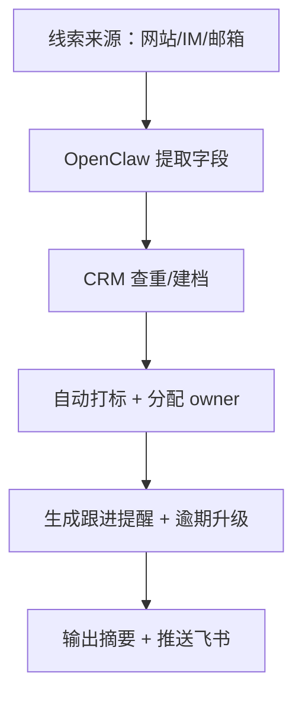

# 商务销售实战：客户支持与 CRM 协同助手

> **适用场景**：线索来源分散、销售跟进漏单、客服与销售信息不同步。本文把“咨询→建档→跟进→成交/沉淀”流线化，先让龙虾稳定做“自动建档 + 关键提醒”，再保留扩展空间。

## 1. 你将得到什么

跑通后，会得到透明可追踪的销售闭环：

- 新线索自动分类、打标、分配负责人
- CRM 自动建档或合并重复线索
- 每次沟通都自动产出跟进提醒（含 owner、截止）
- 逾期任务自动升级并推送飞书

## 2. 先复制这一句给龙虾

```text
请帮我搭一条“客户支持与 CRM 跟进”流程：新线索来了先提取姓名/公司/预算/来源，查 CRM 是否重复，若是就合并先追加沟通摘要，若否就新建线索并填好 owner、下一次 deadline，按意向等级给出 A/B/C，逾期提醒每天 09:00 推一次，输出包含【线索摘要/CRM 状态/下一步动作】。
```

如果你想要先试邮件抓线索的版本，再补一句“邮件线索先用 agentmail 把标题+正文抓下来”即可。

## 3. 需要哪些 Skills

先看每个 Skill 是做什么的：

- `skill-vetter`
  链接：<https://llmbase.ai/openclaw/skill-vetter/>
  作用：安装前安全检查。
- `hubspot`
  链接：<https://termo.ai/skills/hubspot-api>、<https://termo.ai/skills/hubspot-integration>、<https://termo.ai/skills/hubspot-crm>
  作用：建档、字段查询、状态回写。
- `agentmail`
  链接：<https://docs.agentmail.to/integrations/openclaw>
  作用：抓邮箱线索、生成回信草稿。
- `feishu-doc`
  链接：<https://www.tmser.com/2026/03/02/%E6%AF%8F%E5%A4%A9%E4%B8%80%E4%B8%AAopenclaw-skill-feishu-doc/>、<https://clawhub.ai/skills/feishu-doc>
  作用：保存跟进记录、周报和复盘文档。

安装命令如下：

```bash
clawhub install skill-vetter
clawhub install hubspot
clawhub install agentmail
clawhub install feishu-doc
```

| 技能 | 作用 |
| --- | --- |
| `skill-vetter` | 安装前安全检查 |
| `hubspot`（或你正在用的 CRM skill） | 建档、状态回写、字段查询 |
| `agentmail` | 从邮箱入口抓线索/发自动回复草稿 |
| `feishu-doc` | 跟进周报、协作记录、复盘文档 |

`feishu-cron-reminder`、定时提醒类目前没有确定的 slug，推荐直接写成“用 `openclaw cron` + 飞书发送脚本”或在第 6 节里让 Claw 自建一个 reminder skill。

## 4. 跑通后你会看到什么

```text
【线索摘要】
客户：张三 / ABC Robotics
预算：10-20 万
来源：官网表单
意向等级：A

【CRM 状态】
未发现重复，已建 Lead-2026-0318-07
负责人：李四
阶段：首次跟进

【下一步动作】
1) 今天 16:00 前完成首次电话
2) 明天 10:00 发方案邮件草稿并同步给 agentmail 等待确认
注意：手机号与旧线索弱匹配，请人工确认
```

只要龙虾输出“摘要 + 状态 + 行动”，说明 Prompt 和技能链跑通了。

## 5. 怎么一步步配出来

### 工作流架构



### 配置步骤

1. 统一字段：来源、意向、预算、owner、下一步 action。
2. 把 prompt 固定成“摘要 / CRM 状态 / 下一步动作”三段。
3. 让 `agentmail` 帮你抓邮件线索，再输出“需回复 + 草稿”。
4. 设定逾期处理：比如逾期 2 小时自动标红、每天 09:00 推送未完成清单。
5. 让 `feishu-doc` 自动沉淀周报（字段+对话摘要）。

## 6. 如果没有现成 Skill，就让 Claw 帮你造

如果你是第一次做这件事，先直接把下面这句话发给龙虾，让它先帮你起一个最小 skill：

```text
请按“客户线索建档、跟进提醒、CRM 回写”帮我生成一个最小可用 skill，第一版只要能解析输入、查重、创建或更新 lead，并输出结构化摘要。
```

如果它已经能按这个思路给出目录结构和脚本草稿，你再看下面这个最小骨架就行：

```text
revops-followup/
├── SKILL.md
└── scripts/
    └── main.py
```

最小 `SKILL.md` 可以这样写：

```md
---
name: revops-followup
description: 客户线索建档、跟进提醒、CRM 回写
---

# RevOps Followup

调用场景：用户需要整理线索 + 状态更新 + 逾期提醒时使用。

```

`scripts/main.py` 第一版先实现 4 件事：解析输入、查 CRM、创建或更新 lead、输出结构化摘要。先跑通，再升级，不要一开始就追求全自动。

## 7. 再往下优化

- 把上游来源（官网/IM/邮箱）作为 metadata，便于分渠道自动化。
- 加入“跟进结果记忆”：每次输出都带推送历史、负责人。
- 让 Claw 生成 CSV/文档，并自动同步到 `feishu-doc` 做周报。

## 8. 常见问题

**Q1：HubSpot 字段太多，怎么控制？**  
A：先把“必填字段”列出来，只让龙虾填 `name/source/status/owner/next_action`，其他字段默认人工补。

**Q2：行动项没人接？**  
A：在 Prompt 里强制“若 owner 为空则返回 `待补充 owner` 并停止执行”。

**Q3：线索重复了怎么办？**  
A：指令里加“若手机号/邮箱匹配则合并，并把匹配字段列出来”。

## 9. 相关阅读

- [会议预约与纪要自动化](/cn/university/meeting-ops/)
- [知识库共享与检索](/cn/university/knowledge-base/)
