# 🧪 龙虾大学：自动化科研实战（说句话，出论文）

> **适用场景**：你有一个研究想法，想让 AI 帮你跑完从文献检索、实验设计、代码执行到论文撰写的全流程；或者导师/老板要求一份某领域的系统性调研，你希望自动化完成。**你只需要在 Telegram 里描述课题，龙虾帮你搜文献、跑实验、写论文。**

[AutoResearchClaw](https://github.com/aiming-lab/AutoResearchClaw) 是由 [aiming-lab](https://github.com/aiming-lab) 开发的开源自动化科研管线，目标是**从一个研究想法到一篇可投稿论文的全自动产出**。它内置 **23 个阶段、8 大阶段组**，覆盖选题分解、文献检索、假设生成、实验设计、代码生成与执行、结果分析、论文撰写、多智能体同行评审的完整科研流程。最终输出包括：

- **完整论文**（Markdown + LaTeX，支持 NeurIPS / ICML / ICLR 模板）
- **实验代码与结果**（自动生成 Python 代码并在沙箱中执行）
- **对比图表**（含误差线和置信区间）
- **引用验证报告**（4 层引用真实性校验）
- **同行评审意见**（多智能体评审）

配合 OpenClaw 的 Telegram 渠道，你可以直接在手机上发起研究课题，然后去喝杯咖啡——论文写好了会推送到你的 Telegram。

---

## 1. 你将得到什么（真实场景价值）

跑通后，你会拥有一个**全自动的科研助理**：

### 场景 1：从想法到论文
- **问题**：有一个研究想法，但从文献调研到实验再到写作，整个流程太长
- **解决**：在 Telegram 里描述课题，AutoResearchClaw 自动完成文献检索、假设生成、实验设计与执行、论文撰写，产出一篇会议格式的完整论文

### 场景 2：应对紧急调研需求
- **问题**：导师/老板要求一份某领域的系统性调研报告，从零开始来不及
- **解决**：把需求发给龙虾，AutoResearchClaw 在后台跑管线，论文生成后自动推送到 Telegram

### 场景 3：带实验的研究论文
- **问题**：不只想写综述，还需要跑实验验证假设，但手动写实验代码太耗时
- **解决**：AutoResearchClaw 会自动设计实验、生成 Python 代码、在沙箱中执行（支持 GPU 加速），并将结果整合到论文中

### 场景 4：研究选题探索
- **问题**：想了解某个交叉领域有哪些研究进展，但不知道从哪篇论文开始读
- **解决**：描述你感兴趣的方向，AutoResearchClaw 会帮你从海量论文中筛选、整理，快速建立领域全景认知

---

## 2. 技能选型：为什么用 AutoResearchClaw？

### 核心架构：23 阶段 × 8 阶段组

```mermaid
flowchart LR

subgraph A["A 选题"]
A1["选题初始化"]
A2["问题分解"]
end

subgraph B["B 文献"]
B1["检索策略"]
B2["文献收集"]
B3["文献筛选 🚪"]
B4["知识提取"]
end

subgraph C["C 综合"]
C1["发现聚类"]
C2["假设生成"]
end

subgraph D["D 实验设计"]
D1["实验设计 🚪"]
D2["代码生成"]
D3["资源规划"]
end

subgraph E["E 执行"]
E1["沙箱执行"]
E2["自愈迭代"]
end

subgraph F["F 分析"]
F1["结果分析"]
F2["研究决策"]
end

subgraph G["G 写作"]
G1["论文大纲"]
G2["论文撰写"]
G3["同行评审"]
G4["论文修改"]
end

subgraph H["H 定稿"]
H1["质量关卡 🚪"]
H2["知识归档"]
H3["导出发布"]
H4["引用验证"]
end

A --> B --> C --> D --> E --> F --> G --> H
```



> 🚪 标记的阶段为**人工审批关卡**（Gate Stage），默认需要人工确认才能继续。使用 `--auto-approve` 可跳过。

### 实验执行模式

AutoResearchClaw 支持多种代码执行环境，**自动检测硬件并选择最优方案**：

| 模式 | 说明 | 适用场景 |
|------|------|---------|
| `sandbox` | 本地 Python + venv 隔离 | 轻量实验，无需容器 |
| `docker` | 容器化执行，支持网络策略控制 | 需要环境隔离的实验 |
| `ssh_remote` | 远程 GPU 服务器执行，可指定 GPU ID | 深度学习训练、大规模实验 |
| `simulated` | 模拟执行，不实际运行代码 | 测试管线流程、纯综述论文 |

> **GPU 支持**：自动检测 NVIDIA CUDA 和 Apple MPS，无 GPU 时回退到 CPU。如果你的课题涉及深度学习实验（如训练模型、跑 benchmark），建议使用带 GPU 的服务器并配置 `ssh_remote` 或启用 Docker GPU 支持。

### 为什么选 AutoResearchClaw？

| 特性 | 说明 |
|------|------|
| **全流程自动化** | 23 个阶段覆盖完整科研流程，从选题到投稿 |
| **真实实验执行** | 自动生成代码、在沙箱中执行、自愈修复，支持 GPU 加速 |
| **学术级输出** | LaTeX 论文（NeurIPS/ICML/ICLR 模板）、BibTeX 引用、对比图表 |
| **引用真实性保障** | 4 层验证：arXiv ID → CrossRef DOI → Semantic Scholar 标题匹配 → LLM 相关性评分 |
| **多智能体评审** | 假设、实验结果、论文均经过多视角评审 |
| **自学习进化** | 每次运行提取经验教训，后续运行自动复用 |
| **开源免费** | 项目完全开源，只需自备 LLM API Key |

> **与论文推送助手的区别**：[论文推送助手](/cn/university/paper-assistant/)侧重于**每日论文筛选和摘要推送**（输入是关键词，输出是论文列表）；AutoResearchClaw 侧重于**完整论文产出**（输入是研究课题，输出是可投稿论文）。两者互补，可以搭配使用。

---

## 3. 配置指南：从零到论文的完整流程

### 3.1 前置条件

| 条件 | 说明 |
|------|------|
| OpenClaw 已安装运行 | 基础环境就绪 |
| Telegram 账号 | 用于与 OpenClaw 交互 |
| 大模型 API Key | 支持 OpenAI / Claude / DeepSeek / 本地模型等 |
| 工具配置档为 coding/full | 需要命令执行权限，详见[第七章](/cn/adopt/chapter7/) |
| Python >= 3.10 | AutoResearchClaw 运行依赖 |
| **（可选）GPU** | 深度学习实验需要 NVIDIA GPU + CUDA；纯综述/模拟实验不需要 |

### 3.2 配置 Telegram 渠道

AutoResearchClaw 通过 Telegram 与你交互，因此需要先创建一个 Telegram 机器人并接入 OpenClaw。

**第一步：创建 Telegram Bot**

打开 Telegram App，在搜索栏输入 `BotFather` 并选择带蓝色认证标志的官方账号：


点击 **Start** 开始对话，然后输入 `/newbot` 创建一个新机器人：


BotFather 会依次询问你两个问题：

1. **机器人显示名称**（name）——可以用中文，比如"虾兄"
2. **机器人用户名**（username）——必须以 `bot` 结尾，比如 `HelloClawClaw_bot`

完整对话示例：

```text
你：/newbot
BotFather：Alright, a new bot. How are we going to call it?
           Please choose a name for your bot.
你：虾兄
BotFather：Good. Now let's choose a username for your bot.
           It must end in `bot`.
你：HelloClawClaw_bot
BotFather：Done! Congratulations on your new bot.
           Use this token to access the HTTP API:
           8658429978:AAHNbNq3sNN4o7sDnz90ON6itCfiqqWLMrc
```

> **重要**：妥善保管这个 Bot Token，后续配置 OpenClaw 时需要用到。任何拥有此 Token 的人都可以控制你的机器人。

**第二步：在 OpenClaw 中接入 Telegram**

回到 OpenClaw 主机，运行 onboard 命令：

```bash
openclaw onboard
```

一路 skip 和 continue，直到出现 **Select channel** 页面，选择 **Telegram (Bot API)**。

系统会提示：

```text
●  How do you want to provide this Telegram bot token?
●  Enter Telegram bot token (Stores the credential
   directly in OpenClaw config)
```

把刚才从 BotFather 获取的 Bot Token 粘贴进去即可。

**第三步：获取你的 Telegram User ID**

接下来需要填写 `allowFrom`（允许哪些用户与机器人对话）。这需要你的 Telegram 数字 ID。

获取方法很简单——在 Telegram 中找到你刚创建的机器人，发送 `/start`：


机器人会回复你的 User ID：

```text
OpenClaw: access not configured.

Your Telegram user id: 8561283145

Pairing code: 6KKG7C7K

Ask the bot owner to approve with:
openclaw pairing approve telegram 6KKG7C7K
```

记下这个 User ID（如 `8561283145`），填入 `allowFrom` 字段。

全部配置完成后，选择 **restart** 重启 OpenClaw，Telegram 渠道即生效。

### 3.3 安装与配置 AutoResearchClaw

Telegram 渠道就绪后，接下来配置 AutoResearchClaw 研究管线。

在 Telegram 端向你的龙虾机器人发送以下提示词，让它进入配置助手模式：

```text
阅读：
https://github.com/aiming-lab/AutoResearchClaw

你是一个"极简交互配置助手"。

规则：
- 每次回复 ≤ 5 行
- 一次只做一件事
- 优先提问，不要解释太多
- 不要一次性给完整教程

流程：
1. 用3行以内说明这个项目是干嘛的
2. 列出必须配置的最少参数
3. 然后开始逐个向我提问（一次一个问题）：
   - 模型类型（OpenAI / Claude / 本地）
   - API key
   - base url（如需要）
4. 根据我的回答逐步生成 config.yaml

目标：
让我用最少输入完成配置
```

龙虾会像一个耐心的配置向导，逐个问你：

1. 你想用哪个大模型？（OpenAI / Claude / DeepSeek / 本地部署）
2. API Key 是什么？
3. Base URL 需要自定义吗？（如果用国内代理或本地模型）
4. 实验执行模式？（sandbox / docker / ssh_remote / simulated）
5. ...直到 `config.yaml` 生成完毕

> **提示**：配置过程完全通过对话完成，不需要你 SSH 到服务器手动编辑文件。

<details>
<summary>config.yaml 最小配置示例（参考）</summary>

```yaml
project:
  name: "my-research"

research:
  topic: "Your research topic here"

llm:
  base_url: "https://api.openai.com/v1"
  api_key_env: "OPENAI_API_KEY"
  primary_model: "gpt-4o"
  fallback_models: ["gpt-4o-mini"]

experiment:
  mode: "sandbox"            # sandbox / docker / ssh_remote / simulated
  time_budget_sec: 300       # 每次实验最长执行时间
  max_iterations: 10         # 最大迭代轮次
  sandbox:
    python_path: ".venv/bin/python"
```

如果需要 GPU 实验，配置 `ssh_remote` 模式：

```yaml
experiment:
  mode: "ssh_remote"
  ssh_remote:
    host: "gpu-server.example.com"
    user: "researcher"
    gpu_ids: [0, 1]          # 指定使用哪些 GPU
```

</details>

### 3.4 开启命令执行权限

```bash
openclaw config set tools.profile coding
```

---

## 4. 第一次跑通：发起你的第一个研究课题

### 4.1 自检（30 秒）

```bash
openclaw doctor             # OpenClaw 整体健康
```

确认 Telegram 渠道正常后，就可以发起第一个课题了。

### 4.2 发起研究课题

在 Telegram 里用自然语言描述你的研究课题。建议包含以下要素：

- **研究主题**：明确的研究方向
- **任务目标**：期望产出什么（综述、带实验的论文、对比分析等）
- **约束条件**：范围限制（时间段、领域、是否跑实验等）
- **输出要求**：论文格式、目标会议等

示例——**纯综述（无实验）**：

```text
研究主题：强化学习在 OpenClaw 框架中的应用综述

任务目标：
- 收集并整理相关论文与资料
- 分析强化学习在智能代理 / 自动化研究系统中的应用方式
- 总结主要方法、范式与发展趋势

约束：
- 不进行任何实验或代码实现
- 仅进行文献调研与综述写作

输出要求：
- 一篇完整的综述论文（包含引用与结构化分析）
```

示例——**带实验的研究论文**：

```text
研究主题：基于 Prompt Engineering 的小样本文本分类方法对比

任务目标：
- 在 SST-2 和 AG News 数据集上对比 zero-shot、few-shot、chain-of-thought 三种策略
- 记录准确率、F1 分数、推理时间
- 生成对比图表

实验环境：
- 使用 sandbox 模式执行 Python 代码
- 模型调用通过 API（无需本地 GPU）

输出要求：
- 一篇包含实验结果的完整论文（NeurIPS 格式）
```

### 4.3 等待管线运行

发送后，AutoResearchClaw 会在后台启动 23 阶段研究管线。你会在 Telegram 中看到进度更新：

```text
收到！更新课题 + 跑管线：Preflight 通过了（3/10，只是建议，
课题是综述不追求顶会 novelty）。管线在跑，继续等：
新 run 已启动！查进度：Stage 4 在跑！
新 run：rc-20260329-011929-48c212
arXiv 在限速，circuit breaker 进入冷却。等它恢复...
```

> **耐心等待**：完整的研究管线通常需要 **2-4 小时**（纯综述可能更快，带实验的可能更长），取决于课题复杂度、实验规模和 arXiv API 限速。管线运行期间你可以正常使用 Telegram 做其他事情。

### 4.4 接收论文成果

论文生成完毕后，让龙虾把 PDF 发送到 Telegram。建议在发起课题时就提前说明"完成后请提醒我并发送 PDF"：


龙虾会告诉你 PDF 的存储路径和文件大小，并直接发送到聊天窗口供你预览和下载。

完整的产出物目录结构：

```text
artifacts/rc-YYYYMMDD-HHMMSS-<hash>/deliverables/
├── paper_draft.md          # Markdown 格式论文
├── paper.tex               # LaTeX 格式论文（可直接上传 Overleaf）
├── references.bib          # BibTeX 引用文件
├── verification_report.json # 引用验证报告
├── experiment_runs/        # 实验代码与执行结果
├── charts/                 # 自动生成的对比图表
├── reviews.md              # 多智能体同行评审意见
└── evolution/              # 自学习经验记录
```

---

## 5. 高级场景：从"能用"到"好用"

### 场景 1：深度学习实验（需要 GPU）

如果你的课题涉及模型训练或大规模推理，需要配置 GPU 执行环境：

```text
研究主题：对比 LoRA、QLoRA 和 Full Fine-tuning 在 LLaMA-7B 上的效果差异

实验环境：
- 使用 ssh_remote 模式，连接 GPU 服务器
- 需要至少 1 张 NVIDIA A100（40GB）
- 训练时间预算：每个实验不超过 2 小时

输出要求：
- 包含训练曲线、评估指标对比表的完整论文
```

> **硬件要求**：深度学习实验依赖 GPU 硬件。AutoResearchClaw 会自动检测 NVIDIA CUDA 和 Apple MPS，无 GPU 时回退到 CPU。对于需要训练的课题，建议使用 `ssh_remote` 模式连接带 GPU 的服务器，或使用 `docker` 模式并启用 GPU 直通。

### 场景 2：指定论文检索范围

通过在课题描述中明确时间范围和来源，提升文献质量：

```text
研究主题：大语言模型在代码生成中的最新进展

约束：
- 仅检索 2025-2026 年的论文
- 优先 arXiv cs.CL 和 cs.SE 分类
- 包含 ACL、EMNLP、ICSE 顶会论文
```

### 场景 3：竞品/方案对比（带实验验证）

```text
研究主题：对比分析 ReAct、Reflexion 和 LATS 三种 Agent 推理框架

任务目标：
- 梳理每种框架的核心思想和适用场景
- 在 HotpotQA 和 ALFWorld 数据集上复现对比实验
- 用表格和图表呈现性能差异

输出要求：包含实验结果的对比研究论文（ICML 格式）
```

### 场景 4：课题迭代优化

如果第一版论文不够理想，可以通过后续对话调整：

```text
第一版论文已收到，请补充以下内容：
1) 增加 2026 年最新的几篇关键论文
2) 强化"方法对比"部分，增加定量实验结果的汇总表
3) 在结论部分加入对未来研究方向的展望
```

### 场景 5：利用自学习进化

AutoResearchClaw 每次运行都会提取经验教训（决策原因、异常警告等），后续运行自动复用这些经验。这意味着：

- 第一次运行某领域可能需要更多迭代
- 后续同领域课题会更快更稳定（官方数据：鲁棒性提升 18.3%，阶段重试减少 24.8%）
- 建议在同一个 OpenClaw 实例上持续运行相关课题，积累领域知识

---

## 6. 常见问题与排障

### 问题 1：管线运行时间过长

**常见原因**：
- arXiv API 限速——最常见原因，内置 circuit breaker 会自动等待恢复
- 课题范围太广——尝试缩小研究范围或添加更具体的约束条件
- 实验执行时间长——深度学习训练可能需要数小时，可通过 `time_budget_sec` 限制单次实验时长
- LLM API 响应慢——检查 API Key 是否有效、网络是否通畅

**诊断步骤**：

```bash
openclaw logs --limit 50    # 检查 OpenClaw 日志
```

### 问题 2：Telegram Bot 无响应

**诊断步骤**：

1. 确认 Bot Token 正确：重新在 BotFather 中查看 Token
2. 确认 `allowFrom` 包含你的 User ID
3. 确认 OpenClaw 已重启：`openclaw restart`
4. 检查 OpenClaw 健康状态：`openclaw doctor`

### 问题 3：实验代码执行失败

**常见原因**：
- Python 环境缺少依赖——AutoResearchClaw 的自愈机制会尝试自动修复（最多 10 轮迭代），如果仍然失败，检查 Python 版本和基础包
- GPU 不可用——确认 CUDA 已正确安装（`nvidia-smi`），或切换到 `simulated` 模式跳过实验
- 内存不足——通过 `max_memory_mb` 配置限制内存用量，或使用更小的数据集
- Docker 网络策略过严——如果实验需要下载数据集，将 `network_policy` 设为 `pip_only` 或 `full`

### 问题 4：论文质量不理想

**常见原因**：
- 课题描述太模糊——提供更具体的研究问题、范围限制和输出格式要求
- 模型能力不足——推荐使用 GPT-4o 或 Claude 等较强模型作为 `primary_model`
- 跳过了人工审批关卡——Gate Stage（阶段 5、9、20）的人工审核能显著提升质量，建议不要全程使用 `--auto-approve`

### 问题 5：配置 AutoResearchClaw 失败

**常见原因**：
- 工具配置档不对——确认已执行 `openclaw config set tools.profile coding`
- API Key 无效——检查 Key 是否过期或额度用尽
- 网络问题——确保服务器能访问 arXiv（`curl -I https://arxiv.org`）和 LLM API 端点

---

## 7. 安全与合规提醒

### 提醒 1：Telegram Bot Token 安全

- **不要泄露 Bot Token**：任何拥有 Token 的人都可以控制你的机器人，读取所有消息记录
- **不要将 Token 提交到 Git 仓库**：使用环境变量或 `.env` 文件管理，并确保 `.gitignore` 中包含敏感配置文件
- **定期轮换 Token**：如果怀疑 Token 泄露，立即在 BotFather 中使用 `/revoke` 命令重新生成
- **限制 `allowFrom`**：只允许你自己的 Telegram User ID 与机器人交互，防止陌生人向你的 OpenClaw 发送指令

### 提醒 2：API Key 与计算资源安全

- LLM API Key 存储在服务器的 `config.yaml` 中，确保服务器访问权限受控
- 不要在 Telegram 聊天中以明文方式反复发送 API Key
- 定期检查 API 用量——带实验的完整管线可能消耗较多 Token
- 如果使用 `ssh_remote` 模式，确保 SSH 密钥安全存放

### 提醒 3：实验执行安全

- `sandbox` 模式在 venv 中隔离执行，但仍然是本地进程——不要在生产服务器上运行不受信任的课题
- `docker` 模式提供更好的隔离，推荐用于安全敏感的环境
- 配置 `network_policy` 限制容器网络访问（`none` 最安全，`setup_only` 仅允许安装阶段联网）

### 提醒 4：论文合规性

- AutoResearchClaw 生成的论文是 AI 辅助产出，**在正式发表前务必人工审核**
- 检查引用的准确性——尽管有 4 层验证，AI 仍可能产生错误
- 验证实验结果的可复现性——沙箱执行结果应作为参考而非最终结论
- 遵守所在机构/期刊对 AI 辅助写作的相关政策
- 生成的论文适合用作**调研参考和初稿框架**，不建议直接作为最终投稿

---

## 8. 总结：从"想法"到"论文"

AutoResearchClaw 的核心价值是**将完整的科研流程自动化**——你只需要描述课题，23 个阶段的管线帮你跑完剩下的一切：

- **全流程覆盖**：选题分解 → 文献检索 → 假设生成 → 实验设计 → 代码执行 → 结果分析 → 论文撰写 → 同行评审
- **真实实验能力**：自动生成代码、沙箱执行、支持 GPU 加速，带自愈修复
- **学术级产出**：LaTeX 论文 + BibTeX 引用 + 对比图表 + 评审意见
- **手机端操作**：通过 Telegram 随时随地发起课题、接收论文
- **持续进化**：每次运行积累经验，后续课题更快更准

**记住**：AutoResearchClaw 生成的论文是一个强大的**起点**，而不是终点。它帮你跨过从零到一的最大障碍——快速完成文献调研、实验验证和初稿撰写。在此基础上，加入你自己的洞察、分析和创见，才是真正有价值的研究。

## 参考资料

### AutoResearchClaw
- [AutoResearchClaw（自动化学术研究管线）](https://github.com/aiming-lab/AutoResearchClaw)
- [aiming-lab（项目开发团队）](https://github.com/aiming-lab)

### Telegram
- [Telegram BotFather（创建 Telegram Bot）](https://t.me/BotFather)
- [Telegram Bot API 官方文档](https://core.telegram.org/bots/api)

### 相关教程
- [论文推送助手（每日论文筛选与推送）](/cn/university/paper-assistant/)
- [第七章 工具与定时任务](/cn/adopt/chapter7/)
- [第四章 聊天平台接入](/cn/adopt/chapter4/)
