# 🧪 Lobster University: Automated Research in Practice (Just Describe It, Get a Paper)

> **Use cases**: You have a research idea and want AI to handle the entire pipeline from literature search, experiment design, code execution to paper writing; or your advisor/boss is asking for a systematic review of a field, and you want it fully automated. **All you need to do is describe the topic in Telegram, and Lobster searches the literature, runs experiments, and writes the paper for you.**

[AutoResearchClaw](https://github.com/aiming-lab/AutoResearchClaw) is an open-source automated research pipeline developed by [aiming-lab](https://github.com/aiming-lab), aiming to produce **a submission-ready paper fully automatically from a single research idea**. It features **23 stages across 8 phases**, covering topic decomposition, literature search, hypothesis generation, experiment design, code generation and execution, result analysis, paper writing, and multi-agent peer review. The final output includes:

- **Complete paper** (Markdown + LaTeX, supporting NeurIPS / ICML / ICLR templates)
- **Experiment code and results** (auto-generated Python code executed in a sandbox)
- **Comparison charts** (with error bars and confidence intervals)
- **Citation verification report** (4-layer citation integrity check)
- **Peer review comments** (multi-agent review)

Combined with OpenClaw's Telegram channel, you can submit a research topic right from your phone, then go grab a coffee — the finished paper will be pushed to your Telegram.

---

## 1. What You'll Get (Real-World Value)

Once this is running, you'll have a **fully automated research assistant**:

### Scenario 1: From Idea to Paper
- **Problem**: You have a research idea, but the full pipeline from literature review to experiments to writing is too long
- **Solution**: Describe the topic in Telegram, and AutoResearchClaw automatically handles literature search, hypothesis generation, experiment design and execution, and paper writing — producing a complete conference-format paper

### Scenario 2: Handle Urgent Research Requests
- **Problem**: Your advisor/boss asks for a systematic review of a field, and starting from scratch won't make the deadline
- **Solution**: Send the requirements to Lobster, AutoResearchClaw runs the pipeline in the background, and the paper is automatically pushed to Telegram when complete

### Scenario 3: Research Papers with Experiments
- **Problem**: You don't just want a survey — you need to run experiments to validate hypotheses, but writing experiment code manually is too time-consuming
- **Solution**: AutoResearchClaw automatically designs experiments, generates Python code, executes it in a sandbox (with GPU acceleration support), and integrates the results into the paper

### Scenario 4: Research Topic Exploration
- **Problem**: You want to understand what research progress exists in a cross-disciplinary area but don't know which paper to start with
- **Solution**: Describe your area of interest, and AutoResearchClaw will screen and organize the literature, quickly building a panoramic view of the field

---

## 2. Skill Selection: Why AutoResearchClaw?

### Core Architecture: 23 Stages × 8 Phases

```mermaid
flowchart LR

subgraph A["A Scoping"]
A1["Topic Init"]
A2["Problem Decompose"]
end

subgraph B["B Literature"]
B1["Search Strategy"]
B2["Literature Collect"]
B3["Literature Screen 🚪"]
B4["Knowledge Extract"]
end

subgraph C["C Synthesis"]
C1["Finding Clustering"]
C2["Hypothesis Gen"]
end

subgraph D["D Experiment Design"]
D1["Experiment Design 🚪"]
D2["Code Generation"]
D3["Resource Planning"]
end

subgraph E["E Execution"]
E1["Sandbox Execution"]
E2["Self-Healing Iteration"]
end

subgraph F["F Analysis"]
F1["Result Analysis"]
F2["Research Decision"]
end

subgraph G["G Writing"]
G1["Paper Outline"]
G2["Paper Draft"]
G3["Peer Review"]
G4["Paper Revision"]
end

subgraph H["H Finalization"]
H1["Quality Gate 🚪"]
H2["Knowledge Archive"]
H3["Export & Publish"]
H4["Citation Verify"]
end

A --> B --> C --> D --> E --> F --> G --> H
```



> 🚪 marks **Gate Stages** that require human approval by default. Use `--auto-approve` to skip them.

### Experiment Execution Modes

AutoResearchClaw supports multiple code execution environments, **automatically detecting hardware and choosing the optimal approach**:

| Mode | Description | Use Case |
|------|-------------|----------|
| `sandbox` | Local Python + venv isolation | Lightweight experiments, no container needed |
| `docker` | Containerized execution with network policy control | Experiments requiring environment isolation |
| `ssh_remote` | Remote GPU server execution with configurable GPU IDs | Deep learning training, large-scale experiments |
| `simulated` | Simulated execution, no actual code runs | Testing pipeline flow, pure survey papers |

> **GPU support**: Automatically detects NVIDIA CUDA and Apple MPS, falling back to CPU when no GPU is available. If your topic involves deep learning experiments (e.g., model training, running benchmarks), use a GPU-equipped server with `ssh_remote` mode or enable Docker GPU passthrough.

### Why AutoResearchClaw?

| Feature | Description |
|---------|-------------|
| **End-to-end automation** | 23 stages covering the complete research workflow, from topic to submission |
| **Real experiment execution** | Auto-generates code, executes in sandbox, self-healing repair, GPU acceleration |
| **Academic-grade output** | LaTeX papers (NeurIPS/ICML/ICLR templates), BibTeX citations, comparison charts |
| **Citation integrity** | 4-layer verification: arXiv ID → CrossRef DOI → Semantic Scholar title matching → LLM relevance scoring |
| **Multi-agent peer review** | Hypotheses, experiment results, and papers reviewed from multiple perspectives |
| **Self-learning evolution** | Extracts lessons from each run, automatically reused in subsequent runs |
| **Open source and free** | Fully open source — you only need your own LLM API Key |

> **How this differs from the Paper Push Assistant**: The [Paper Push Assistant](/en/university/paper-assistant/) focuses on **daily paper screening and summary notifications** (input: keywords, output: paper list); AutoResearchClaw focuses on **complete paper production** (input: research topic, output: submission-ready paper). They complement each other and can be used together.

---

## 3. Configuration Guide: Complete Flow from Zero to Paper

### 3.1 Prerequisites

| Condition | Description |
|-----------|-------------|
| OpenClaw installed and running | Base environment ready |
| Telegram account | For interacting with OpenClaw |
| LLM API Key | Supports OpenAI / Claude / DeepSeek / local models, etc. |
| Tools profile set to coding/full | Command execution permissions required, see [Chapter 7](/en/adopt/chapter7/) |
| Python >= 3.10 | Required for AutoResearchClaw |
| **(Optional) GPU** | Deep learning experiments require NVIDIA GPU + CUDA; pure surveys/simulated experiments don't |

### 3.2 Configuring the Telegram Channel

AutoResearchClaw interacts with you via Telegram, so you first need to create a Telegram bot and connect it to OpenClaw.

**Step 1: Create a Telegram Bot**

Open the Telegram App and search for `BotFather` in the search bar — select the official account with the blue verification badge:


Click **Start** to begin the conversation, then type `/newbot` to create a new bot:


BotFather will ask you two questions in sequence:

1. **Bot display name** (name) — can use any language, e.g., "Lobster Bro"
2. **Bot username** — must end in `bot`, e.g., `HelloClawClaw_bot`

Full conversation example:

```text
You: /newbot
BotFather: Alright, a new bot. How are we going to call it?
           Please choose a name for your bot.
You: Lobster Bro
BotFather: Good. Now let's choose a username for your bot.
           It must end in `bot`.
You: HelloClawClaw_bot
BotFather: Done! Congratulations on your new bot.
           Use this token to access the HTTP API:
           8658429978:AAHNbNq3sNN4o7sDnz90ON6itCfiqqWLMrc
```

> **Important**: Keep this Bot Token safe — you'll need it when configuring OpenClaw. Anyone who has this Token can control your bot.

**Step 2: Connect Telegram to OpenClaw**

Go back to your OpenClaw host machine and run the onboard command:

```bash
openclaw onboard
```

Skip and continue through the prompts until you reach the **Select channel** page, then choose **Telegram (Bot API)**.

The system will prompt:

```text
●  How do you want to provide this Telegram bot token?
●  Enter Telegram bot token (Stores the credential
   directly in OpenClaw config)
```

Paste the Bot Token you got from BotFather.

**Step 3: Get Your Telegram User ID**

Next, you need to fill in `allowFrom` (which users are allowed to chat with the bot). This requires your numeric Telegram ID.

The method is simple — find the bot you just created in Telegram and send `/start`:


The bot will reply with your User ID:

```text
OpenClaw: access not configured.

Your Telegram user id: 8561283145

Pairing code: 6KKG7C7K

Ask the bot owner to approve with:
openclaw pairing approve telegram 6KKG7C7K
```

Note down this User ID (e.g., `8561283145`) and enter it in the `allowFrom` field.

Once all configuration is complete, select **restart** to restart OpenClaw, and the Telegram channel is live.

### 3.3 Installing and Configuring AutoResearchClaw

With the Telegram channel ready, it's time to configure the AutoResearchClaw research pipeline.

Send the following prompt to your Lobster bot on Telegram to enter configuration assistant mode:

```text
Read:
https://github.com/aiming-lab/AutoResearchClaw

You are a "minimalist interactive configuration assistant."

Rules:
- Each reply ≤ 5 lines
- One thing at a time
- Ask questions first, don't over-explain
- Don't give the full tutorial at once

Flow:
1. Describe what this project does in 3 lines or less
2. List the minimum required parameters
3. Then ask me one question at a time:
   - Model type (OpenAI / Claude / local)
   - API key
   - Base URL (if needed)
4. Generate config.yaml based on my answers

Goal:
Let me complete the configuration with minimal input
```

Lobster will act like a patient configuration wizard, asking you one by one:

1. Which LLM do you want to use? (OpenAI / Claude / DeepSeek / locally deployed)
2. What's your API Key?
3. Do you need a custom Base URL? (for domestic proxies or local models)
4. Experiment execution mode? (sandbox / docker / ssh_remote / simulated)
5. ...until `config.yaml` is fully generated

> **Tip**: The entire configuration process is completed through conversation — no need to SSH into the server and edit files manually.

<details>
<summary>Minimal config.yaml example (for reference)</summary>

```yaml
project:
  name: "my-research"

research:
  topic: "Your research topic here"

llm:
  base_url: "https://api.openai.com/v1"
  api_key_env: "OPENAI_API_KEY"
  primary_model: "gpt-4o"
  fallback_models: ["gpt-4o-mini"]

experiment:
  mode: "sandbox"            # sandbox / docker / ssh_remote / simulated
  time_budget_sec: 300       # Max execution time per experiment
  max_iterations: 10         # Max iteration rounds
  sandbox:
    python_path: ".venv/bin/python"
```

For GPU experiments, configure `ssh_remote` mode:

```yaml
experiment:
  mode: "ssh_remote"
  ssh_remote:
    host: "gpu-server.example.com"
    user: "researcher"
    gpu_ids: [0, 1]          # Specify which GPUs to use
```

</details>

### 3.4 Enable Command Execution Permissions

```bash
openclaw config set tools.profile coding
```

---

## 4. First Run: Submitting Your First Research Topic

### 4.1 Self-Check (30 Seconds)

```bash
openclaw doctor             # OpenClaw overall health check
```

Once the Telegram channel is confirmed working, you can submit your first topic.

### 4.2 Submit a Research Topic

Describe your research topic in natural language in Telegram. It's recommended to include these elements:

- **Research topic**: A clear research direction
- **Objectives**: What you expect as output (survey, paper with experiments, comparative analysis, etc.)
- **Constraints**: Scope limitations (time period, field, whether to run experiments, etc.)
- **Output requirements**: Paper format, target venue, etc.

Example — **Pure survey (no experiments)**:

```text
Research topic: A Survey of Reinforcement Learning Applications in the OpenClaw Framework

Objectives:
- Collect and organize relevant papers and resources
- Analyze how reinforcement learning is applied in intelligent agents / automated research systems
- Summarize the main methods, paradigms, and development trends

Constraints:
- No experiments or code implementation
- Literature review and survey writing only

Output requirements:
- A complete survey paper (with citations and structured analysis)
```

Example — **Research paper with experiments**:

```text
Research topic: Comparing Prompt Engineering Strategies for Few-Shot Text Classification

Objectives:
- Compare zero-shot, few-shot, and chain-of-thought strategies on SST-2 and AG News datasets
- Record accuracy, F1 score, and inference time
- Generate comparison charts

Experiment environment:
- Use sandbox mode for Python code execution
- Model calls via API (no local GPU needed)

Output requirements:
- A complete paper with experimental results (NeurIPS format)
```

### 4.3 Wait for the Pipeline to Run

After sending, AutoResearchClaw will start the 23-stage research pipeline in the background. You'll see progress updates in Telegram:

```text
Got it! Updating topic + running pipeline: Preflight passed (3/10,
just suggestions, this is a survey so no need for top-venue novelty).
Pipeline is running, please wait:
New run started! Check progress: Stage 4 is running!
New run: rc-20260329-011929-48c212
arXiv is rate-limiting, circuit breaker entering cooldown. Waiting for recovery...
```

> **Be patient**: The full research pipeline typically takes **2-4 hours** (pure surveys may be faster, papers with experiments may take longer), depending on topic complexity, experiment scale, and arXiv API rate limits. You can continue using Telegram normally for other things while the pipeline runs.

### 4.4 Receive the Paper

When the paper is ready, ask Lobster to send the PDF to Telegram. It's recommended to say upfront when submitting the topic: "Please notify me and send the PDF when complete":


Lobster will tell you the PDF storage path and file size, and send it directly to the chat for you to preview and download.

The complete output directory structure:

```text
artifacts/rc-YYYYMMDD-HHMMSS-<hash>/deliverables/
├── paper_draft.md          # Markdown format paper
├── paper.tex               # LaTeX format paper (upload directly to Overleaf)
├── references.bib          # BibTeX citation file
├── verification_report.json # Citation verification report
├── experiment_runs/        # Experiment code and execution results
├── charts/                 # Auto-generated comparison charts
├── reviews.md              # Multi-agent peer review comments
└── evolution/              # Self-learning lesson records
```

---

## 5. Advanced Scenarios: From "Works" to "Works Well"

### Scenario 1: Deep Learning Experiments (GPU Required)

If your topic involves model training or large-scale inference, configure a GPU execution environment:

```text
Research topic: Comparing LoRA, QLoRA, and Full Fine-tuning on LLaMA-7B

Experiment environment:
- Use ssh_remote mode, connecting to a GPU server
- Requires at least 1 NVIDIA A100 (40GB)
- Training time budget: no more than 2 hours per experiment

Output requirements:
- A complete paper with training curves and evaluation metric comparison tables
```

> **Hardware requirements**: Deep learning experiments depend on GPU hardware. AutoResearchClaw automatically detects NVIDIA CUDA and Apple MPS, falling back to CPU when no GPU is available. For topics requiring training, use `ssh_remote` mode to connect to a GPU-equipped server, or use `docker` mode with GPU passthrough enabled.

### Scenario 2: Specify Literature Search Scope

Improve literature quality by specifying a time range and sources in the topic description:

```text
Research topic: Latest advances in large language models for code generation

Constraints:
- Only search papers from 2025-2026
- Prioritize arXiv cs.CL and cs.SE categories
- Include ACL, EMNLP, ICSE top-venue papers
```

### Scenario 3: Comparative Analysis (with Experimental Validation)

```text
Research topic: Comparative analysis of ReAct, Reflexion, and LATS — three Agent reasoning frameworks

Objectives:
- Outline the core ideas and applicable scenarios for each framework
- Reproduce comparison experiments on HotpotQA and ALFWorld datasets
- Present performance differences with tables and charts

Output requirements: A comparative research paper with experimental results (ICML format)
```

### Scenario 4: Iterative Topic Refinement

If the first draft isn't ideal, adjust through follow-up conversation:

```text
First draft paper received. Please add the following:
1) Include several key papers from 2026
2) Strengthen the "method comparison" section with a summary table of quantitative experimental results
3) Add a discussion of future research directions in the conclusion
```

### Scenario 5: Leveraging Self-Learning Evolution

AutoResearchClaw extracts lessons from each run (decision rationale, anomaly warnings, etc.) and automatically reuses them in subsequent runs. This means:

- The first run on a new domain may require more iterations
- Subsequent runs in the same domain will be faster and more stable (official data: +18.3% robustness, 24.8% fewer stage retries)
- It's recommended to keep running related topics on the same OpenClaw instance to accumulate domain knowledge

---

## 6. Common Issues and Troubleshooting

### Issue 1: Pipeline Takes Too Long

**Common causes**:
- arXiv API rate limiting — the most common cause; the built-in circuit breaker automatically waits for recovery
- Topic scope too broad — try narrowing the research scope or adding more specific constraints
- Long experiment execution — deep learning training can take hours; use `time_budget_sec` to limit per-experiment duration
- Slow LLM API response — check if the API Key is valid and network connectivity is good

**Diagnostic steps**:

```bash
openclaw logs --limit 50    # Check OpenClaw logs
```

### Issue 2: Telegram Bot Not Responding

**Diagnostic steps**:

1. Confirm the Bot Token is correct: re-check the Token in BotFather
2. Confirm `allowFrom` includes your User ID
3. Confirm OpenClaw has been restarted: `openclaw restart`
4. Check OpenClaw health: `openclaw doctor`

### Issue 3: Experiment Code Execution Fails

**Common causes**:
- Missing Python dependencies — AutoResearchClaw's self-healing mechanism will attempt auto-repair (up to 10 iterations); if it still fails, check the Python version and base packages
- GPU unavailable — confirm CUDA is properly installed (`nvidia-smi`), or switch to `simulated` mode to skip experiments
- Insufficient memory — use `max_memory_mb` to limit memory usage, or use a smaller dataset
- Docker network policy too restrictive — if the experiment needs to download datasets, set `network_policy` to `pip_only` or `full`

### Issue 4: Paper Quality Is Poor

**Common causes**:
- Topic description too vague — provide more specific research questions, scope constraints, and output format requirements
- Model capability insufficient — recommend using GPT-4o or Claude as the `primary_model`
- Skipped human approval gates — human review at Gate Stages (stages 5, 9, 20) significantly improves quality; avoid using `--auto-approve` for the entire run

### Issue 5: AutoResearchClaw Configuration Fails

**Common causes**:
- Wrong tools profile — confirm you've run `openclaw config set tools.profile coding`
- Invalid API Key — check if the key has expired or the quota is exhausted
- Network issues — make sure the server can access arXiv (`curl -I https://arxiv.org`) and the LLM API endpoint

---

## 7. Security and Compliance Reminders

### Reminder 1: Telegram Bot Token Security

- **Do not leak the Bot Token**: Anyone with the Token can control your bot and read all message history
- **Do not commit the Token to Git repositories**: Use environment variables or `.env` files, and make sure `.gitignore` includes sensitive configuration files
- **Rotate the Token regularly**: If you suspect the Token has been compromised, immediately use the `/revoke` command in BotFather to regenerate it
- **Restrict `allowFrom`**: Only allow your own Telegram User ID to interact with the bot, preventing strangers from sending commands to your OpenClaw instance

### Reminder 2: API Key and Compute Resource Security

- The LLM API Key is stored in `config.yaml` on the server — make sure server access is properly controlled
- Do not repeatedly send the API Key as plain text in Telegram chats
- Regularly check API usage — a full pipeline with experiments can consume significant tokens
- If using `ssh_remote` mode, ensure SSH keys are securely stored

### Reminder 3: Experiment Execution Security

- `sandbox` mode runs in a venv with isolation, but it's still a local process — don't run untrusted topics on production servers
- `docker` mode provides better isolation and is recommended for security-sensitive environments
- Configure `network_policy` to restrict container network access (`none` is most secure, `setup_only` allows networking only during installation)

### Reminder 4: Paper Compliance

- Papers generated by AutoResearchClaw are AI-assisted output — **always conduct a manual review before formal publication**
- Verify citation accuracy — despite 4-layer verification, AI may still produce errors
- Validate reproducibility of experimental results — sandbox execution results should be treated as references, not final conclusions
- Follow your institution's/journal's policies regarding AI-assisted writing
- Generated papers are best used as **research references and draft frameworks**, not recommended as final submissions directly

---

## 8. Summary: From "Idea" to "Paper"

The core value of AutoResearchClaw is **automating the complete research workflow** — all you need to do is describe the topic, and the 23-stage pipeline handles everything else:

- **End-to-end coverage**: Topic decomposition → literature search → hypothesis generation → experiment design → code execution → result analysis → paper writing → peer review
- **Real experiment capability**: Auto-generates code, sandbox execution, GPU acceleration support, with self-healing repair
- **Academic-grade output**: LaTeX papers + BibTeX citations + comparison charts + review comments
- **Mobile operation**: Submit topics and receive papers anytime, anywhere via Telegram
- **Continuous evolution**: Each run accumulates experience, making subsequent topics faster and more accurate

**Remember**: The paper generated by AutoResearchClaw is a powerful **starting point**, not the finish line. It helps you overcome the biggest obstacle from zero to one — quickly completing literature review, experimental validation, and initial drafting. Adding your own insights, analysis, and original contributions on top of it is what makes truly valuable research.

## References

### AutoResearchClaw
- [AutoResearchClaw (Automated Academic Research Pipeline)](https://github.com/aiming-lab/AutoResearchClaw)
- [aiming-lab (Project Development Team)](https://github.com/aiming-lab)

### Telegram
- [Telegram BotFather (Create Telegram Bots)](https://t.me/BotFather)
- [Telegram Bot API Official Documentation](https://core.telegram.org/bots/api)

### Related Tutorials
- [Paper Push Assistant (Daily Paper Screening and Push)](/en/university/paper-assistant/)
- [Chapter 7: Tools and Scheduled Tasks](/en/adopt/chapter7/)
- [Chapter 4: Chat Platform Integration](/en/adopt/chapter4/)
